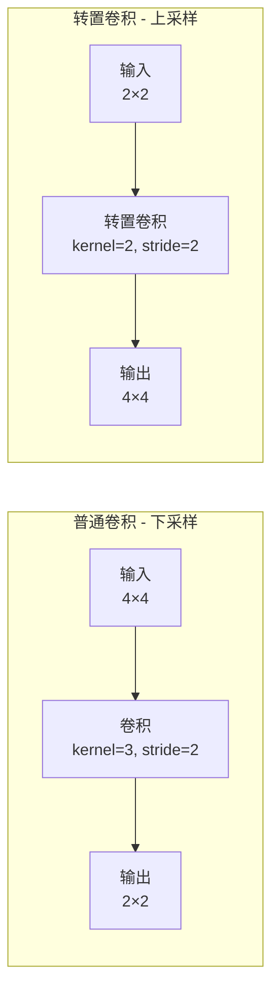
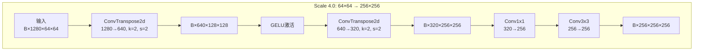

# ConvTranspose（转置卷积）详解

## 一、什么是ConvTranspose？

**ConvTranspose2d**（转置卷积，也叫反卷积）是卷积的"逆操作"，用于**上采样**，将特征图放大。

### 普通卷积 vs 转置卷积



## 二、ConvTranspose的工作原理

### 2.1 核心思想

**普通卷积**：用一个滤波器在输入上滑动，生成更小的输出
**转置卷积**：用一个滤波器在输入的每个位置进行"扩张"，生成更大的输出

### 2.2 具体操作步骤

以 `ConvTranspose2d(in_channels=1, out_channels=1, kernel_size=2, stride=2)` 为例：

```
输入: 2×2的特征图
卷积核: 2×2
stride: 2
输出: 4×4的特征图
```

#### PyTorch实际运行结果：

```python
# 输入 2×2
input = tensor([[1., 2.],
                [3., 4.]])

# 卷积核 2×2（单位对角矩阵）
kernel = tensor([[1., 0.],
                 [0., 1.]])

# ConvTranspose2d(kernel_size=2, stride=2)
# 输出 4×4
output = tensor([[1., 0., 2., 0.],
                 [0., 1., 0., 2.],
                 [3., 0., 4., 0.],
                 [0., 3., 0., 4.]])
```

### 2.3 正确的工作原理

**转置卷积的真实操作方式：**

转置卷积将输入的每个元素在输出中映射到一个`stride×stride`的区域。每个输入元素乘以卷积核，按照stride间隔放置。

#### 映射规则：

```
输入位置(i, j) → 输出起始位置(i×stride, j×stride)

对于stride=2:
输入(0,0) → 输出(0,0)开始的2×2区域
输入(0,1) → 输出(0,2)开始的2×2区域
输入(1,0) → 输出(2,0)开始的2×2区域
输入(1,1) → 输出(2,2)开始的2×2区域
```

#### 详细可视化（基于实际PyTorch输出）：

```
步骤1: 处理输入元素1（位置0,0）
输入值=1, 卷积核:      放置到输出(0,0):
┌───┬───┐              ┌───┬───┬───┬───┐
│ 1 │ 0 │              │1×1│1×0│   │   │  = │1│0│ │ │
├───┼───┤  ×1  →       ├───┼───┼───┼───┤    ├─┼─┼─┼─┤
│ 0 │ 1 │              │1×0│1×1│   │   │    │0│1│ │ │
└───┴───┘              ├───┼───┼───┼───┤    ├─┼─┼─┼─┤
                       │   │   │   │   │    │ │ │ │ │
                       ├───┼───┼───┼───┤    ├─┼─┼─┼─┤
                       │   │   │   │   │    │ │ │ │ │
                       └───┴───┴───┴───┘    └─┴─┴─┴─┘

步骤2: 处理输入元素2（位置0,1）
输入值=2, 卷积核:      放置到输出(0,2):
┌───┬───┐              ┌───┬───┬───┬───┐
│ 1 │ 0 │              │ 1 │ 0 │2×1│2×0│  = │1│0│2│0│
├───┼───┤  ×2  →       ├───┼───┼───┼───┤    ├─┼─┼─┼─┤
│ 0 │ 1 │              │ 0 │ 1 │2×0│2×1│    │0│1│0│2│
└───┴───┘              ├───┼───┼───┼───┤    ├─┼─┼─┼─┤
                       │   │   │   │   │    │ │ │ │ │
                       ├───┼───┼───┼───┤    ├─┼─┼─┼─┤
                       │   │   │   │   │    │ │ │ │ │
                       └───┴───┴───┴───┘    └─┴─┴─┴─┘

步骤3: 处理输入元素3（位置1,0）
输入值=3, 卷积核:      放置到输出(2,0):
┌───┬───┐              ┌───┬───┬───┬───┐
│ 1 │ 0 │              │ 1 │ 0 │ 2 │ 0 │  = │1│0│2│0│
├───┼───┤  ×3  →       ├───┼───┼───┼───┤    ├─┼─┼─┼─┤
│ 0 │ 1 │              │ 0 │ 1 │ 0 │ 2 │    │0│1│0│2│
└───┴───┘              ├───┼───┼───┼───┤    ├─┼─┼─┼─┤
                       │3×1│3×0│   │   │    │3│0│ │ │
                       ├───┼───┼───┼───┤    ├─┼─┼─┼─┤
                       │3×0│3×1│   │   │    │0│3│ │ │
                       └───┴───┴───┴───┘    └─┴─┴─┴─┘

步骤4: 处理输入元素4（位置1,1）
输入值=4, 卷积核:      放置到输出(2,2):
┌───┬───┐              ┌───┬───┬───┬───┐
│ 1 │ 0 │              │ 1 │ 0 │ 2 │ 0 │  = │1│0│2│0│
├───┼───┤  ×4  →       ├───┼───┼───┼───┤    ├─┼─┼─┼─┤
│ 0 │ 1 │              │ 0 │ 1 │ 0 │ 2 │    │0│1│0│2│
└───┴───┘              ├───┼───┼───┼───┤    ├─┼─┼─┼─┤
                       │ 3 │ 0 │4×1│4×0│    │3│0│4│0│
                       ├───┼───┼───┼───┤    ├─┼─┼─┼─┤
                       │ 0 │ 3 │4×0│4×1│    │0│3│0│4│
                       └───┴───┴───┴───┘    └─┴─┴─┴─┘

最终输出（与PyTorch完全一致）:
┌───┬───┬───┬───┐
│ 1 │ 0 │ 2 │ 0 │
├───┼───┼───┼───┤
│ 0 │ 1 │ 0 │ 2 │
├───┼───┼───┼───┤
│ 3 │ 0 │ 4 │ 0 │
├───┼───┼───┼───┤
│ 0 │ 3 │ 0 │ 4 │
└───┴───┴───┴───┘
```

#### 关键观察：

1. **不是简单插零**：输入元素不是简单地在中间插入零，而是按照stride间隔映射到输出

2. **卷积核的作用**：
   - 使用对角矩阵[1,0; 0,1]，每个输入值出现在输出的对角位置
   - 位置(0,0)→值1出现在(0,0)和(1,1)
   - 位置(0,1)→值2出现在(0,2)和(1,3)
   - 位置(1,0)→值3出现在(2,0)和(3,1)
   - 位置(1,1)→值4出现在(2,2)和(3,3)

3. **stride的作用**：
   - stride=2使每个输入元素在输出中占据2×2区域
   - 不同输入元素的输出区域不重叠（因为stride等于kernel_size）

4. **如果区域重叠会怎样**：
   - 如果stride<kernel_size，输出区域会重叠，重叠部分的值会相加

## 三、SAM 3中的实际应用

### 3.1 代码实现

```python
# SAM 3中的转置卷积
nn.ConvTranspose2d(
    in_channels=1280,    # 输入通道数
    out_channels=640,    # 输出通道数
    kernel_size=2,       # 2×2的卷积核
    stride=2            # 步长为2，实现2倍上采样
)
```

### 3.2 详细的尺寸变化

```
输入特征图: B×1280×64×64

使用 ConvTranspose2d(1280, 640, kernel_size=2, stride=2):

步骤1: 在每个元素之间插入(stride-1)=1个零
       64×64 → 128×128 (逻辑上的插值)

步骤2: 应用2×2卷积核
       通道: 1280 → 640
       
输出特征图: B×640×128×128
```

### 3.3 可视化示例

```
原始特征图 (简化为单通道):
┌───┬───┬───┬───┐
│ 1 │ 2 │ 3 │ 4 │  64×64 (只显示4×4作为示例)
├───┼───┼───┼───┤
│ 5 │ 6 │ 7 │ 8 │
├───┼───┼───┼───┤
│ 9 │10 │11 │12 │
├───┼───┼───┼───┤
│13 │14 │15 │16 │
└───┴───┴───┴───┘

经过 ConvTranspose2d(kernel_size=2, stride=2) 后:
┌──┬──┬──┬──┬──┬──┬──┬──┐
│ *│  │ *│  │ *│  │ *│  │  128×128 (8×8作为示例)
├──┼──┼──┼──┼──┼──┼──┼──┤
│  │  │  │  │  │  │  │  │  每个原始像素扩展为2×2区域
├──┼──┼──┼──┼──┼──┼──┼──┤
│ *│  │ *│  │ *│  │ *│  │  *表示原始信息的影响区域
├──┼──┼──┼──┼──┼──┼──┼──┤
│  │  │  │  │  │  │  │  │
├──┼──┼──┼──┼──┼──┼──┼──┤
│ *│  │ *│  │ *│  │ *│  │
├──┼──┼──┼──┼──┼──┼──┼──┤
│  │  │  │  │  │  │  │  │
├──┼──┼──┼──┼──┼──┼──┼──┤
│ *│  │ *│  │ *│  │ *│  │
├──┼──┼──┼──┼──┼──┼──┼──┤
│  │  │  │  │  │  │  │  │
└──┴──┴──┴──┴──┴──┴──┴──┘
```

## 四、为什么使用2×2卷积核和stride=2？

### 4.1 完美的2倍上采样

```
输入尺寸: H × W
输出尺寸: (H - 1) × stride + kernel_size
       = (H - 1) × 2 + 2
       = 2H - 2 + 2
       = 2H

同理，宽度也是 2W
```

**因此：`kernel_size=2, stride=2` 实现了精确的2倍上采样！**

### 4.2 覆盖均匀

使用2×2卷积核和stride=2，每个输出位置恰好被一个输入位置影响，没有重叠，也没有间隙：

```
输入:     输出:
  a       a的影响区域
  │       ┌─┬─┐
  │       │*│*│
  │       ├─┼─┤
  └────→  │*│*│
          └─┴─┘
```

## 五、与其他上采样方法的对比

### 5.1 双线性插值 (Bilinear Interpolation)

```python
F.interpolate(x, scale_factor=2, mode='bilinear')
```

**优点：**
- 简单快速
- 平滑的结果

**缺点：**
- 没有可学习的参数
- 固定的插值规则

### 5.2 最近邻插值 (Nearest Neighbor)

```python
F.interpolate(x, scale_factor=2, mode='nearest')
```

**优点：**
- 最简单

**缺点：**
- 块状效应
- 没有可学习的参数

### 5.3 转置卷积 (ConvTranspose)

```python
nn.ConvTranspose2d(in_c, out_c, kernel_size=2, stride=2)
```

**优点：**
- **可学习的参数** - 网络可以学习最佳的上采样方式
- 灵活性高
- 可以同时改变通道数

**缺点：**
- 参数更多
- 计算量稍大
- 可能产生棋盘效应（但可以通过设计缓解）

## 六、SAM 3的完整上采样路径



### 详细步骤：

1. **第一次转置卷积**
   - 输入: `B×1280×64×64`
   - 操作: `ConvTranspose2d(1280, 640, kernel_size=2, stride=2)`
   - 输出: `B×640×128×128`
   - **H和W都扩大2倍！**

2. **GELU激活**
   - 非线性变换
   - 尺寸不变

3. **第二次转置卷积**
   - 输入: `B×640×128×128`
   - 操作: `ConvTranspose2d(640, 320, kernel_size=2, stride=2)`
   - 输出: `B×320×256×256`
   - **H和W再次扩大2倍！**

4. **通道调整**
   - Conv1x1 和 Conv3x3 将通道数统一到256
   - 空间尺寸保持不变

**总体：64×64 → 128×128 → 256×256 = 4倍上采样**

## 七、总结

### ConvTranspose2d的关键点：

1. **功能**：实现特征图的上采样（放大）

2. **参数**：
   - `kernel_size=2`：使用2×2的卷积核
   - `stride=2`：步长为2，实现2倍上采样

3. **工作原理**：
   - 在输入元素之间插入零
   - 应用卷积核进行"扩张"
   - 生成更大的输出

4. **优势**：
   - 可学习的参数（网络自己学习如何上采样）
   - 可以同时改变通道数
   - 灵活性高

5. **在SAM 3中的作用**：
   - 将ViT的64×64特征恢复到更高分辨率
   - 捕获更细粒度的空间信息
   - 为检测小物体提供支持

这就是ConvTranspose如何通过2×2卷积核和stride=2实现H和W都扩大2倍的完整原理！