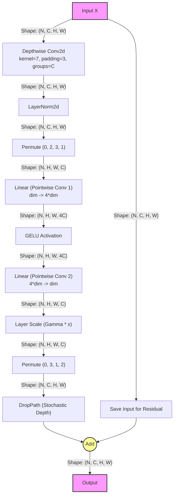

# CXBlock (ConvNeXt Block)

This document describes the `CXBlock` module found in `sam3/model/memory.py`. 
It is a block adapted from the ConvNeXt architecture, featuring a depthwise convolution followed by an inverted bottleneck implemented with point-wise convolutions (Linear layers).

## Workflow

The following flowchart illustrates the data flow through the `forward` method of the `CXBlock`, assuming an input tensor $X$ with batch size $N$, channels $C$ (denoted as `dim` in code), height $H$, and width $W$.



## 关于 Padding=3 的详细解释

在 `CXBlock` 的 `dwconv` 层中，参数 `padding` 默认为 3。这一设置对于模块的正常运行至关重要。

### 1. 为什么必须是 Padding=3? (Why Padding=3?)

代码中使用了残差连接（Residual Connection）：
```python
x = input + self.drop_path(x)
```
这要求卷积分支的输出 `x` 必须与输入 `input` 具有完全相同的空间尺寸（Height, Width）。

卷积层输出尺寸的计算公式为：
$$ OutputSize = \lfloor \frac{InputSize + 2 \times Padding - KernelSize}{Stride} \rfloor + 1 $$

在 `CXBlock` 中：
*   **Stride**: 默认为 1。
*   **Kernel Size**: 默认设置为 7。

为了保持输入输出尺寸一致 ($OutputSize = InputSize$)，我们需要满足：
$$ 2 \times Padding = KernelSize - 1 $$
$$ Padding = \frac{7 - 1}{2} = 3 $$

因此，`padding=3` 是为了配合 `kernel_size=7` 从而实现 **Same Padding**（保持尺寸不变）。

### 2. 如果 Padding 为 0 或 1 会发生什么？

如果将 `padding` 修改为 0 或 1，而保持 `stride=1`：

*   **Padding = 0**: 
    $$ Output = Input - 7 + 0 + 1 = Input - 6 $$
    输出尺寸比输入小 6 个像素。

*   **Padding = 1**:
    $$ Output = Input - 7 + 2 + 1 = Input - 4 $$
    输出尺寸比输入小 4 个像素。

**后果**：
当代码运行到最后的加法步骤 `x = input + ...` 时，由于 Tensor 形状不匹配（例如 $224 \times 224$ 和 $218 \times 218$ 相加），PyTorch 会抛出 **RuntimeError**，导致程序崩溃。

### 3. Padding 与 Stride 的关系

虽然公式 $Output = (Input + 2P - K)/S + 1$ 允许通过组合不同的 Padding 和 Stride (例如 Stride=2) 来得到特定的输出尺寸，但在 `CXBlock` 这个特定的网络结构中，**Stride 被隐含限制为 1**。这是因为残差结构的 shortcut 分支（直接把 input 加过去）没有经过任何下采样操作。如果卷积分支使用了 Stride > 1 进行下采样，两个分支的尺寸将无法对齐。

## 关于 DropPath (Stochastic Depth) 的详细解释

代码中引入了 `DropPath`：

```python
try:
    from timm.layers import DropPath
except ModuleNotFoundError:
    # compatibility for older timm versions
    from timm.models.layers import DropPath
```

### 1. 来源与概念
`DropPath` 通常来自于 `timm` (PyTorch Image Models) 库，它实现了一种被称为 **Stochastic Depth** (随机深度) 的正则化技术。它不同于传统的 Dropout（随机丢弃神经元），而是随机丢弃整个残差分支（Residual Branch）。

### 2. 工作机制

在残差结构 `Output = Input + f(Input)` 中，`DropPath` 作用于 `f(Input)` 部分：

*   **训练阶段 (Training)**:
    以概率 $p$ (drop probability) 将整个分支 `f(Input)` 的输出变为 0。
    *   如果分支被丢弃：`Output = Input + 0 = Input`（变成了恒等映射 Identity Mapping）。
    *   如果分支被保留：`Output = Input + f(Input)`。
    
    这意味着在每个训练 batch 中，网络实际上是在训练不同深度的子网络集合。有的 Layer 被跳过了，网络变浅了。

*   **推理阶段 (Inference)**:
    不进行丢弃，使用完整的网络结构。为了保持期望值一致，通常会在训练时对保留下来的分支输出进行缩放（除以 $1-p$），或者在推理时进行缩放（这一细节取决于具体实现，`timm` 的实现通常在训练时进行 scaling，使得推理时不需要额外操作）。

### 3. 为什么要用 DropPath?

1.  **防止过拟合 (Regularization)**: 类似于 Dropout，它减少了神经元之间的共适应关系，提高了模型的泛化能力。
2.  **训练更深的网络**: 对于这就是几百层的极深网络（如 ResNet-1000+ 或大型 Vision Transformer），梯度的传播会变得很困难。随机深度通过在训练时随机把网络“变浅”，有效地缩短了梯度反向传播的路径，缓解了梯度消失问题，加速了收敛。

### 4. DropPath 的行为细节

针对您关心的**丢弃粒度（Batched vs Per-Sample）**和**参数范围**：

*   **丢弃粒度 (Granularity): 每个样本独立丢弃**
    在 `timm` 的主流实现中，`DropPath` 是针对 **Batch 中的每个样本独立进行** 的。
    假设 Input Shape 为 $(B, C, H, W)$，其中 $B$ 是 Batch Size，$C$ 是通道数，$H, W$ 是特征图尺寸。
    *   `DropPath` 会生成一个形状为 $(B, 1, 1, 1)$ 的随机 Mask。
    *   这意味着对于每一个样本 $b$ (其中 $0 \le b < B$)，都有一个独立的概率 $p$ 使得该样本对应的 Mask 值为 0。
    *   通过广播机制 (Broadcasting)，这个状态会应用到该样本的所有通道 $C$ 和空间位置 $H, W$ 上。
    *   **结论**：是的，就是针对每个 $b$，有 $p$ 的概率被丢弃。

*   **参数配置 (Parameter Value)**:
    参数 `drop_path` 代表的是**丢弃概率 (drop probability)**，因此它必须在 **`[0, 1]`** 之间。
    *   `0.0`: 从不丢弃（等同于无 DropPath）。
    *   `0.1`: 有 10% 的概率丢弃该层。
    *   `0.5`: 有 50% 的概率丢弃该层。
    *   `1.0`: 总是丢弃（该层完全失效，永远输出 identity）。
    
    **不可以**设置任意值（如 5, 10 等），因为概率不能超过 1（100%）。

## 参数数量计算 (Parameter Count)

`CXBlock` 的参数主要来自于卷积层、全连接层（Linear）、归一化层和可学习的缩放参数 gamma。

假设输入通道数为 $C$ (即代码中的 `dim`)，卷积核大小为 $K=7$。

### 详细计算过程

1.  **Depthwise Conv2d (`self.dwconv`)**:
    *   Type: `nn.Conv2d(C, C, kernel_size=7, groups=C)`
    *   **Weights**: $C \times 1 \times 7 \times 7 = 49C$ (因为 `groups=C`，每个通道只有一个 $7 \times 7$ 的卷积核)
    *   **Bias**: $C$
    *   **Subtotal**: $50C$

    **Standard Conv vs Depthwise Conv (About Groups)**
    *   **Standard Conv (`groups=1`)**:
        如果这是一个标准卷积，Weight 的形状应为 $(C_{out}, C_{in}, K, K)$。
        参数量为 $C \times C \times 7 \times 7 = 49C^2$。
    *   **Depthwise Conv (`groups=C_{in}`)**:
        这里设置了 `groups=dim` (=C)，意味着**每个输入通道只被一个卷积核处理**，并且生成一个输出通道。
        Weight 的形状变为 $(C_{out}, \frac{C_{in}}{groups}, K, K) = (C, 1, 7, 7)$。
        参数量为 $C \times 1 \times 7 \times 7 = 49C$。
        这就是为什么这里是 $49C$ 而不是 $49C^2$。
    *   **Bias**: 
        Bias 始终对应于输出维度 $C_{out}$。无论 groups 是多少，输出都是 $C$，所以 Bias 始终是 $C$。

2.  **LayerNorm (`self.norm`)**:
    *   Type: `LayerNorm2d` (equivalent to `nn.LayerNorm(C)`)
    *   **Weights** (gamma): $C$
    *   **Bias** (beta): $C$
    *   **Subtotal**: $2C$

3.  **Pointwise Conv 1 (`self.pwconv1`)**:
    *   Type: `nn.Linear(C, 4*C)`
    *   **Weights**: $(4C) \times C = 4C^2$
    *   **Bias**: $4C$
    *   **Subtotal**: $4C^2 + 4C$

4.  **Pointwise Conv 2 (`self.pwconv2`)**:
    *   Type: `nn.Linear(4*C, C)`
    *   **Weights**: $C \times (4C) = 4C^2$
    *   **Bias**: $C$
    *   **Subtotal**: $4C^2 + C$

5.  **Layer Scale (`self.gamma`)**:
    *   Type: `nn.Parameter` of shape `(C)`
    *   **Weights**: $C$
    *   **Subtotal**: $C$

### 总和公式 (Total)

$$ Total Params = (50C) + (2C) + (4C^2 + 4C) + (4C^2 + C) + (C) $$

$$ Total Params = 8C^2 + 58C $$

### 举例
如果 `dim = 96` (Tiny 模型常见配置):
*   $8 \times 96^2 + 58 \times 96$
*   $= 8 \times 9216 + 5568$
*   $= 73728 + 5568$
*   $= 79,296$ 参数 (约 79K)

## 深入解析: 标准卷积(Standard) vs 深度卷积(Depthwise)

针对您关于 `groups=C` 的核心疑问：

**问题**：如果 Groups=C，Weight Shape 是 $(C_{in}, 1, K, K)$，那为什么输出通道数还是 $C$ 呢？

### 直观的工作原理对比

1.  **Standard Convolution (groups=1)**
    *   **机制**: 假设我们有 $C$ 个输入通道，想要得到 $C$ 个输出通道。标准卷积会有 **$C$ 个滤波器**（Filters）。**每一个**滤波器都会查看**所有**的输入通道，进行 3D 卷积求和。
    *   **参数**: 每个3D滤波器的参数是 $C_{in} \times K \times K$。一共有 $C_{out}$ 个滤波器。总数 $C_{out} \times C_{in} \times K \times K$。
    *   **输出**: 滤波器 0 扫描所有输入得到输出通道 0；滤波器 1 此类推。

2.  **Depthwise Convolution (groups=C)**
    *   **机制**: 这里我们依然有 $C$ 个滤波器，但是它们被限制了视野。
        *   **滤波器 0**：只允许看 **输入通道 0**。它不管其他通道。它的参数只有 $1 \times K \times K$。它产出 -> **输出通道 0**。
        *   **滤波器 1**：只允许看 **输入通道 1**。参数 $1 \times K \times K$。它产出 -> **输出通道 1**。
        *   ...
        *   **滤波器 C-1**：只允许看 **输入通道 C-1**。
    *   **参数**: 总共有 $C$ 个滤波器，每个参数是 $1 \times K \times K$。总数 $C \times 1 \times K \times K$。
    *   **拼接**: 虽然每个滤波器只处理了一个输入通道，但我们有 $C$ 个这样的滤波器同时并行工作。
    *   **结果**: 我们会把这 $C$ 个滤波器的结果叠在一起 (Concatenate)。因为一共有 $C$ 个独立的滤波器操作，所以我们最终得到了 $C$ 个输出通道。

**结论**: `groups=C` 是一种**稀疏连接**。它通过强行规定“第i个输出通道只由第i个输入通道产生”，极大地减少了参数量（从 $C^2$ 降到了 $C$），但依然能够维持 $C$ 个维度的特征输出。

## 关于 Groups 的整除约束 (Constraints on Groups)

关于 groups 设置是否有什么限制：

1.  **$C_{in}$ 必须被 groups 整除**:
    输入通道被平均分配给 $groups$ 个组，每组包含 $C_{in} / groups$ 个通道。如果不能整除，PyTorch 会报错。

2.  **$C_{out}$ 必须被 groups 整除**:
    输出通道也是由 $groups$ 个组产生的，每组产生 $C_{out} / groups$ 个通道。

### 为什么 $C_{out}$ 必须被 Groups 整除?

您之前的疑问：“我有 $C_{out}$ 个滤波器，不论能否被 groups 整除，都可以吧？”

**回答**：
虽然从理论上讲，你可以设计一个不对称的网络（例如 Groups=2，组1负责2个通道，组2负责3个通道），但在深度学习框架（如 PyTorch, TensorFlow）的具体实现中，为了保证**计算的并行性**和**结构的一致性**，它们采用了**均匀分组**（Uniform Grouped Convolution）的定义。

它假设所有的 Group 是**同构**的，即每个组：
*   接收相同数量的输入通道。
*   拥有相同数量的滤波器。
*   产生相同数量的输出通道。

只有这样，GPU 才能高效地并行处理所有组的计算（可以理解为 Batch 维度的某种扩展）。如果允许不对称分组，底层算子的实现会变得极其复杂且低效。因此，这是一个为了工程实现效率而做的数学约束。

## 计算示例：Groups 对参数量的影响 (Example: Effect of Groups)

假设参数如下：
*   $C_{in} = 256$
*   $C_{out} = 512$
*   $Kernel = 3 \times 3$ (为方便展示，使用常见的 K=3)

### 情景 1: groups = 1 (标准卷积)

*   **含义**: 每个输出通道的滤波器都会查看所有的 256 个输入通道。
*   **计算**:
    $$ Params = C_{out} \times C_{in} \times K^2 $$
    $$ Params = 512 \times 256 \times 9 $$
    $$ Params = 1,179,648 $$
    $$ \approx 1.18 \text{ Million} $$

### 情景 2: groups = 8

*   **含义**: 通道被分为 8 组。
    *   每个组的输入通道数：$256 / 8 = 32$
    *   每个组的输出通道数：$512 / 8 = 64$
*   **计算**:
    每个组内部就是一个小型的标准卷积 (32入 -> 64出)。
    *   单组参数: $64 \times 32 \times 9 = 18,432$
    *   总参数 (8个组): $18,432 \times 8 = 147,456$
    $$ \approx 0.147 \text{ Million} $$

或者使用通用公式：
$$ Params = C_{out} \times \frac{C_{in}}{\text{groups}} \times K^2 $$
$$ Params = 512 \times \frac{256}{8} \times 9 $$
$$ Params = 512 \times 32 \times 9 = 147,456 $$

### 对比结果

*   **groups = 1**: 1.18 M
*   **groups = 8**: 0.15 M

**结论**: 参数量减少到了原来的 $\frac{1}{groups} = \frac{1}{8}$。