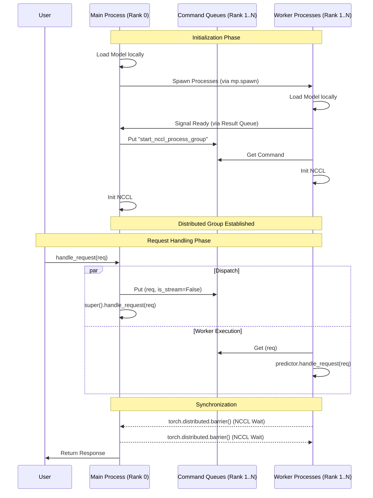

# Sam3VideoPredictorMultiGPU Documentation

**File:** `sam3/model/sam3_video_predictor.py`

This document details the architecture and workflow of the `Sam3VideoPredictorMultiGPU` class. This class extends the single-GPU `Sam3VideoPredictor` to support distributed inference across multiple GPUs using PyTorch's `multiprocessing` and `distributed` (NCCL) modules.

## 1. Overview

The `Sam3VideoPredictorMultiGPU` creates a Master-Worker architecture to parallelize video processing.

*   **Inheritance**: It inherits from `Sam3VideoPredictor`, meaning it shares the same core inference logic (adding prompts, propagating masks).
*   **Role**: It acts as a **Dispatcher**. The instance running in the main process doesn't just do inference; it manages a cluster of worker processes (one per additional GPU) and synchronizes their actions.

## 2. Architecture & Communication

The communication model is based on **Message Passing** via Queues for control logic, and **NCCL** for tensor synchronization.

### 2.1 Process Structure

If `gpus_to_use` specifies $N$ GPUs:
*   **Main Process (Rank 0)**:
    *   Runs on the first GPU.
    *   Handles the user-facing API (e.g., `handle_request`).
    *   Spawns and manages $N-1$ worker processes.
    *   Loads the model weights and then signals workers to start.
*   **Worker Processes (Rank 1 to $N-1$)**:
    *   Run on the remaining GPUs.
    *   Run an infinite loop (`_worker_process_command_loop`) waiting for commands.
    *   Mirror the operations of the main process to ensure distributed state consistency.

### 2.2 Dual-Queue System

The class maintains two sets of queues for **Inter-Process Communication (IPC)**. While initiated identically as `mp.Queue()`, they serve opposite directions:

| Queue Name | Direction | Purpose | Content Examples |
| :--- | :--- | :--- | :--- |
| **`command_queues`** | **Main $\to$ Worker** | Control Logic | `("start_session", ...)`, `("add_prompt", ...)` |
| **`result_queues`** | **Worker $\to$ Main** | Status/Ack | `("load_model", pid)`, `("shutdown", True)` |

*Note: There is one pair of queues for **each** worker rank.*

### 2.3 Synchronization (Barriers)

Since `Sam3VideoPredictor` involves stateful inference (tracking objects over time), all GPUs must process the same frames and prompts in lockstep.

*   **Control Sync**: achieved via `command_queues`. The main process puts the exact same request into every worker's queue.
*   **Tensor Sync**: achieved via `torch.distributed` (NCCL). After processing a request, explicit barriers (`torch.distributed.barrier()`) or collective operations (during inference) ensure all ranks are aligned before returning the result to the user.

## 3. Workflow Diagram

The following chart illustrates the lifecycle of a request in `Sam3VideoPredictorMultiGPU`.



## 4. Key Implementation Details

### 4.1 Initialization (`__init__`)
1.  **Environment Setup**: Sets `MASTER_ADDR`, `MASTER_PORT`, `RANK`, and `WORLD_SIZE` environment variables required by PyTorch Distributed.
2.  **Sequential Loading**: 
    *   The Main process loads the model *first*. This allows it to potentially compile the model (`torch.compile`) and populate compilation caches without race conditions.
    *   Workers are spawned via `_start_worker_processes` only after the main process is ready.
3.  **NCCL Warmup**: Runs a dummy `all_reduce` on a tensor to ensure the distributed backend is fully operational before accepting user requests.

### 4.2 Request Dispatch (`handle_request`)
This method overrides the base class logic to act as a proxy.
```python
if self.world_size > 1 and self.rank == 0:
    for rank in range(1, self.world_size):
        # 1. Distribute task
        self.command_queues[rank].put((request, False))

# 2. Local Execution
response = super().handle_request(request)

if self.world_size > 1:
    # 3. Wait for workers
    torch.distributed.barrier()
```

### 4.3 Worker Loop (`_worker_process_command_loop`)
This static method is the entry point for worker processes.
1.  **Reconstruction**: It instantiates a fresh `Sam3VideoPredictorMultiGPU` inside the worker process. The class design handles `RANK` detection to know it's a worker.
2.  **Event Loop**:
    *   Wait for command from queue (`command_queue.get()`).
    *   Check for shutdown signals.
    *   Execute command (`predictor.handle_request`).
    *   **Zombie Protection**: It periodically checks `psutil.pid_exists(parent_pid)`. If the main process dies unexpectedly (e.g., `kill -9`), the worker detects it and self-terminates to prevent orphaned GPU processes.

## 5. Why use distinct Queues?

One might ask: *Why define `command_queues` and `result_queues` separately if they are just `mp.Queue`?*

```python
self.command_queues = {rank: mp_ctx.Queue() for rank in range(1, world_size)}
self.result_queues = {rank: mp_ctx.Queue() for rank in range(1, world_size)}
```

While they are structurally identical, separating them enforces **unidirectional data flow**:
*   **Command Queue** is strictly **Write-Only for Main** and **Read-Only for Worker**.
*   **Result Queue** is strictly **Write-Only for Worker** and **Read-Only for Main**.

This separation prevents:
1.  **Deadlocks**: A process trying to read its own message.
2.  **Race Conditions**: Main process reading a "command" it just sent instead of the "result" it was waiting for.
3.  **Logic Clarity**: It clearly delineates the Control Plane (Commands) from the Status Plane (Results).