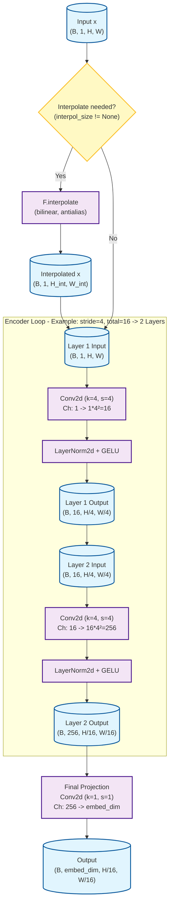
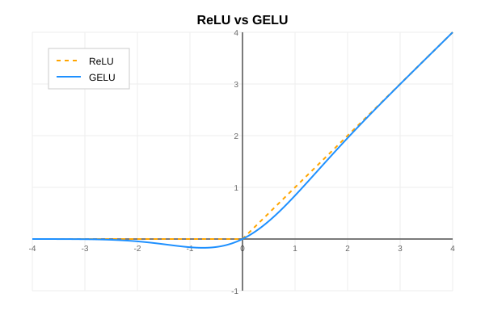

# SimpleMaskDownSampler Workflow

This chart illustrates the data flow for the `SimpleMaskDownSampler` class in `sam3/model/memory.py`.

It assumes the default configuration for demonstration purposes:
- `stride = 4`
- `total_stride = 16` (implies 2 layers: $4^2 = 16$)
- `embed_dim = 256`



## Specific Instance Workflow (kernel=3, stride=2, padding=1, interpol_size=[1152, 1152])

This chart visualizes the data flow for the instance:
```python
SimpleMaskDownSampler(
    kernel_size=3, stride=2, padding=1, interpol_size=[1152, 1152]
)
```
**Key Transformations:**
- **Interpolation**: Input mask is resized to `(1152, 1152)`
- **Layers**: `log2(16) / log2(2) = 4` layers.
- **Channel Growth**: Powers of 2 (stride=2): $1 \rightarrow 4 \rightarrow 16 \rightarrow 64 \rightarrow 256$.
- **Spatial Reduction**: Halved at each step: $1152 \rightarrow 576 \rightarrow 288 \rightarrow 144 \rightarrow 72$.

```mermaid
graph TD
    %% Define Styles
    classDef tensor fill:#e1f5fe,stroke:#01579b,stroke-width:2px;
    classDef op fill:#f3e5f5,stroke:#4a148c,stroke-width:2px;
    classDef cond fill:#fff9c4,stroke:#fbc02d,stroke-width:2px;

    %% Nodes
    Input_Custom[("Input x<br/>(B, 1, H_in, W_in)")]:::tensor
    Interp_Custom["F.interpolate<br/>to (1152, 1152)"]:::op
    TensorIn_Custom[("Interpolated x<br/>(B, 1, 1152, 1152)")]:::tensor

    subgraph Custom_Encoder_Loop [Encoder Loop - 4 Layers]
        direction TB

        %% Layer 1
        CL1_Conv["Conv2d (k=3, s=2, p=1)<br/>Ch: 1 -> 4<br/>Size: 1152 -> 576"]:::op
        CL1_NormAct["LayerNorm2d + GELU"]:::op
        CL1_Out[("L1 Out<br/>(B, 4, 576, 576)")]:::tensor
        
        %% Layer 2
        CL2_Conv["Conv2d (k=3, s=2, p=1)<br/>Ch: 4 -> 16<br/>Size: 576 -> 288"]:::op
        CL2_NormAct["LayerNorm2d + GELU"]:::op
        CL2_Out[("L2 Out<br/>(B, 16, 288, 288)")]:::tensor

        %% Layer 3
        CL3_Conv["Conv2d (k=3, s=2, p=1)<br/>Ch: 16 -> 64<br/>Size: 288 -> 144"]:::op
        CL3_NormAct["LayerNorm2d + GELU"]:::op
        CL3_Out[("L3 Out<br/>(B, 64, 144, 144)")]:::tensor

        %% Layer 4
        CL4_Conv["Conv2d (k=3, s=2, p=1)<br/>Ch: 64 -> 256<br/>Size: 144 -> 72"]:::op
        CL4_NormAct["LayerNorm2d + GELU"]:::op
        CL4_Out[("L4 Out<br/>(B, 256, 72, 72)")]:::tensor
    end

    FinalProj_Custom["Final Projection<br/>Conv2d (k=1, s=1)<br/>Ch: 256 -> 256"]:::op
    Output_Custom[("Output<br/>(B, 256, 72, 72)")]:::tensor

    %% Connections
    Input_Custom --> Interp_Custom --> TensorIn_Custom
    
    TensorIn_Custom --> CL1_Conv --> CL1_NormAct --> CL1_Out
    CL1_Out --> CL2_Conv --> CL2_NormAct --> CL2_Out
    CL2_Out --> CL3_Conv --> CL3_NormAct --> CL3_Out
    CL3_Out --> CL4_Conv --> CL4_NormAct --> CL4_Out
    
    CL4_Out --> FinalProj_Custom --> Output_Custom
```



## Detailed Explanation of LayerNorm2d + GELU

This combination is commonly used in Vision Transformers and modern ConvNets (like ConvNeXt) to process NCHW (Batch, Channels, Height, Width) data.

### 1. `LayerNorm2d` (Layer Normalization)

The `LayerNorm2d` used here simulates the behavior of LayerNorm in ViT, which **normalizes each "Token" (each pixel)** independently.

Assuming input tensor $x$ has shape $(B, C, H, W)$:

#### Step 1: Normalization (Standardization)
The goal is to eliminate contrast and scale differences between different samples by normalizing the feature distribution.

1.  **Calculate Mean (`u`) and Variance (`s`)**:
    *   Code: `x.mean(1, keepdim=True)`
    *   It computes the mean along the **Channel dimension (dim=1)**.
    *   For each image in the batch and each spatial location $(h, w)$, it calculates the statistics of the $C$ channel values.
    *   The resulting shape of mean $u$ and variance $s$ is $(B, 1, H, W)$.

2.  **Normalize**:
    *   Code: `(x - u) / torch.sqrt(s + self.eps)`
    *   Using the calculated statistics, it standardizes the feature vector at each pixel location to have 0 mean and 1 variance.

#### Step 2: Affine Transformation (Learnable Scaling/Shifting)
The normalization forces the data into a fixed distribution (mean=0, std=1), which might limit the network's expressive power. The affine transformation allows the network to learn to **restore** a specific mean and variance that is optimal for the task.

1.  **Parameters**: The layer introduces two learnable parameter vectors:
    *   `weight` ($\gamma$): Size $(C)$. Controls the scale (variance).
    *   `bias` ($\beta$): Size $(C)$. Controls the shift (mean).
    
2.  **Total Learnable Parameters**:
    *   **$2 \times C$** parameters in total.
    *   The parameter count depends **only on Channel dimension $C$**.
    *   It does **not** depend on Batch size $B$, Height $H$, or Width $W$.

3.  **How it works (Broadcasting)**:
    *   The normalized input $x_{norm}$ is $(B, C, H, W)$.
    *   The parameters are effectively reshaped to $(1, C, 1, 1)$.
    *   For a specific channel $c$, there is **one** scalar weight $\gamma_c$ and **one** scalar bias $\beta_c$.
    *   Equation: $y_{b,c,h,w} = (x_{norm})_{b,c,h,w} \times \gamma_c + \beta_c$
    *   **Interpretation**: Every single pixel in Channel 0 gets multiplied by the SAME $\gamma_0$ and added with the SAME $\beta_0$. Channel 1 uses $\gamma_1, \beta_1$, and so on. The shared parameters ensure that the feature transformation is translation invariant across the image.

### 2. `GELU` (Gaussian Error Linear Unit)

The activation function used is `nn.GELU`.

*   **Operation**: Element-wise activation.
*   **Formula**: $GELU(x) \approx 0.5 \cdot x \cdot (1 + \tanh(\sqrt{2/\pi} \cdot (x + 0.044715 \cdot x^3)))$
*   **Effect**: Similar to ReLU but smoother (curved near 0, allows small negative gradients). It introduces non-linearity to the network, deciding which important features are preserved or enhanced.



### Combined Effect

In each step of the `SimpleMaskDownSampler`:
1.  **Conv2d** extracts features and increases channel capacity.
2.  **LayerNorm2d** "cleans" and standardizes each pixel vector, then applies a learned scale/shift.
3.  **GELU** adds non-linearity.