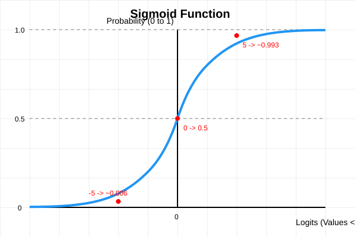

# SimpleMaskEncoder Documentation

`SimpleMaskEncoder` 是 SAM3 模型中用于处理和编码 Mask 信息的关键模块。它的主要作用是将输入的 Mask（无论是 Ground Truth 还是模型预测的 Mask）转化为能够与图像特征（Pixel Embeddings）进行融合的高维特征向量。

本文档基于 `sam3/model/memory.py` 和 `sam3/model_builder.py` 中的代码实现进行解析。

## 1. 模块结构与初始化

根据 `model_builder.py` 中的初始化代码，`SimpleMaskEncoder` 由以下几个核心组件构成：

### 1.1 `SimpleMaskDownSampler` (Mask 下采样器)
*   **作用**: 将高分辨率的 Mask 逐步下采样并增加通道数，将其转化为初步的特征图。
    *   **Interpolation**: 首先通过双线性插值将输入 Mask 调整到指定大小（例如 `[1152, 1152]`）。
    *   **Conv Layers**: 使用多层卷积（Stride > 1）进行下采样。例如 `total_stride=16`，意味着分辨率缩小 16 倍。
    *   **Channel Growth**: 随着空间尺寸减小，通道数成倍增加（例如从 1 -> 4 -> 16 -> 64 -> 256）。
*   **典型配置**: `kernel_size=3, stride=2, padding=1`。

### 1.2 `SimpleFuser` & `CXBlock` (特征融合与增强)
`SimpleMaskEncoder` 并没有直接使用下采样后的特征，而是通过一个 `fuser` 进行深度处理。
*   **`CXBlock` (ConvNeXt Block)**: 这是特征提取的核心单元。
    *   源自 ConvNeXt 架构，包含 Depthwise Conv (7x7), LayerNorm, 和 Pointwise Conv (Linear)。
    *   **Padding=3**: 这里特意设置 `padding=3` 配合 `kernel_size=7`，以保证特征图尺寸在经过卷积后保持不变（Same Padding），便于残差连接。
    *   **DropPath**: 引入随机深度（Stochastic Depth）正则化，提高模型鲁棒性。
*   **`SimpleFuser`**: 简单地堆叠这些 `CXBlock` 层。
    *   在我们的配置中，`num_layers=2`，意味着 mask 特征会经过两层 ConvNeXt Block 的精细化处理。

### 1.3 `PositionEmbeddingSine` (位置编码)
*   **作用**: 为处理后的特征图添加空间位置信息。
*   **Split Dimension**: 特征维度被一分为二，一半编码 Y 坐标，一半编码 X 坐标。
*   **Sinusoidal**: 采用正弦/余弦函数生成位置编码，允许模型感知特征的空间相对位置。

### 1.4 Projections (特征投影)
*   **`pix_feat_proj`**: 一个 1x1 卷积，用于将输入的图像特征（Pixel Features）投影到与 Mask 特征相同的维度空间，以便进行加法融合。
*   **`out_proj`**: 输出前的线性投影，用于调整最终输出的通道数（例如从 256 降维到 64）。

## 2. Forward Pass (前向传播流程)

下面的 Mermaid 流程图详细展示了 `SimpleMaskEncoder.forward` 函数的具体操作流程。

**假设配置 (基于 `sam3/model_builder.py`)**:
*   **Batch Size**: `B`
*   **Mask Input**: `(B, 1, H, W)`
*   **Pix Feat Input**: `(B, 256, 72, 72)` (假设图像特征已是下采样后的分辨率)
*   **Mask Downsampler**: Target Size `(1152, 1152)` -> Downsample 16x -> `(72, 72)`
*   **Out Dim**: 64

```mermaid
graph TD
    %% Define Styles
    classDef tensor fill:#e1f5fe,stroke:#01579b,stroke-width:2px;
    classDef op fill:#f3e5f5,stroke:#4a148c,stroke-width:2px;
    classDef process fill:#fff9c4,stroke:#fbc02d,stroke-width:2px;
    classDef output fill:#e8f5e9,stroke:#2e7d32,stroke-width:2px;

    %% --- Inputs ---
    MaskIn[("Mask Input<br/>(B, 1, H, W)")]:::tensor
    PixFeatIn[("Pix Feat Input<br/>(B, 256, 72, 72)")]:::tensor

    %% --- Mask Processing Branch ---
    subgraph Sigmoid_Block [Sigmoid Normalization]
        direction TB
        CheckSigmoid{"skip_mask_sigmoid?<br/>(False)"}:::process
        SigmoidOp["F.sigmoid(masks)<br/>Convert Logits -> Prob"]:::op
        MaskSigmoided[("Masks (Prob)<br/>(B, 1, H, W)")]:::tensor
    end

    subgraph Downsample_Block [Mask Downsampler]
        direction TB
        Interpolate["F.interpolate<br/>Resize to (1152, 1152)"]:::op
        DownConv["Conv Layers (x4)<br/>Stride=2 each<br/>1 -> 256 Channels"]:::op
        MaskDownsampled[("Masks Downsampled<br/>(B, 256, 72, 72)")]:::tensor
    end

    %% --- Pix Feat Processing Branch ---
    subgraph PixProj_Block [Pix Feat Projection]
        PixToDevice["Move to Mask Device"]:::process
        PixProj["pix_feat_proj (Conv2d 1x1)<br/>256 -> 256"]:::op
        PixFeatProj[("Projected Pix Feat<br/>(B, 256, 72, 72)")]:::tensor
    end

    %% --- Fusion ---
    SumOp(("Add (+)")):::op
    FusedFeat[("Fused Features<br/>(B, 256, 72, 72)")]:::tensor

    %% --- Deep Fusion ---
    subgraph Fuser_Block [Fuser - Deep Processing]
        direction TB
        CX1["CXBlock Layer 1<br/>(ConvNext Block)"]:::op
        CX2["CXBlock Layer 2<br/>(ConvNext Block)"]:::op
        FuserOut[("Fuser Output<br/>(B, 256, 72, 72)")]:::tensor
    end

    %% --- Output Projection ---
    OutProj["out_proj (Conv2d 1x1)<br/>256 -> 64"]:::op
    FinalFeat[("Final Vision Features<br/>(B, 64, 72, 72)")]:::output

    %% --- Pos Enc ---
    PosEncOp["PositionEmbeddingSine"]:::op
    FinalPos[("Vision Pos Enc<br/>(B, 64, 72, 72)")]:::output

    %% --- Connection Flow ---
    MaskIn --> CheckSigmoid
    CheckSigmoid -- No --> SigmoidOp --> MaskSigmoided
    CheckSigmoid -- Yes --> MaskSigmoided
    
    MaskSigmoided --> Interpolate --> DownConv --> MaskDownsampled

    PixFeatIn --> PixToDevice --> PixProj --> PixFeatProj

    MaskDownsampled --> SumOp
    PixFeatProj --> SumOp

    SumOp --> FusedFeat --> CX1 --> CX2 --> FuserOut

    FuserOut --> OutProj --> FinalFeat
    FinalFeat --> PosEncOp --> FinalPos

    %% Output Returns
    ReturnDict[("Return Dict:<br/>vision_features: FinalFeat<br/>vision_pos_enc: [FinalPos]")]:::output
    FinalFeat --> ReturnDict
    FinalPos --> ReturnDict
    
```



### 详细步骤说明

1.  **Mask Sigmoid (可选)**:
    *   如果 `skip_mask_sigmoid=False` (默认)，输入的 raw masks (logits) 会经过 `F.sigmoid` 变换为概率值 $[0, 1]$。这有助于减少输入分布与 Ground Truth 之间的差异（Domain Shift）。

2.  **Mask Downsampling (下采样)**:
    *   `mask_downsampler` 首先将 mask 强制插值到统一分辨率 (例如 `1152x1152`)。
    *   然后通过一系列步长为 2 的卷积层进行由大到小的特征提取，最终变为 `(B, 256, 72, 72)`。

3.  **Pix Feat Projection (图像特征对齐)**:
    *   输入的图像特征 `pix_feat` (通常来自 Image Encoder) 首先确保在同一设备上。
    *   通过 `pix_feat_proj` (1x1 Conv) 进行线性变换，虽然输入输出都是 256 维，但这提供了一个可学习的适配层。

4.  **Feature Fusion (加法融合)**:
    *   **核心操作**: `x = x + masks`。
    *   将 图像特征 与 Mask特征 **逐元素相加**。这要求两者的形状必须完全一致 `(B, 256, 72, 72)`。

5.  **Fuser (深度融合)**:
    *   融合后的特征通过 `SimpleFuser`，也就是堆叠的 `CXBlock`。
    *   这些模块利用 Depthwise Conv (7x7) 提取更大的感受野上下文，进一步通过 MLP 混合通道信息。

6.  **Output Projection (输出降维)**:
    *   通过 `out_proj` (1x1 Conv) 将通道数从 256 压缩到 64，以适配 Memory 模块的输入要求。

7.  **Position Encoding (位置编码生成)**:
    *   基于最终特征图 `(B, 64, 72, 72)` 的空间尺寸，动态生成对应的正弦位置编码 `vision_pos_enc`。

---

## 3. Mask Downsampler Shape Logic

针对您关于 **Shape Consistency (尺寸一致性)** 和 **Calculation (计算细节)** 的核心疑问，这里进行详细解析。

### 3.1 参数配置
根据 `sam3/model_builder.py`：
```python
mask_downsampler = SimpleMaskDownSampler(
    kernel_size=3, stride=2, padding=1, interpol_size=[1152, 1152]
)
```
虽然没有显式传递 `total_stride`，但在 `SimpleMaskDownSampler` 定义中其默认为 **16**。

### 3.2 为什么输出尺寸是 72x72 ?

1.  **强制插值**: 输入不论多大，首先被 resize 到 `interpol_size` -> **1152x1152**。
2.  **层数计算**:
    *   `total_stride = 16`
    *   `stride = 2` (单层步长)
    *   `num_layers = log2(16) / log2(2) = 4` 层。
3.  **单层下采样公式**:
    卷积输出尺寸公式为：$H_{out} = \lfloor \frac{H_{in} + 2P - D(K-1) - 1}{S} + 1 \rfloor$
    
    > **解释**:
    > *   **$D$ (Dilation/膨胀系数)**: 在代码中 `nn.Conv2d` 没有显式传递 `dilation` 参数，因此默认值为 **1**。
    > *   **为什么有 -1 ?**: 实际上这一项来自有效卷积核大小（Likely Kernel Size）。
    >     *   有效核大小 $K_{eff} = D(K-1) + 1$。
    >     *   公式可以理解为：$\lfloor \frac{\text{TotalPaddedSize} - K_{eff}}{S} \rfloor + 1$。
    >     *   $\text{TotalPaddedSize} - K_{eff} = (H_{in} + 2P) - (D(K-1) + 1) = H_{in} + 2P - D(K-1) - 1$。
    
    对于 $K=3, P=1, S=2, D=1$ (默认)：
    $$ H_{out} = \lfloor \frac{H_{in} + 2 \times 1 - 3}{2} + 1 \rfloor $$
    $$ H_{out} = \lfloor \frac{H_{in} - 1}{2} + 1 \rfloor $$
    $$ H_{out} = \frac{H_{in}}{2} $$
    (当 $H_{in}$ 为偶数时)

    **验证**:
    $$ 1152 \div 2 = 576 $$
    $$ 576 \div 2 = 288 $$
    $$ 288 \div 2 = 144 $$
    $$ 144 \div 2 = 72 $$
    最终输出尺寸确认为 **72x72**。

### 3.3 关于 Shape Consistency (尺寸一致性) 的担忧

您问到：“这个时候不担心 shape 不一致么？”

**回答：不担心，因为是精心设计对齐的。**

1.  **源头控制**: 通过 `interpol_size=[1152, 1152]` 强制锁定了 Mask 分支的起始分辨率。$1152 = 16 \times 72$，这是为了配合 `total_stride=16` 而倒推出来的数值，确保能够被整除。
2.  **目标对齐**: 在 `sam3/model_builder.py` 中，Transformer 的特征尺寸也被显式硬编码为 `[72, 72]`：
    ```python
    self_attention = RoPEAttention(..., feat_sizes=[72, 72], ...)
    ```
3.  **计算保证**: 使用 $K=3, P=1, S=2$ 的组合数学性质，保证了偶数尺寸输入下的**精确减半**，不会出现 $\lfloor (N-1)/2 \rfloor$ 带来的 "off-by-one" 误差（如果 padding=0 就会出问题）。

---

# SimpleMaskEncoder Sigmoid Explanation

在 `sam3/model/memory.py` 的 `SimpleMaskEncoder` 类中，有如下代码段：

```python
        if not skip_mask_sigmoid:
            masks = F.sigmoid(masks)
```

## 含义解答

**这也并不意味着将值强制映射为 0 或 1（二值化）。**

恰恰相反，`F.sigmoid`（Sigmoid 函数）的作用是将输入值（通常是 Logits，范围可能是 $-\infty$ 到 $+\infty$）**平滑地映射到 $(0, 1)$ 的区间内**，将其转化为**概率值**。

*   **输入 (Logits)**: 可以是任意实数，例如 -5, 0.2, 10 等。
*   **输出 (Probability)**: 严格在 0 到 1 之间。

针对您提到的值：
*   如果 Mask 里的值是 **0.2** (Logit): $\text{sigmoid}(0.2) \approx 0.55$
*   如果 Mask 里的值是 **0.3** (Logit): $\text{sigmoid}(0.3) \approx 0.57$
*   如果 Mask 里的值是 **0.5** (Logit): $\text{sigmoid}(0.5) \approx 0.62$
*   如果 Mask 里的值是 **-5** (Logit): $\text{sigmoid}(-5) \approx 0.006$ (接近 0)
*   如果 Mask 里的值是 **+5** (Logit): $\text{sigmoid}(5) \approx 0.993$ (接近 1)

### 为什么这样做？

代码注释中提到：`# sigmoid, so that less domain shift from gt masks which are bool`

*   **GT Masks (Ground Truth)** 通常是布尔值（0 或 1）。
*   **模型预测的 Raw Masks** 通常是 Logits（未归一化的分数）。
*   通过 Sigmoid 操作，Logits 被转化为概率图（soft mask），其数值范围变为了 $[0, 1]$。这使得特征分布在数值域上更接近 Ground Truth 的 0/1 分布，减少了 "Domain Shift"（域偏移），有利于后续的特征融合（Fusion）。

## Sigmoid 函数图示

下图展示了 Logits（x轴）如何映射到 概率值（y轴）：



可以看到：
1.  **非线性映射**：它不是直接截断，而是一条 S 型曲线。
2.  **平滑过渡**：在 0 附近变化较快，在两端趋于饱和。

---

# F.interpolate 与 Antialias 应用

您问到：**"这个函数，能否用来针对一个图像 cv2.imread 转成tensor 后来进行插值？实现 antialias 的效果？"**

**答案：完全可以，而且推荐这样做。**

在图像缩放（特别是下采样/缩小）过程中，使用 `antialias=True` 可以显著减少混叠效应（Aliasing，如锯齿纹、摩尔纹）。

### 1. 使用步骤

虽然 PyTorch 本质上处理的是 Tensor，但可以很容易地接入 OpenCV 流程：

```python
import cv2
import torch
import torch.nn.functional as F
import numpy as np

# 1. 读取图像 (OpenCV) -> (H, W, 3) BGR
image_path = "assets/images/groceries.jpg"
img_bgr = cv2.imread(image_path)
img_rgb = cv2.cvtColor(img_bgr, cv2.COLOR_BGR2RGB) # 转为 RGB

# 2. 预处理 (Numpy -> Tensor)
# 形状转换: (H, W, C) -> (C, H, W)
# 维度扩展: (C, H, W) -> (1, C, H, W) (Batch Dimension)
input_tensor = torch.from_numpy(img_rgb).permute(2, 0, 1).unsqueeze(0).float()

# 推荐: 归一化到 [0, 1] 区间，这对于深度学习模型是必须的，对于插值也是推荐的
input_tensor = input_tensor / 255.0 

# 3. 使用 F.interpolate 进行抗锯齿下采样
target_size = (128, 128) # 假设我们要缩得很小
output_tensor = F.interpolate(
    input_tensor,
    size=target_size,
    mode="bilinear",
    align_corners=False,
    antialias=True  # 关键参数: 开启抗锯齿
)

# 4. 后处理 (Tensor -> Numpy)
output_img = output_tensor.squeeze(0).permute(1, 2, 0).numpy()
# 如果需要保存或显示，可能需要转回 [0, 255] uint8
output_img_uint8 = (output_img * 255).clip(0, 255).astype(np.uint8)
```

### 2. 对比：PIL.LANCZOS vs OpenCV.INTER_AREA vs F.interpolate

您问到：**"单纯缩放图像，哪个抗锯齿效果最好？"**

如果您的目标**仅仅是图像处理质量**（不涉足模型训练或GPU加速），以下是对比推荐：

#### 🥇 **第一名：PIL (Image.resize with LANCZOS)** - **画质最佳**
*   **方法**: `Image.resize(..., resample=Image.LANCZOS)`
*   **原理**: 使用 Lanczos 窗口 sinc 函数进行重采样。这是传统图像处理中公认的高质量重采样算法，能够最清晰地保留细节并去除锯齿。
*   **适用场景**: 对画质要求极高，离线处理数据，制作 Dataset。
*   **缺点**: 速度相对较慢（CPU端）。

#### 🥈 **第二名（并列）：OpenCV (INTER_AREA)** - **速度与质量的平衡**
*   **方法**: `cv2.resize(..., interpolation=cv2.INTER_AREA)`
*   **原理**: 基于像素区域关系的重采样。在下采样（缩小）时，它计算源图像中覆盖目标像素的平均值。这在数学上非常鲁棒，能有效防止莫尔纹。
*   **适用场景**: 工业级应用，必须使用 OpenCV 的场景，追求极快速度。
*   **缺点**: 细节锐度略逊于 Lanczos。

#### 🥉 **第三名：PyTorch (F.interpolate with antialias=True)** - **深度学习场景最佳**
*   **方法**: `F.interpolate(..., mode='bilinear', antialias=True)`
*   **原理**: 先应用一个固定的高斯低通滤波器（Gaussian Low-pass Filter）模糊图像，然后再进行双线性插值。
*   **优点**: **可微分 (Differentiable)**，**GPU 加速**。这是它存在的意义——让神经网络在缩放图片时也能享受到抗锯齿，并且梯度可以回传。
*   **缺点**: 它的滤波器通常比 Lanczos 简单，锐度不如 PIL。

### 总结建议

1.  **如果您在做数据预处理脚本 (Offline Script)**：
    *   追求极致画质 -> 用 **PIL (LANCZOS)**。
    *   追求速度兼顾好画质 -> 用 **OpenCV (INTER_AREA)**。
    
2.  **如果您在模型的前向传播中 (Inside Model / On GPU)**：
    *   必须用 **PyTorch (`F.interpolate(antialias=True)`)**。因为它是唯一能在 GPU 上跑得飞快且支持反向传播的方案。