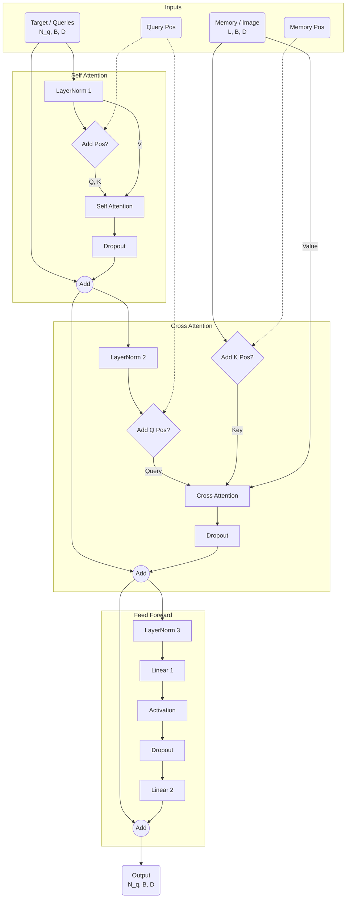

# TransformerDecoderLayerv1 Documentation

This document details the architecture and data flow of the `TransformerDecoderLayerv1` class defined in `sam3/model/decoder.py`. This class implements a standard Transformer Decoder layer with support for Pre-Norm/Post-Norm variants and a specific Divide-and-Conquer (DAC) decoding strategy.

## Overview

The `TransformerDecoderLayerv1` is a composite layer consisting of three main sub-blocks:
1.  **Self-Attention**: Processes interactions between queries.
2.  **Cross-Attention**: Processes interactions between queries (features) and memory (image features).
3.  **Feed-Forward Network (FFN)**: Applies a point-wise **MLP (Multilayer Perceptron)** to the features.

> **Note on MLP**: In the context of Transformers, "MLP" typically refers to a **Position-wise Feed-Forward Network**. It consists of two linear transformations with a non-linear activation function in between. It processes each token position independently and identically, distinguishing it from attention layers which mix information across the sequence.
>
> **Why is it called MLP?**
> The term "Multilayer Perceptron" (MLP) historically refers to a neural network with at least one hidden layer (and thus multiple layers of neurons/perceptrons). Although the block here is simple (Input $\to$ Hidden $\to$ Output), it technically satisfies the definition of an MLP. In modern Transformer literature, "FFN" (Feed-Forward Network) and "MLP" are used interchangeably to describe this block.

It supports conditional positional encoding injection and a split-processing strategy for queries known as "DAC" (Divide-and-Conquer).

## Initialization Parameters

| Parameter | Type | Description |
| :--- | :--- | :--- |
| `d_model` | `int` | The dimension of the input/output embeddings (e.g., 256). |
| `dim_feedforward` | `int` | The inner dimension of the FFN (e.g., 2048). |
| `dropout` | `float` | Dropout probability. |
| `activation` | `str` | Activation function used in the FFN (e.g., 'relu'). |
| `pre_norm` | `bool` | If `True`, applies LayerNorm before attention/MLP blocks (Pre-Norm). If `False`, applies after (Post-Norm). |
| `self_attention` | `nn.Module` | The module used for self-attention. |
| `cross_attention` | `nn.Module` | The module used for cross-attention. |
| `pos_enc_at_attn` | `bool` | Whether to add positional encoding to Query/Key in Self-Attention. |
| `pos_enc_at_cross_attn_queries` | `bool` | Whether to add positional encoding to Query in Cross-Attention. |
| `pos_enc_at_cross_attn_keys` | `bool` | Whether to add positional encoding to Key in Cross-Attention. |

## Data Flow & Shape Analysis

**Notation:**
- $B$: Batch Size
- $N_q$: Number of Queries (`tgt` length)
- $L$: Memory Sequence Length ($Memory Spatial Height \times Width$)
- $D$: Model Dimension (`d_model`)
- $D_{ffn}$: Feedforward Dimension (`dim_feedforward`)

### 1. Inputs

The `forward_pre` method (Pre-Norm variant) accepts the following primary tensors:

- **Target (`tgt`)**: Shape $(N_q, B, D)$ representing the query features.
- **Memory (`memory`)**: Shape $(L, B, D)$ representing the image context features.
- **Query Pos (`query_pos`)**: Shape $(N_q, B, D)$ representing positional encodings for the queries.
- **Memory Pos (`pos`)**: Shape $(L, B, D)$ representing positional encodings for the memory.

### 2. Forward Logic (Pre-Norm Variant)

The layer sequentially processes the input through Self-Attention, Cross-Attention, and FFN.

#### Phase 1: Self-Attention
This block allows queries to attend to each other.

1.  **DAC Split (Optional)**:
    If `dac=True`, the input `tgt` is split into two halves along the query dimension ($N_q$). Self-attention is applied **only to the first half** ($N_q/2$).
    - `active_tgt`: $0$ to $N_q/2$
    - `passive_tgt`: $N_q/2$ to $N_q$ (bypasses self-attention)

2.  **Normalization**:
    $$ X_{norm} = \text{LayerNorm1}(tgt) $$

3.  **Positional Encoding Injection**:
    - Query ($Q$): $X_{norm} + query\_pos$ (if `pos_enc_at_attn` is True, else $X_{norm}$)
    - Key ($K$): $X_{norm} + query\_pos$ (if `pos_enc_at_attn` is True, else $X_{norm}$)
    - Value ($V$): $X_{norm}$

    > **Note on Q/K Identity**: In Self-Attention, the query and key inputs are often identical (same source `tgt` + `pos`). However, the `MultiheadAttention` module applies **different learnable linear projections** ($W_q$ vs $W_k$) to these inputs internally. Thus, the projected vectors used for the dot product $QK^T$ are effectively distinct.

4.  **Attention**:
    $$ X_{attn} = \text{SelfAttention}(Q, K, V) $$

5.  **Residual & Dropout**:
    $$ tgt = tgt + \text{Dropout1}(X_{attn}) $$

6.  **DAC Recombine (Optional)**:
    If `dac=True`, the processed `active_tgt` is concatenated back with the unprocessed `passive_tgt` to restore the full $(N_q, B, D)$ shape.

#### Phase 2: Cross-Attention
This block allows queries to extract information from the memory (image features).

1.  **Normalization**:
    $$ X_{norm} = \text{LayerNorm2}(tgt) $$

2.  **Positional Encoding Injection**:
    - Query ($Q$): $X_{norm} + query\_pos$ (if `pos_enc_at_cross_attn_queries` is True, else $X_{norm}$)
    - Key ($K$): $memory + pos$ (if `pos_enc_at_cross_attn_keys` is True, else $memory$)
    - Value ($V$): $memory$

3.  **Attention**:
    $$ X_{attn} = \text{CrossAttention}(Q, K, V) $$

4.  **Residual & Dropout**:
    $$ tgt = tgt + \text{Dropout2}(X_{attn}) $$

#### Phase 3: Feed-Forward Network (FFN)
Standard MLP block processing each token independently.

1.  **Normalization**:
    $$ X_{norm} = \text{LayerNorm3}(tgt) $$

2.  **MLP Operation**:
    $$ X_{mlp} = \text{Linear2}(\text{Dropout}(\text{Activation}(\text{Linear1}(X_{norm})))) $$
    - Linear1: Projects $D \to D_{ffn}$.
    - Linear2: Projects $D_{ffn} \to D$.

3.  **Residual & Dropout**:
    $$ tgt = tgt + \text{Dropout3}(X_{mlp}) $$

## Visual Workflow

## Summary of Operations

| Layer | Input Shape | Operation | Output Shape | Parameters (Main) |
| :--- | :--- | :--- | :--- | :--- |
| **Norm 1** | $(N_q, B, D)$ | Layer Normalization | $(N_q, B, D)$ | $2 \times D$ |
| **Self Attn** | $(N_q, B, D)$ | Multi-Head Attention | $(N_q, B, D)$ | $4 \times D^2$ (approx) |
| **Norm 2** | $(N_q, B, D)$ | Layer Normalization | $(N_q, B, D)$ | $2 \times D$ |
| **Cross Attn** | Q:$(N_q, B, D)$, KV:$(L, B, D)$ | Multi-Head Attention | $(N_q, B, D)$ | $4 \times D^2$ (approx) |
| **Norm 3** | $(N_q, B, D)$ | Layer Normalization | $(N_q, B, D)$ | $2 \times D$ |
| **Linear 1** | $(N_q, B, D)$ | Linear Projection | $(N_q, B, D_{ffn})$ | $D \times D_{ffn}$ |
| **Linear 2** | $(N_q, B, D_{ffn})$ | Linear Projection | $(N_q, B, D)$ | $D_{ffn} \times D$ |