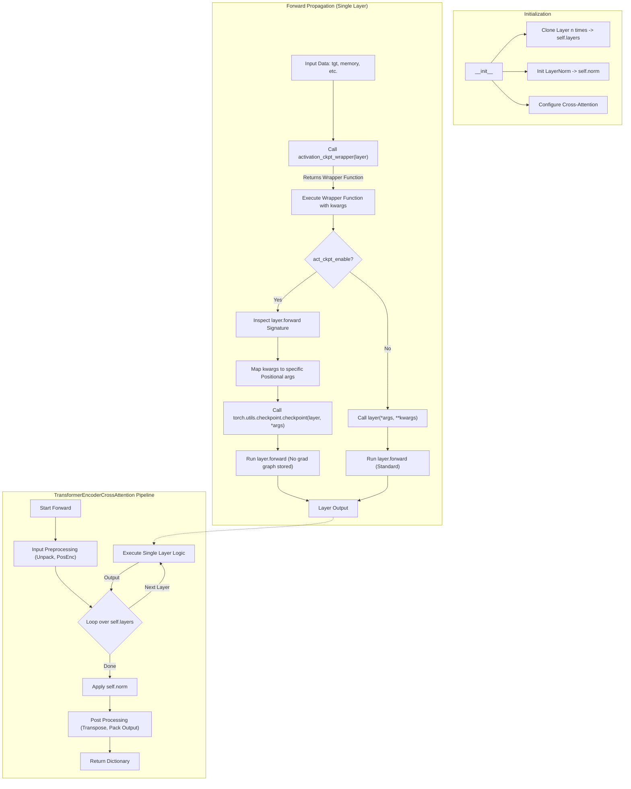

# TransformerEncoderCrossAttention Code Analysis

This document details the implementation of the `TransformerEncoderCrossAttention` class found in `sam3/model/decoder.py`. It explains the network construction, the forward propagation logic, and specifically addresses the implementation details of the `activation_ckpt_wrapper`.

## 1. Network Construction (`__init__`)

The `TransformerEncoderCrossAttention` class is a module designed to process self-attention inputs (`src`) while attending to cross-attention inputs (`prompt`).

### Key Components:

*   **Layer Duplication**: 
    The class takes a template `layer` (usually a `TransformerDecoderLayer`) and duplicates it `num_layers` times using `get_clones`. These become the stack of layers that data will pass through.
    ```python
    self.layers = get_clones(layer, num_layers)
    ```

*   **Normalization**: 
    It initializes a LayerNorm that will be applied to the final output.
    ```python
    self.norm = nn.LayerNorm(d_model)
    ```

*   **Cross Attention Control**:
    It supports selectively removing cross-attention from specific layers via `remove_cross_attention_layers`. If a layer index is flagged to have cross-attention removed, it manually sets that layer's `cross_attn_image`, `norm2`, and `dropout2` to `None`.

*   **Freezing**:
    If `frozen=True` is passed, it iterates through all parameters and sets `requires_grad_(False)`.

## 2. Forward Propagation (`forward`)

The `forward` method processes the input sequence through the stack of layers.

### Input Handling
*   **List Unpacking**: It supports inputs (`src`, `src_key_padding_mask`, `src_pos`) being wrapped in a list (common in some detection frameworks) and unpacks them.
*   **Positional Encoding**: If `pos_enc_at_input` is True, it adds a scaled positional encoding to the input `src` before processing: `output = output + 0.1 * src_pos`.
*   **Batch First**: If configured, it transposes dimensions `(0, 1)` to switch between sequence-first and batch-first formats.

### Layer Iteration and Activation / Gradient Checkpointing
The core loop iterates through each layer in `self.layers`. This is where the **Activation Checkpointing** logic is applied.

```python
for layer in self.layers:
    # ... (RoPE keyword handling) ...

    output = activation_ckpt_wrapper(layer)(
        tgt=output,
        memory=prompt,
        tgt_mask=src_mask,
        # ... other arguments ...
        act_ckpt_enable=self.training and self.use_act_checkpoint,
        **kwds,
    )
    
    # Normalize the output of the current layer (Note: effectively only the last one is used for return)
    normed_output = self.norm(output)
```

### Output
After the loop, it handles the batch-first transposition again (if needed) and returns a text dictionary containing the final normalized memory, positional embeddings, and padding masks.

## 3. Deep Dive: `activation_ckpt_wrapper`

You may notice the specific syntax used to call the layer:

```python
output = activation_ckpt_wrapper(layer)(
    tgt=output, 
    # ... args ...
)
```

### How it works

1.  **Function Generation**: `activation_ckpt_wrapper(layer)` is a call that returns a **wrapper function** (a closure). This wrapper function "remembers" the specific `layer` instance you passed to it.
2.  **Execution**: The subsequent `(...)` calls this wrapper function with your arguments (`tgt`, `memory`, etc.).

### Logic Flow

The wrapper function (`act_ckpt_utils.py`) contains logic to handle **Gradient Checkpointing**:

*   **If `act_ckpt_enable=True`**:
    *   **Argument Reordering**: PyTorch's `checkpoint.checkpoint` API requires positional arguments to work correctly for gradient tracking. The wrapper inspects `layer.forward`'s signature, takes your keyword arguments (like `tgt=...`), and rearranges them into an ordered list of positional arguments (`*args`).
    *   **Execution**: It calls `torch.utils.checkpoint.checkpoint(layer, *args)`. This runs the layer without saving intermediate activations for backprop (saving VRAM), and re-computes them during the backward pass (costing compute).
    *   **Note**: `checkpoint.checkpoint` here does **not** mean loading weights from disk. It refers to the "re-computation" strategy for memory optimization.

*   **If `act_ckpt_enable=False`**:
    *   **Direct Call**: It simply calls `layer(*args, **kwargs)`. This is the standard forward pass: `module.forward(...)`.

## 4. Visual Workflow

The following flowchart illustrates the complete process from initialization to forward propagation, including the activation checkpointing mechanism.



## 5. Summary of Q&A

*   **Q: What does `activation_ckpt_wrapper(layer)` return?**
    *   A: It returns a callable function (the wrapper).
*   **Q: What arguments does this new function accept?**
    *   A: It accepts the same arguments as `layer.forward` (e.g., `tgt`, `memory`), plus control arguments like `act_ckpt_enable`.
*   **Q: Does it return a module?**
    *   A: No, it assumes `layer` is already an initialized module. The wrapper returns the **Tensor output** of the forward pass.
*   **Q: What is the parameter processing code doing in `act_ckpt_utils.py`?**
    *   A: You correctly identified that it is reorganizing parameters. Since `checkpoint` relies on positional arguments, the code uses strict inspection of the module's signature to convert flexible Keyword Arguments (`kwargs`) into rigid Positional Arguments (`*args`) to ensure the checkpointing mechanism functions correctly.