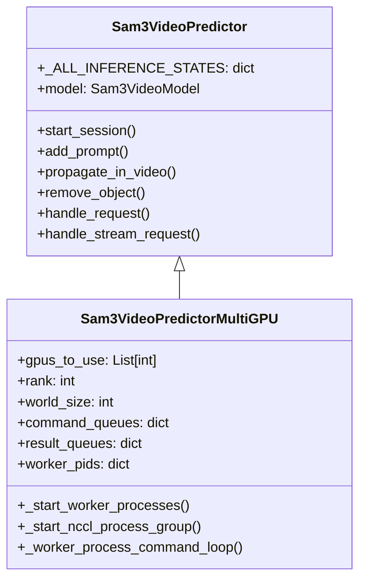
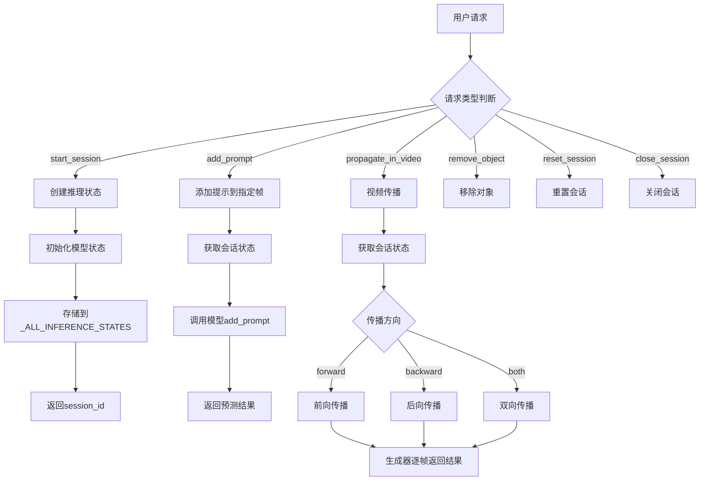
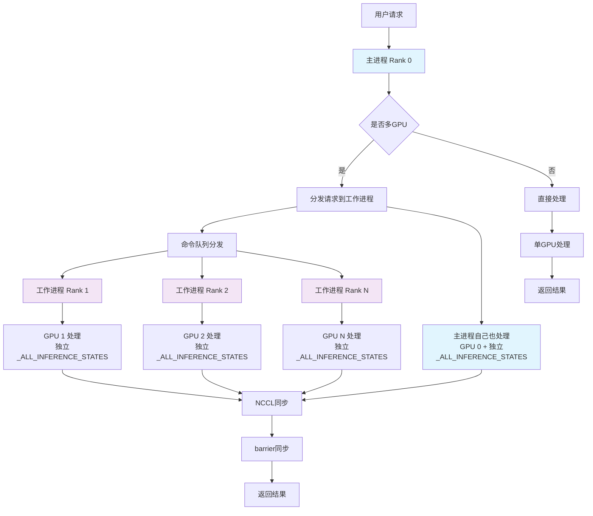
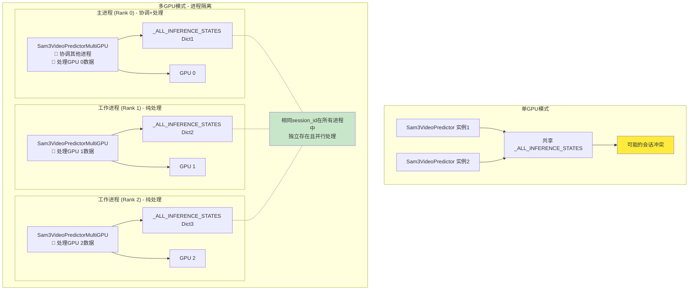
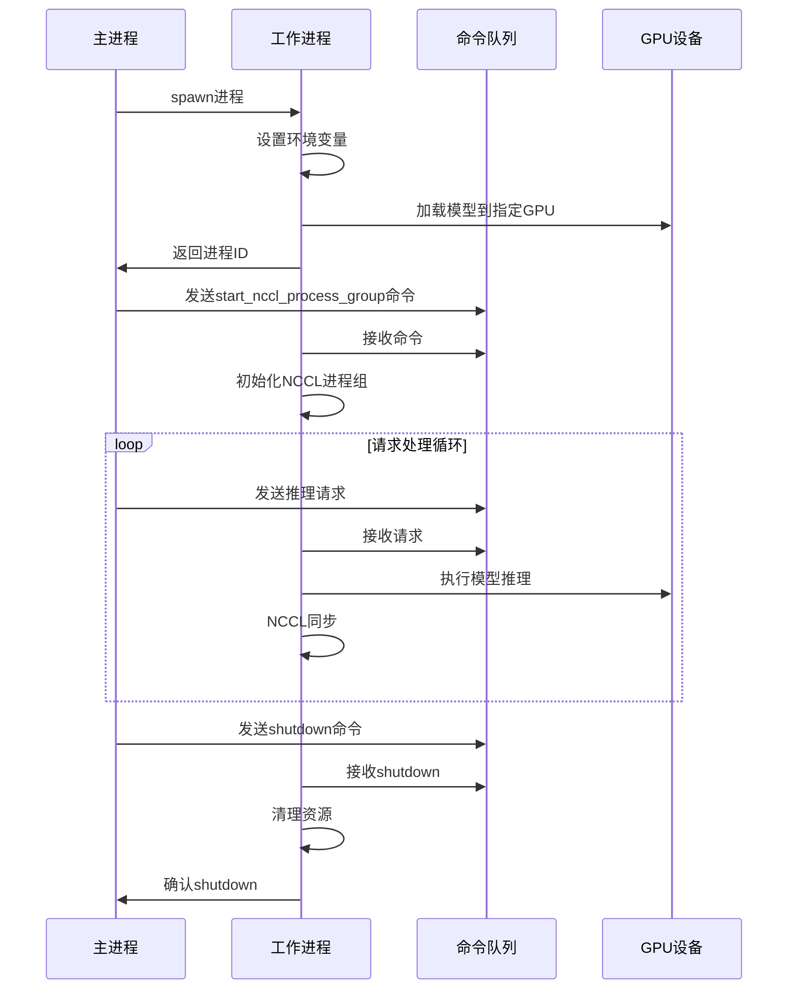

# Sam3 Video Predictor 类详细分析

## 概述

这个文件`sam3/model/sam3_video_predictor.py` 包含两个主要的类：`Sam3VideoPredictor` 和 `Sam3VideoPredictorMultiGPU`。它们是SAM3（Segment Anything Model 3）视频预测器的实现，用于在视频中进行对象分割和跟踪。

## Sam3VideoPredictor 类

### 功能描述

`Sam3VideoPredictor` 是基础的单GPU视频预测器类，提供以下核心功能：

1. **会话管理**：管理多个并发的推理会话
2. **提示处理**：支持文本、点击、边界框等多种提示方式
3. **视频传播**：在视频帧之间传播分割结果
4. **对象跟踪**：跟踪和移除特定对象

### 关键特性

- **状态管理**：使用类级别字典 `_ALL_INFERENCE_STATES` 存储所有会话状态
- **多模态提示**：支持文本、点击点、边界框等多种输入方式
- **异步帧加载**：可选的异步视频帧加载机制
- **双向传播**：支持前向、后向或双向的视频传播

### ⚠️ 重要：_ALL_INFERENCE_STATES 的作用域分析

`_ALL_INFERENCE_STATES = {}` 是一个**类变量**（class variable），这意味着：

#### 在单GPU模式下：
- 所有 `Sam3VideoPredictor` 实例**共享同一个字典**
- 如果创建多个predictor实例，它们会共享相同的会话状态
- 这可能导致会话ID冲突或意外的状态共享

#### 在多GPU模式下：
- 每个**进程**都有自己独立的内存空间
- 每个worker进程中的 `Sam3VideoPredictorMultiGPU` 实例都有**独立的** `_ALL_INFERENCE_STATES` 字典
- 主进程（rank 0）有一个，每个worker进程（rank 1, 2, ..., N）都有各自独立的一个
- 这意味着相同的session_id可能在不同的GPU进程中存在，但它们是完全独立的

```python
# 第25行的类变量定义
class Sam3VideoPredictor:
    _ALL_INFERENCE_STATES = {}  # 类级别共享变量
```

### 主要方法

- `start_session()`: 创建新的推理会话
- `add_prompt()`: 在指定帧添加提示
- `propagate_in_video()`: 在视频中传播分割结果
- `remove_object()`: 移除跟踪的对象
- `reset_session()`: 重置会话状态
- `close_session()`: 关闭会话并清理资源

## Sam3VideoPredictorMultiGPU 类

### 功能描述

`Sam3VideoPredictorMultiGPU` 是 `Sam3VideoPredictor` 的子类，专门为多GPU环境设计，提供分布式推理能力。

### 继承关系



### 附加功能实现

#### 1. 多进程架构

`Sam3VideoPredictorMultiGPU` 实现了主从进程架构：

- **主进程 (Rank 0)**：负责接收请求、协调工作进程
- **工作进程 (Rank 1-N)**：在不同GPU上执行实际的模型推理

#### 2. 分布式通信

使用NCCL (NVIDIA Collective Communications Library) 实现GPU间通信：

```python
# 初始化NCCL进程组
torch.distributed.init_process_group(
    backend="nccl",
    init_method="env://",
    timeout=timeout,
    device_id=self.device,
)
```

#### 3. 请求分发机制

重写了 `handle_request()` 和 `handle_stream_request()` 方法：

- 主进程接收请求后分发到所有工作进程
- 使用 `torch.distributed.barrier()` 确保所有进程同步完成

## 数据处理流程图

### 单GPU处理流程



### 多GPU处理流程



**关键点说明**：
- 主进程（Rank 0）既负责**协调**又负责**实际处理**
- 主进程使用GPU 0进行推理，同时管理其他worker进程
- 所有进程（包括主进程）都参与NCCL同步
- 每个进程都有自己独立的 `_ALL_INFERENCE_STATES`

### 会话状态管理机制



### Session ID 分发策略

在多GPU模式下，特别需要注意的是session_id的生成和分发机制：

1. **主进程生成session_id**：
   ```python
   # 第342-343行
   if request["type"] == "start_session" and request.get("session_id") is None:
       request["session_id"] = str(uuid.uuid4())
   ```

2. **分发到所有工作进程**：
   ```python
   # 第345-347行
   if self.world_size > 1 and self.rank == 0:
       for rank in range(1, self.world_size):
           self.command_queues[rank].put((request, False))
   ```

这确保了所有进程使用相同的session_id，但每个进程在自己的内存空间中独立维护会话状态。

### 工作进程生命周期



## 核心特性对比

| 特性 | Sam3VideoPredictor | Sam3VideoPredictorMultiGPU |
|------|-------------------|---------------------------|
| GPU支持 | 单GPU | 多GPU分布式 |
| 内存使用 | 较低 | 较高（多进程） |
| 推理速度 | 中等 | 高（并行处理） |
| 复杂度 | 简单 | 复杂（进程管理） |
| 适用场景 | 小规模推理 | 大规模生产环境 |

## 多GPU实现的关键技术

### 1. 进程间通信
- 使用 `multiprocessing.Queue` 实现命令和结果传递
- 采用 "spawn" 上下文避免CUDA上下文冲突

### 2. 同步机制
- `torch.distributed.barrier()` 确保所有进程同步
- 超时机制防止死锁

### 3. 资源管理
- 自动检测和分配可用GPU
- 优雅的进程关闭和资源清理

### 4. 容错处理
- 父进程监控机制
- 异常捕获和日志记录

## 使用场景

### Sam3VideoPredictor
- 原型开发和测试
- 小规模视频分割任务
- 资源受限的环境

### Sam3VideoPredictorMultiGPU
- 生产环境部署
- 大规模视频处理
- 需要高吞吐量的场景
- 多GPU服务器环境

## 总结

`Sam3VideoPredictorMultiGPU` 通过继承 `Sam3VideoPredictor` 并添加分布式处理能力，实现了：

1. **水平扩展**：支持多GPU并行处理
2. **负载均衡**：请求在多个GPU间分布
3. **高可用性**：容错和恢复机制
4. **性能优化**：NCCL通信和同步优化

这种设计模式体现了面向对象编程中的**开闭原则**，在不修改基类的情况下扩展了功能，同时保持了API的一致性。

## 设计考虑和潜在问题

### 类变量共享的深入分析

#### 单GPU模式的潜在问题：

1. **会话冲突风险**：
   ```python
   # 危险的使用模式
   predictor1 = Sam3VideoPredictor(checkpoint_path="model.pth")
   predictor2 = Sam3VideoPredictor(checkpoint_path="model.pth")
   
   # 两个实例共享同一个 _ALL_INFERENCE_STATES 字典
   session1 = predictor1.start_session("video1.mp4")
   session2 = predictor2.start_session("video2.mp4")
   
   # 可能导致意外的会话交叉访问
   ```

2. **内存泄漏风险**：一个实例创建的会话可能被另一个实例意外保留
3. **并发安全性**：多线程环境下可能出现竞态条件

#### 多GPU模式的优势设计：

1. **进程隔离**：每个GPU进程有独立的内存空间和会话状态
2. **容错性**：一个进程崩溃不会影响其他进程的会话
3. **可扩展性**：可以独立扩展每个GPU的处理能力

### 会话ID的统一管理

在多GPU模式下，虽然每个进程维护独立的 `_ALL_INFERENCE_STATES`，但所有进程使用相同的session_id来处理同一个会话请求：

```python
# 主进程统一生成session_id (line 342-343)
if request["type"] == "start_session" and request.get("session_id") is None:
    request["session_id"] = str(uuid.uuid4())

# 然后分发到所有worker进程 (line 345-347)
for rank in range(1, self.world_size):
    self.command_queues[rank].put((request, False))
```

这确保了：
- 所有GPU处理相同session_id的请求
- 每个GPU在自己的内存空间中独立维护该会话的状态
- 通过NCCL同步确保处理的一致性

### 最佳实践建议

#### 对于单GPU使用：
```python
# ✅ 推荐：使用单例模式或确保只创建一个实例
predictor = Sam3VideoPredictor(checkpoint_path="model.pth")

# ❌ 避免：在同一程序中创建多个实例
# predictor1 = Sam3VideoPredictor(...)  # 会导致状态共享
# predictor2 = Sam3VideoPredictor(...)  # 会导致状态共享
```

#### 对于多GPU使用：
```python
# ✅ 正确：让MultiGPU类管理所有进程和状态
predictor = Sam3VideoPredictorMultiGPU(
    checkpoint_path="model.pth",
    gpus_to_use=[0, 1, 2, 3]
)
```

### 架构改进建议

如果要改进这个设计，可以考虑：

1. **使用实例变量**：
   ```python
   class Sam3VideoPredictor:
       def __init__(self, ...):
           self._inference_states = {}  # 实例变量而非类变量
   ```

2. **添加会话管理器**：
   ```python
   class SessionManager:
       def __init__(self):
           self._sessions = {}
           self._lock = threading.Lock()
   ```

3. **使用线程安全的数据结构**：在多线程环境下确保安全性

### 当前实现的权衡

**优点**：
- 简单直接的实现，便于理解和维护
- 在多GPU模式下通过进程隔离完美避免了竞态条件
- 保持了API的简洁性和一致性
- 利用进程级隔离实现了天然的容错机制

**缺点**：
- 单GPU模式下的类变量共享可能导致意外行为
- 缺乏显式的会话生命周期管理
- 在复杂应用场景中可能需要额外的协调机制
- 对开发者的使用规范有一定要求

### 设计哲学

这个设计选择体现了分布式系统设计中的重要原则：
- **进程级隔离 > 线程级同步**：通过进程隔离避免复杂的同步机制
- **简单性 > 完美性**：选择简单直接的实现方式，将复杂性通过架构设计解决
- **一致性 > 灵活性**：保持API的一致性，降低使用门槛

这种设计在SAM3这样的大型模型推理场景中是合理的，因为：
1. 模型加载成本高，通常不会频繁创建实例
2. 多GPU场景下的进程隔离提供了更好的稳定性
3. 简单的API设计降低了使用复杂度