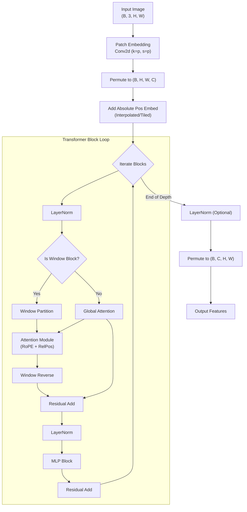

# ViT (Vision Transformer for Detection)

Arguments: `sam3/model/vitdet.py`

## Overview

The `ViT` class implements a plain Vision Transformer backbone adapted for object detection tasks, commonly referred to as **ViTDet**. Unlike standard ViTs used for classification, this backbone is optimized to process high-resolution images efficiently using **Window Attention** and partial **Global Attention**.

It serves as the **Image Encoder** in the SAM 3 architecture, transforming raw input images into dense feature embeddings.

## Core Components

### 1. ViT (Main Container)
The entry point of the backbone. It orchestrates the patching and the stack of transformer blocks.

*   **Patch Embedding**: Converts image pixels into token embeddings using a convolution layer key `kernel_size=patch_size`.
*   **Positional Embedding**: A learnable parameter tensor ($1 \times N_{pos} \times C$) initialized with specific distributions (e.g., truncated normal) to encode spatial information.
    *   **Initialization**: Created as a `nn.Parameter` with shape based on the pretraining image size (e.g., $224^2/16^2$ or $1024^2/16^2$). It is initialized with zeros and then filled with values from a truncated normal distribution (std=0.02).
    *   **Adaptation**: During inference, if the input resolution differs from the pretraining resolution, the 1D embedding sequence is reshaped to a 2D grid and then **interpolated** (bicubic) or **tiled** to match the current feature map size $(H, W)$.
    *   **Learning**: As a parameter of the model, its values are updated via gradient descent during training, allowing the model to learn optimal spatial biases.
    *   **Physical Meaning**: Unlike RoPE which uses fixed mathematical rotations to encode *relative* distance, Absolute Positional Embeddings provide a unique "spatial signature" or "coordinate tag" for each grid location. Without them, the Transformer would view the image as a bag of shuffled patches (permutation invariant). Through training, these embeddings learn the 2D topology of the image—if you visualize the similarity between learned embeddings, they naturally reconstruct the 2D grid structure (i.e., position $(i,j)$ is most similar to its neighbors).

    > **Note on Hybrid Encodings**: This model often uses a hybrid approach:
    > 1.  **Absolute Positional Embedding** (`self.pos_embed`): **Learned parameters**. Added *once* at the beginning to give tokens a global coordinate identity.
    > 2.  **RoPE / RelPos** (Inside Attention): **Fixed math (RoPE)** or **Learned biases (RelPos)**. Applied *at each layer* to model the interaction between tokens based on their relative distance. RoPE is parameter-free (no learning required after setup), while RelPos uses learned tables.
*   **Block Stacking**: Manages a list of `Block` modules. It distinguishes between:
    *   **Window Attention Blocks**: Restrict attention to local windows (e.g., 14x14) to save computational cost.
    *   **Global Attention Blocks**: Perform full self-attention across the entire image at specific indices (defined by `global_att_blocks`, e.g., indices 2, 5, 8, 11) to allow information propagation.

### 2. Block (Transformer Block)
Represents a single layer in the transformer depth.

$$
\text{Block}(x) = \text{MLP}(\text{Norm}_2(\text{Attention}(\text{Norm}_1(x)) + x)) + x
$$

*   **Window Partitioning**: If `window_size > 0`, input features $(B, H, W, C)$ are reshaped and permuted into windows $(B \times N_{win}, window\_size, window\_size, C)$ before attention.
*   **LayerScale**: Learnable diagonal scaling applied to the output of Attention and MLP (improves deep model convergence).
*   **DropPath**: Stochastic depth for regularization.

### 3. Attention (Backbone Specific)
A Multi-Head Self-Attention (MHSA) module heavily customized for vision tasks.

*   **2D RoPE (Rotary Positional Embeddings)**: Rotates Query and Key vectors based on their 2D spatial positions.
*   **Relative Positional Embeddings**: Learnable biases added to the attention logits based on relative distances between tokens.
*   **Formula**:
    $$ \text{Attention}(Q, K, V) = \text{Softmax}\left(\frac{Q_{rope} K_{rope}^T + \text{RelPosBias}}{\sqrt{d_k}}\right) V $$

## Data Flow & Shapes

Assuming input config: `img_size=1024`, `patch_size=16`, `embed_dim=768`.

1.  **Input**: `(B, 3, 1024, 1024)`
2.  **Patch Embed**:
    *   Conv2d(3, 768, kernel=16, stride=16) $\rightarrow$ `(B, 768, 64, 64)`
    *   Flatten/Permute $\rightarrow$ `(B, 64, 64, 768)`
3.  **Positional Embed**: Add Absolute Positional Embeddings (interpolated if necessary).
4.  **Transformer Blocks (Loop N times)**:
    *   **Input**: `(B, H, W, C)`
    *   **Window Partition** (if applicable): `(B * NumWindows, WinSize, WinSize, C)`
    *   **Attention**:
        *   QKV Projection.
        *   Apply RoPE / RelPos.
        *   Scaled Dot Product Attention.
    *   **Window Unpartition**: Restore `(B, H, W, C)`.
    *   **MLP**: Point-wise feed forward.
5.  **Output**: List of feature tensors (usually just the final layer, or intermediate layers for FPN).
    *   Format: `(B, C, H, W)` -> e.g., `(B, 768, 64, 64)`.

## Workflow Visualization



## Attention Internals Detail

The `Attention` module in `vitdet.py` handles the spatial grid explicitly.

```mermaid
flowchart TD
    Input["x: (B, L, C)"] --> QKV[Linear QKV]
    QKV --> Split["Split Q, K, V"]
    
    Split --> RoPE["Apply 2D RoPE<br/>(Rotate Q, K based on H, W)"]
    RoPE --> RelPos[Calc Relative Pos Bias]
    
    RelPos --> SDPA["Scaled Dot Product Attention<br/>Softmax((QK^T + Bias)/scale) * V"]
    SDPA --> Proj[Output Projection]
    Proj --> Out["Out: (B, L, C)"]