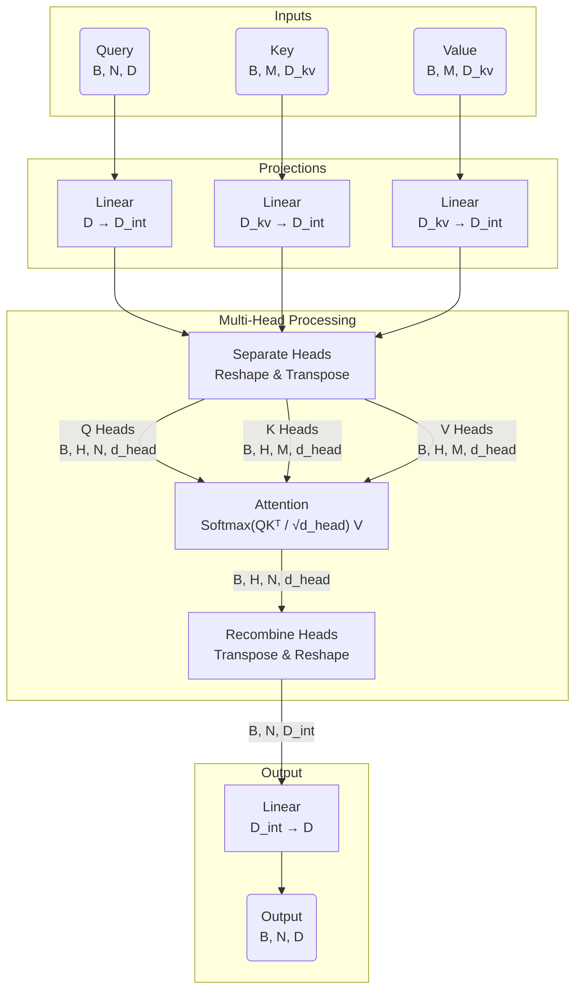
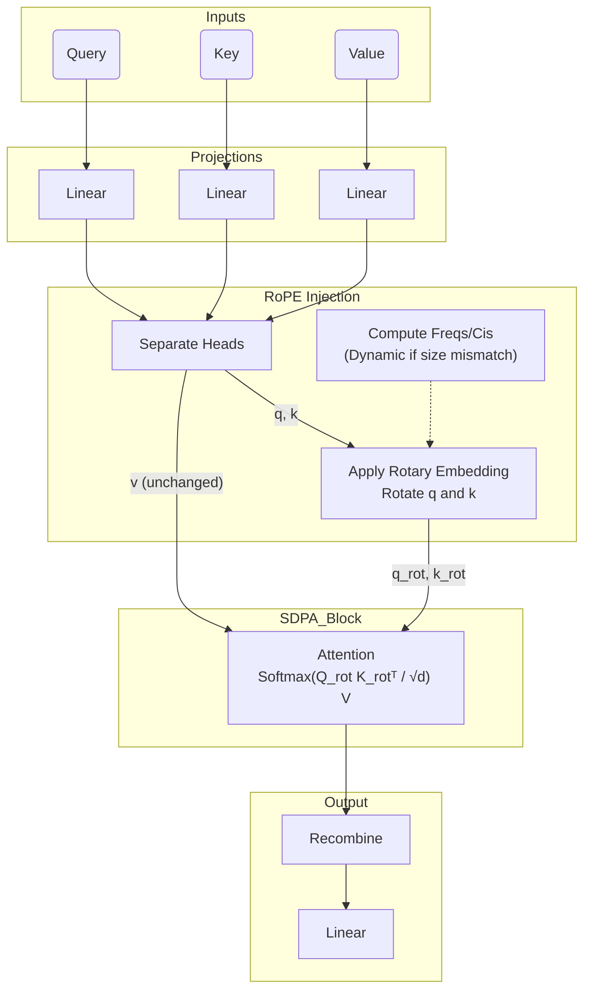
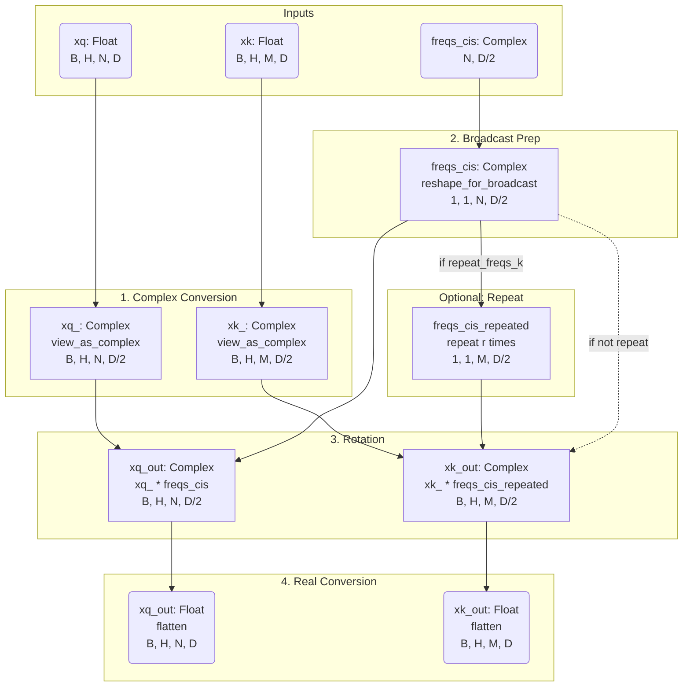

# Attention Module Documentation

This document details the architecture and data flow of the `Attention` class defined in `sam3/sam/transformer.py`. This module implements a Multi-Head Attention mechanism with an optional feature for downscaling the internal embedding dimension to reduce computational cost.

## Overview

The `Attention` layer projects inputs (Queries, Keys, Values) into an internal dimension space, splits them into multiple heads, performs scaled dot-product attention, and finally projects the result back to the original embedding dimension.

## Initialization Parameters

| Parameter | Symbol | Description | Default |
| :--- | :--- | :--- | :--- |
| `embedding_dim` | $D$ | The size of the input/output embeddings (specifically for Queries). | Required |
| `num_heads` | $H$ | The number of attention heads. | Required |
| `downsample_rate` | $R$ | Factor by which to reduce the internal dimension. $D_{int} = D / R$. | 1 |
| `dropout` | $P_{drop}$ | Dropout probability applied to attention weights. | 0.0 |
| `kv_in_dim` | $D_{kv}$ | The dimension size of input Keys and Values. If `None`, defaults to $D$. | None |
| `use_fa3` | - | Whether to use Flash Attention 3 implementation explicitly. | False |

## Data Flow & Shape Analysis

Let the input batch size be $B$.
Let the number of Query tokens be $N$.
Let the number of Key/Value tokens be $M$.

> **Understanding dimensions:**
> - **$B$ (Batch Size)**: The number of independent samples processed in parallel.
>   - *NLP Example*: Number of sentences in a batch.
>   - *Vision Example*: Number of images processed simultaneously.
> - **$N$ / $M$ (Sequence Length)**: The number of elements (tokens) in the sequence.
>   - *NLP Example*: Number of words/sub-words in a sentence.
>   - *Vision Example*: Number of flattened feature vectors (or patches) derived from the image. For instance, if a CNN backbone outputs feature maps of spatial size $h \times w$, then $N = h \times w$.

Let the internal dimension be $D_{int} = D / R$.
Let the dimension per head be $d_{head} = D_{int} / H$.

### 1. Inputs

The `forward` method maps three tensors: `q` (Queries), `k` (Keys), and `v` (Values).

- **Input Q (`q`)**: Shape $(B, N, D)$
- **Input K (`k`)**: Shape $(B, M, D_{kv})$
- **Input V (`v`)**: Shape $(B, M, D_{kv})$

> **Note**: $N$ and $M$ can be the same (self-attention) or different (cross-attention).

### 2. Input Projections (Linear Transformation)

The inputs are projected into the internal dimension $D_{int}$ using linear layers.

- `q_proj`: $D \to D_{int}$
- `k_proj`: $D_{kv} \to D_{int}$
- `v_proj`: $D_{kv} \to D_{int}$

**Shapes after protection:**
- $Q \rightarrow (B, N, D_{int})$
- $K \rightarrow (B, M, D_{int})$
- $V \rightarrow (B, M, D_{int})$

### 3. Head Separation

The tensors are reshaped to separate the channel dimension $D_{int}$ into $H$ heads of size $d_{head}$. They are then transposed to bring the head dimension forward for parallel processing.

Operation: `(B, Length, D_int) -> (B, Length, H, d_head) -> (B, H, Length, d_head)`

**Shapes after separation:**
- $Q \rightarrow (B, H, N, d_{head})$
- $K \rightarrow (B, H, M, d_{head})$
- $V \rightarrow (B, H, M, d_{head})$

### 4. Attention Mechanism

Scaled Dot Product Attention is applied: $\text{Softmax}(\frac{QK^T}{\sqrt{d_{head}}})V$. This step calculates the correlation between Queries and Keys and weights the Values accordingly.

- If `use_fa3` is True: Uses `flash_attn_func`.
- Otherwise: Uses `F.scaled_dot_product_attention` (which dispatches to FlashAttention, MemEfficient, or Math kernels automatically).

**Shape after attention:**
- Output $\rightarrow (B, H, N, d_{head})$

### 5. Head Recombination

The attention output is transposed back and reshaped to merge the heads back into a single continuous internal dimension.

Operation: `(B, H, N, d_head) -> (B, N, H, d_head) -> (B, N, D_int)`

**Shape after recombination:**
- Output $\rightarrow (B, N, D_{int})$

### 6. Output Projection

Finally, the output is projected from the internal dimension back to the original `embedding_dim`.

- `out_proj`: $D_{int} \to D$

**Final Output Shape:**
- Output $\rightarrow (B, N, D)$

## Summary of Dimensions

| Stage | Shape | Description |
| :--- | :--- | :--- |
| **Input** | $(B, N, D)$ | Raw Query input |
| **Projected** | $(B, N, D_{int})$ | Project to internal dim ($D_{int} = D / R$) |
| **Heads** | $(B, H, N, d_{head})$ | Split into $H$ heads ($d_{head} = D_{int} / H$) |
| **Attention Out**| $(B, H, N, d_{head})$ | Contextualized vectors per head |
| **Recombined** | $(B, N, D_{int})$ | Heads merged back |
| **Final Output** | $(B, N, D)$ | Projected back to original embedding dim |

## Visual Workflow



## Parameter Count Analysis

This section details the calculation of trainable parameters in the `Attention` layer. The parameters are contained entirely within the four linear projections: `q_proj`, `k_proj`, `v_proj`, and `out_proj`.

**Definitions:**
*   $D$: `embedding_dim`
*   $D_{kv}$: `kv_in_dim`
*   $D_{int}$: `internal_dim` ($D / R$, where $R$ is `downsample_rate`)

Recall that a Linear layer `nn.Linear(in, out)` has:
*   Weights: $out \times in$
*   Bias: $out$
*   **Total**: $out \times (in + 1)$

### Layer breakdown

1.  **Query Projection (`q_proj`)**
    *   Input: $D$, Output: $D_{int}$
    *   Params: $D_{int} \times D + D_{int}$

2.  **Key Projection (`k_proj`)**
    *   Input: $D_{kv}$, Output: $D_{int}$
    *   Params: $D_{int} \times D_{kv} + D_{int}$

3.  **Value Projection (`v_proj`)**
    *   Input: $D_{kv}$, Output: $D_{int}$
    *   Params: $D_{int} \times D_{kv} + D_{int}$

4.  **Output Projection (`out_proj`)**
    *   Input: $D_{int}$, Output: $D$
    *   Params: $D \times D_{int} + D$

### Total Parameters Formulation

$$
\begin{aligned}
\text{Total} &= \text{Params}(q\_proj) + \text{Params}(k\_proj) + \text{Params}(v\_proj) + \text{Params}(out\_proj) \\
&= [D_{int}(D+1)] + 2 \times [D_{int}(D_{kv}+1)] + [D(D_{int}+1)]
\end{aligned}
$$

### Simplified Scenario (Standard Self-Attention)

In the standard case where:
*   No downsampling is used ($R=1 \implies D_{int} = D$)
*   Keys/Values have same dimension as inputs ($D_{kv} = D$)

The formula simplifies to:

$$
\begin{aligned}
\text{Total} &= D(D+1) + 2D(D+1) + D(D+1) \\
&= 4D(D+1) \\
&= 4D^2 + 4D
\end{aligned}
$$

*   $4D^2$: Weights matrix contribution.
*   $4D$: Bias vector contribution.

## Attention Backend Mechanics

The implementation contains specific configuration flags for the `scaled_dot_product_attention` (SDPA) kernel:

```python
torch.backends.cuda.enable_flash_sdp(True)
torch.backends.cuda.enable_math_sdp(True)
torch.backends.cuda.enable_mem_efficient_sdp(True)
out = F.scaled_dot_product_attention(q, k, v, dropout_p=dropout_p)
```

By explicitly setting all three flags to `True` before the function call, the code **forces PyTorch's dispatcher to consider all available attention kernels**.

1.  **`enable_flash_sdp(True)`**: Enables **Flash Attention** (v2). This is the fastest implementation but has strict hardware (A100, H100, RTX3090/4090, etc.) and shape alignment requirements.
2.  **`enable_mem_efficient_sdp(True)`**: Enables **Memory-Efficient Attention** (based on xFormers). This serves as a robust fallback that is also memory-friendly but slightly slower than Flash Attention. It supports a wider range of hardware and input types.
3.  **`enable_math_sdp(True)`**: Enables the **Math (C++) fallback**. This is the standard naive implementation of attention. It is the slowest and most memory-consuming ($O(N^2)$ memory) but guarantees compatibility if the optimized kernels fail due to hardware or shape constraints.

**Why enable all three?**
PyTorch's SDPA dispatcher automatically selects the most efficient kernel available for the given input shapes, data types, and GPU capabilities. Enabling all three serves as a "reset" or "safety net" to ensure that:
*   The dispatcher isn't restricted by previous global settings in the codebase.
*   It can gracefully degrade from Flash $\to$ MemEfficient $\to$ Math depending on what is supported for the specific tensor configuration at runtime.

---

# RoPEAttention Analysis

`RoPEAttention` is a subclass of `Attention` that introduces **Rotary Position Embeddings (RoPE)**. It inherits the core projection and attention logic but injects positional information into the Queries ($q$) and Keys ($k$) before the attention computation.

## Key Differences & Features

1.  **Rotary Positional Encoding (RoPE)**:
    It rotates the query and key vectors in a high-dimensional space to encode relative position information. This is standard in modern LLMs (like LLaMA) and Vision Transformers as it generalizes better to sequence lengths unseen during training.

2.  **Frequency Calculation (`compute_cis`)**:
    *   Frequencies are precomputed based on `feat_sizes` (spatial dimensions of the image feature map).
    *   **Dynamic Update**: The `forward` method checks if the input spatial dimensions (`q.shape[-2]`) match the precomputed frequencies. If not (e.g., handling an image of a different size), it recalculates `self.freqs_cis` on the fly.
    *   **Real vs. Complex**: Supports both complex number implementation (`torch.complex64`) and real number implementation (via `stack`). The code defaults to looking for complex, but has a `use_rope_real` flag.

3.  **Cross-Attention Support (`rope_k_repeat`)**:
    *   If `rope_k_repeat=True`, it allows the key's RoPE embedding to be repeated. This is crucial for cross-attention mechanisms (e.g., attending to a memory bank or a summarized prompt) where the Key sequence length might need to align with a broadcasting pattern.

## Modified Data Flow

The data flow is identical to the standard `Attention` class up to the **Head Separation** step. After separation, an additional step occurs:

**RoPE Injection Step**:
After `_separate_heads` creates $(B, H, N, d_{head})$, RoPE is applied:

1.  **Reshape**: Treat the sequence length $N$ as a 2D spatial grid $(h, w)$. This assumes $N = h \times w$.
2.  **Apply Rotation**:
    *   $q' = \text{RoPE}(q, \text{freqs})$
    *   $k' = \text{RoPE}(k, \text{freqs})$
    *   Where $\text{freqs}$ encodes the $(x, y)$ coordinates in the image grid.

$$
\begin{aligned}
\text{Attention Input} &: q', k', v \\
\end{aligned}
$$

Note that **Values ($v$) are not rotated**, preserving the semantic content of the information being retrieved.

## Parameter Count

`RoPEAttention` introduces **zero additional trainable parameters** compared to the base `Attention` class. The positional encodings are fixed mathematical functions (sinusoids) determined by `rope_theta` and the input dimensions.

## Updated Visual Workflow



## Internal Mechanics: Position Embedding Logic

This section breaks down exactly how the position embeddings are generated in `compute_axial_cis`.

### Why "Axial"?
Standard RoPE (like in LLaMA) treats the sequence as a 1D line ($0, 1, 2, \dots, N$). However, for images, structure is 2D (height $H$ and width $W$). `compute_axial_cis` separates the feature dimension into two halves:
1.  **First Half ($d/2$)**: Encodes the **X-axis** position.
2.  **Second Half ($d/2$)**: Encodes the **Y-axis** position.

### Logic Breakdown (`compute_axial_cis`)

The function generates "complex exponentials" (cis) which represent rotations ($e^{i \theta} = \cos \theta + i \sin \theta$).

1.  **Frequency Generation**:
    It generates base frequencies $\Theta = \{ \theta^{-2i/d} \}_{i=0}^{d/4}$ for one axis.
    $$ \text{freqs} = \frac{1}{\theta^{2i/d}} $$
    
    > **Why `dim // 4`?**
    > The code uses `torch.arange(0, dim, 4)[: (dim // 4)]`. This factor of 4 comes from two splits:
    > 1.  **Axial Split**: `dim` is shared between X and Y axes $\to$ each axis gets `dim / 2`.
    > 2.  **Complex Pairing**: RoPE requires pairing features ($x, y$) to form complex numbers for rotation $\to$ each axis needs `(dim / 2) / 2` = `dim / 4` frequency bands.
    
    **Shapes**:
    *   `freqs_x`: `(dim // 4)`
    *   `freqs_y`: `(dim // 4)`

2.  **Grid Generation (`init_t_xy`)**:
    Creates a meshgrid of coordinates. `t_x` and `t_y` are 1D tensors of length $N = H \times W$, specifying the coordinates for every pixel/patch in the flattened sequence.
    *   $t_x$: $[0, 1, 2, \dots, W-1, \dots]$ (Column indices)
    *   $t_y$: $[0, 0, 0, \dots, 1, \dots]$ (Row indices)
    
    **Shapes**:
    *   `t_x`: `(N)` (e.g. 4096)
    *   `t_y`: `(N)`

3.  **Outer Product (`torch.outer`)**:
    The code performs `torch.outer(t, freqs)`.
    *   **Input**: `t` is a position vector $(N)$. `freqs` is a frequency vector $(dim/4)$.
    *   **Operation**: Calculates $t[i] \times freq[j]$ for all pairs $(i, j)$.
    *   **Result**: A matrix of shape $(N, dim/4)$. Each row $i$ contains the rotation angles for token $i$ across all frequency bands.
    *   **Meaning**: This computes $\theta \cdot \text{pos}$, which is the angle arguments for the sinusoid functions.

    > **Example (H=W=64)**:
    > Consider a $64 \times 64$ grid ($N=4096$) and 2 frequency bands $[f_1, f_2]$.
    >
    > **Coordinate Tensors (Flattened)**:
    > *   $t_x$: $[0, 1, 2, \dots, 63, \quad 0, 1, 2, \dots, 63, \quad \dots]$ (Repeats 0-63 for every row)
    > *   $t_y$: $[0, 0, \dots, 0, \quad 1, 1, \dots, 1, \quad \dots, \quad 63, 63, \dots, 63]$ (Repeats row index 64 times)
    >
    > **Calculation (Outer Product)**:
    > For $t_x$ (Columns):
    > $$
    > \text{Outer}(t_x, [f_1, f_2]) = 
    > \begin{bmatrix}
    > 0 \cdot f_1 & 0 \cdot f_2 \\
    > 1 \cdot f_1 & 1 \cdot f_2 \\
    > \vdots & \vdots \\
    > 63 \cdot f_1 & 63 \cdot f_2 \\
    > 0 \cdot f_1 & 0 \cdot f_2 \\
    > \vdots & \vdots
    > \end{bmatrix}
    > $$
    > This matrix ($4096 \times 2$) maps the column position of every pixel to its rotation angle at each frequency band.

4.  **Polar Conversion (`torch.polar`)**:
    
    ```python
    freqs_cis_x = torch.polar(torch.ones_like(freqs_x), freqs_x)
    ```

    *   **Input**: `torch.polar(abs, angle)` constructs a complex number $z = \text{abs} \cdot e^{i \cdot \text{angle}}$.
    *   **`abs` = 1**: The magnitude is set to 1 (`torch.ones_like`). The purpose of RoPE is **pure rotation** without scaling the vector's magnitude.
    *   **`angle` = freqs_x**: The "outer product" matrix computed above contains the angles $\theta = t \cdot \text{base\_freq}$.
    
    The result is a matrix of complex numbers on the unit circle:
    $$ z = \cos(\text{angle}) + i \sin(\text{angle}) $$
    Multiplying the query/key vector by this $z$ performs the rotation.
    
    **Shapes**:
    *   `freqs_cis_x`: `(N, dim // 4)` (Complex64)
    *   `freqs_cis_y`: `(N, dim // 4)` (Complex64)

5.  **Concatenation**:
    The final embedding combines X and Y embeddings:
    ```python
    torch.cat([freqs_cis_x, freqs_cis_y], dim=-1)
    ```
    
    **Shapes**:
    *   Input: Two matrices of size `(N, dim // 4)`.
    *   Output: `(N, dim // 2)`.
    *   Note: Since these are complex numbers, `dim // 2` complex elements correspond to `dim` float elements (Real/Imag pairs).
    
    > **Concatenation Example**:
    > If a row in `freqs_cis_x` is `[x1, x2]` and a row in `freqs_cis_y` is `[y1, y_2]`.
    > The concatenated row is `[x1, x2, y1, y2]`.
    >
    > This creates a structured embedding vector where:
    > *   **First half** (`0` to `dim/2 - 1`): Encodes X-coordinates.
    > *   **Second half** (`dim/2` to `dim`): Encodes Y-coordinates.

## Broadcasting Mechanics (`reshape_for_broadcast`)

The helper function `reshape_for_broadcast` prepares the 2D frequency tensor `freqs_cis` to be element-wise multiplied with the 4D input tensors ($Q$, $K$).

### Function Logic

```python
def reshape_for_broadcast(freqs_cis: torch.Tensor, x: torch.Tensor):
    ndim = x.ndim                         # e.g., 4 for (B, H, N, D)
    assert 0 <= 1 < ndim                  # Ensures rank is at least 2 (same as ndim > 1)
    # Check that freqs_cis matches the last two dims of x
    assert freqs_cis.shape == (x.shape[-2], x.shape[-1]) 
    
    # Create new shape list
    shape = [d if i >= ndim - 2 else 1 for i, d in enumerate(x.shape)]
    return freqs_cis.view(*shape)
```

1.  **`x.ndim`**: The rank (number of dimensions) of the input tensor `x`. Usually 4: $(B, H, N, D_{head})$.
2.  **`assert 0 <= 1 < ndim`**: This is a slightly verbose way of ensuring `ndim > 1`.
3.  **`shape` Construction**:
    *   Iterates through all dimensions of `x`.
    *   If the current dimension `i` is one of the last two (Sequence Length or Head Dim), keep the size `d`.
    *   Otherwise (Batch or Head Count), set size to `1`.

### Example Transformation

*   **Input `x` Shape**: $(B, H, N, D_{head})$
    *   $B$: Batch Size
    *   $H$: Number of Heads
    *   $N$: Sequence Length (4096)
    *   $D_{head}$: Head Dimension (Complex, e.g., 32)
*   **Input `freqs_cis` Shape**: $(N, D_{head})$
    *   Shape: $(4096, 32)$

**Operation**:
The list comprehension generates: `[1, 1, N, D_{head}]`.
The `view(*shape)` returns a 4D tensor: $(1, 1, 4096, 32)$.

**Why?**
This shape `(1, 1, N, D)` allows standard PyTorch broadcasting logic to apply the *same* rotation frequencies to:
*   Every batch item (1st dim broadcast from 1 to B)
*   Every attention head (2nd dim broadcast from 1 to H)

## Apply Rotary Encoding (`apply_rotary_enc`)

This function injects the positional information into the Queries and Keys using element-wise complex multiplication.

### Logic Flow

1.  **View as Complex**:
    The input float tensors (Q, K) are reshaped to group pairs of values into complex numbers.
    *   Input `xq`: $(B, H, N, D)$ (Float)
    *   Reshape: `(B, H, N, D/2, 2)`
    *   `view_as_complex`: Result `xq_` is $(B, H, N, D/2)$ (Complex64)

2.  **Broadcast Preparation**:
    The computed frequencies `freqs_cis` $(N, D/2)$ are reshaped to $(1, 1, N, D/2)$ using the broadcasting logic described above.

3.  **Rotation (Multiplication)**:
    Element-wise multiplication `*` rotates the vectors in the complex plane. This is **Hadamard product**, NOT matrix multiplication.
    
    *   $xq\_out = xq\_ * freqs\_cis$

    For each element $x$ at $[b, h, n, d]$ and frequency $f$ at $[0, 0, n, d]$:
    $$ x \cdot f = (a + ib)(\cos \theta + i \sin \theta) = (a \cos \theta - b \sin \theta) + i (a \sin \theta + b \cos \theta) $$
    
    This effectively rotates the vector $(a, b)$ by angle $\theta$.

4.  **Repeat Frequencies (Optional)**:
    If `repeat_freqs_k=True`, the function aligns the frequencies with a longer Key sequence.
    *   **Assumption**: The Key sequence length ($M$) must be equal to or an integer multiple of the Query/Freq sequence length ($N$).
    *   `r = xk_.shape[-2] // xq_.shape[-2]`
    *   `freqs_cis.repeat(..., r, 1)`: The frequency tensor is tiled `r` times along the sequence dimension to match the Key tensor's size.
    *   Practically, this implies $M \ge N$ and $M \% N == 0$. If $M < N$, this logic would fail (r=0).

5.  **View as Real/Flatten**:
    The rotated complex numbers are converted back to real pairs and flattened.
    *   `view_as_real`: $(B, H, N, D/2, 2)$
    *   `flatten(3)`: $(B, H, N, D)$

### Visual Workflow



## Real vs. Complex Implementation (`use_rope_real`)

The code provides two implementations for applying RoPE: `apply_rotary_enc` (using complex numbers) and `apply_rotary_enc_real` (using real numbers).

**Mathematical Equivalence**:
Yes, setting `use_rope_real` to either `True` or `False` generates the **same mathematical result**.

1.  **Complex Path**:
    Uses the complex multiplication property directly:
    $$ (a+ib)(\cos\theta + i\sin\theta) = (a\cos\theta - b\sin\theta) + i(a\sin\theta + b\cos\theta) $$

2.  **Real Path**:
    Manually implements the real and imaginary components of the above formula:
    *   `complex_mult` computes:
        *   `real_part` = $xq_{\text{real}} * \cos\theta - xq_{\text{imag}} * \sin\theta$
        *   `imag_part` = $xq_{\text{real}} * \sin\theta + xq_{\text{imag}} * \cos\theta$
    
    This manually implements the `2x2` rotation matrix multiplication for each pair of features.

**Why have both?**
*   **Hardware Compatibility**: Some edge devices (like certain mobile NPUs, TFLite delegates, or older GPU architectures) may not strictly support `Complex64` data types.
*   **Optimization**: In some backends, avoiding complex number casting can be slightly faster or avoid certain overheads.