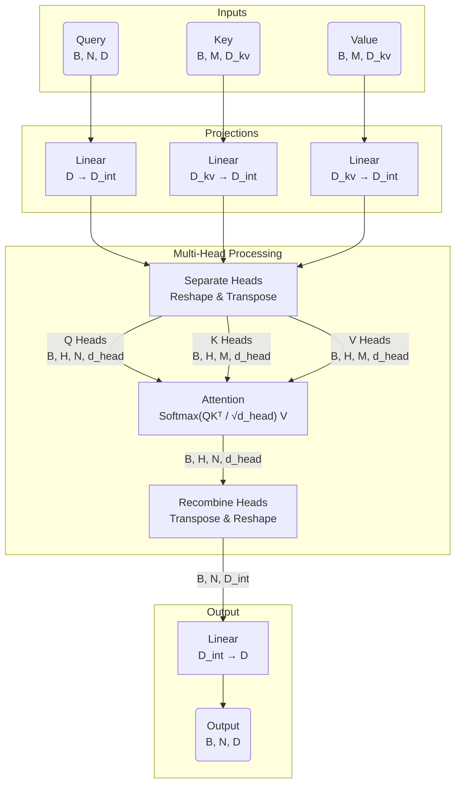

# Attention Module Documentation

This document details the architecture and data flow of the `Attention` class defined in `sam3/sam/transformer.py`. This module implements a Multi-Head Attention mechanism with an optional feature for downscaling the internal embedding dimension to reduce computational cost.

## Overview

The `Attention` layer projects inputs (Queries, Keys, Values) into an internal dimension space, splits them into multiple heads, performs scaled dot-product attention, and finally projects the result back to the original embedding dimension.

## Initialization Parameters

| Parameter | Symbol | Description | Default |
| :--- | :--- | :--- | :--- |
| `embedding_dim` | $D$ | The size of the input/output embeddings (specifically for Queries). | Required |
| `num_heads` | $H$ | The number of attention heads. | Required |
| `downsample_rate` | $R$ | Factor by which to reduce the internal dimension. $D_{int} = D / R$. | 1 |
| `dropout` | $P_{drop}$ | Dropout probability applied to attention weights. | 0.0 |
| `kv_in_dim` | $D_{kv}$ | The dimension size of input Keys and Values. If `None`, defaults to $D$. | None |
| `use_fa3` | - | Whether to use Flash Attention 3 implementation explicitly. | False |

## Data Flow & Shape Analysis

Let the input batch size be $B$.
Let the number of Query tokens be $N$.
Let the number of Key/Value tokens be $M$.

> **Understanding dimensions:**
> - **$B$ (Batch Size)**: The number of independent samples processed in parallel.
>   - *NLP Example*: Number of sentences in a batch.
>   - *Vision Example*: Number of images processed simultaneously.
> - **$N$ / $M$ (Sequence Length)**: The number of elements (tokens) in the sequence.
>   - *NLP Example*: Number of words/sub-words in a sentence.
>   - *Vision Example*: Number of flattened feature vectors (or patches) derived from the image. For instance, if a CNN backbone outputs feature maps of spatial size $h \times w$, then $N = h \times w$.

Let the internal dimension be $D_{int} = D / R$.
Let the dimension per head be $d_{head} = D_{int} / H$.

### 1. Inputs

The `forward` method maps three tensors: `q` (Queries), `k` (Keys), and `v` (Values).

- **Input Q (`q`)**: Shape $(B, N, D)$
- **Input K (`k`)**: Shape $(B, M, D_{kv})$
- **Input V (`v`)**: Shape $(B, M, D_{kv})$

> **Note**: $N$ and $M$ can be the same (self-attention) or different (cross-attention).

### 2. Input Projections (Linear Transformation)

The inputs are projected into the internal dimension $D_{int}$ using linear layers.

- `q_proj`: $D \to D_{int}$
- `k_proj`: $D_{kv} \to D_{int}$
- `v_proj`: $D_{kv} \to D_{int}$

**Shapes after protection:**
- $Q \rightarrow (B, N, D_{int})$
- $K \rightarrow (B, M, D_{int})$
- $V \rightarrow (B, M, D_{int})$

### 3. Head Separation

The tensors are reshaped to separate the channel dimension $D_{int}$ into $H$ heads of size $d_{head}$. They are then transposed to bring the head dimension forward for parallel processing.

Operation: `(B, Length, D_int) -> (B, Length, H, d_head) -> (B, H, Length, d_head)`

**Shapes after separation:**
- $Q \rightarrow (B, H, N, d_{head})$
- $K \rightarrow (B, H, M, d_{head})$
- $V \rightarrow (B, H, M, d_{head})$

### 4. Attention Mechanism

Scaled Dot Product Attention is applied: $\text{Softmax}(\frac{QK^T}{\sqrt{d_{head}}})V$. This step calculates the correlation between Queries and Keys and weights the Values accordingly.

- If `use_fa3` is True: Uses `flash_attn_func`.
- Otherwise: Uses `F.scaled_dot_product_attention` (which dispatches to FlashAttention, MemEfficient, or Math kernels automatically).

**Shape after attention:**
- Output $\rightarrow (B, H, N, d_{head})$

### 5. Head Recombination

The attention output is transposed back and reshaped to merge the heads back into a single continuous internal dimension.

Operation: `(B, H, N, d_head) -> (B, N, H, d_head) -> (B, N, D_int)`

**Shape after recombination:**
- Output $\rightarrow (B, N, D_{int})$

### 6. Output Projection

Finally, the output is projected from the internal dimension back to the original `embedding_dim`.

- `out_proj`: $D_{int} \to D$

**Final Output Shape:**
- Output $\rightarrow (B, N, D)$

## Summary of Dimensions

| Stage | Shape | Description |
| :--- | :--- | :--- |
| **Input** | $(B, N, D)$ | Raw Query input |
| **Projected** | $(B, N, D_{int})$ | Project to internal dim ($D_{int} = D/R$) |
| **Heads** | $(B, H, N, d_{head})$ | Split into $H$ heads ($d_{head} = D_{int}/H$) |
| **Attention Out**| $(B, H, N, d_{head})$ | Contextualized vectors per head |
| **Recombined** | $(B, N, D_{int})$ | Heads merged back |
| **Final Output** | $(B, N, D)$ | Projected back to original embedding dim |

## Visual Workflow



## Parameter Count Analysis

This section details the calculation of trainable parameters in the `Attention` layer. The parameters are contained entirely within the four linear projections: `q_proj`, `k_proj`, `v_proj`, and `out_proj`.

**Definitions:**
*   $D$: `embedding_dim`
*   $D_{kv}$: `kv_in_dim`
*   $D_{int}$: `internal_dim` ($D / R$, where $R$ is `downsample_rate`)

Recall that a Linear layer `nn.Linear(in, out)` has:
*   Weights: $out \times in$
*   Bias: $out$
*   **Total**: $out \times (in + 1)$

### Layer breakdown

1.  **Query Projection (`q_proj`)**
    *   Input: $D$, Output: $D_{int}$
    *   Params: $D_{int} \times D + D_{int}$

2.  **Key Projection (`k_proj`)**
    *   Input: $D_{kv}$, Output: $D_{int}$
    *   Params: $D_{int} \times D_{kv} + D_{int}$

3.  **Value Projection (`v_proj`)**
    *   Input: $D_{kv}$, Output: $D_{int}$
    *   Params: $D_{int} \times D_{kv} + D_{int}$

4.  **Output Projection (`out_proj`)**
    *   Input: $D_{int}$, Output: $D$
    *   Params: $D \times D_{int} + D$

### Total Parameters Formulation

$$
\begin{aligned}
\text{Total} &= \text{Params}(q\_proj) + \text{Params}(k\_proj) + \text{Params}(v\_proj) + \text{Params}(out\_proj) \\
&= [D_{int}(D+1)] + 2 \times [D_{int}(D_{kv}+1)] + [D(D_{int}+1)]
\end{aligned}
$$

### Simplified Scenario (Standard Self-Attention)

In the standard case where:
*   No downsampling is used ($R=1 \implies D_{int} = D$)
*   Keys/Values have same dimension as inputs ($D_{kv} = D$)

The formula simplifies to:

$$
\begin{aligned}
\text{Total} &= D(D+1) + 2D(D+1) + D(D+1) \\
&= 4D(D+1) \\
&= 4D^2 + 4D
\end{aligned}
$$

*   $4D^2$: Weights matrix contribution.
*   $4D$: Bias vector contribution.

## Attention Backend Mechanics

The implementation contains specific configuration flags for the `scaled_dot_product_attention` (SDPA) kernel:

```python
torch.backends.cuda.enable_flash_sdp(True)
torch.backends.cuda.enable_math_sdp(True)
torch.backends.cuda.enable_mem_efficient_sdp(True)
out = F.scaled_dot_product_attention(q, k, v, dropout_p=dropout_p)
```

By explicitly setting all three flags to `True` before the function call, the code **forces PyTorch's dispatcher to consider all available attention kernels**.

1.  **`enable_flash_sdp(True)`**: Enables **Flash Attention** (v2). This is the fastest implementation but has strict hardware (A100, H100, RTX3090/4090, etc.) and shape alignment requirements.
2.  **`enable_mem_efficient_sdp(True)`**: Enables **Memory-Efficient Attention** (based on xFormers). This serves as a robust fallback that is also memory-friendly but slightly slower than Flash Attention. It supports a wider range of hardware and input types.
3.  **`enable_math_sdp(True)`**: Enables the **Math (C++) fallback**. This is the standard naive implementation of attention. It is the slowest and most memory-consuming ($O(N^2)$ memory) but guarantees compatibility if the optimized kernels fail due to hardware or shape constraints.

**Why enable all three?**
PyTorch's SDPA dispatcher automatically selects the most efficient kernel available for the given input shapes, data types, and GPU capabilities. Enabling all three serves as a "reset" or "safety net" to ensure that:
*   The dispatcher isn't restricted by previous global settings in the codebase.
*   It can gracefully degrade from Flash $\to$ MemEfficient $\to$ Math depending on what is supported for the specific tensor configuration at runtime.