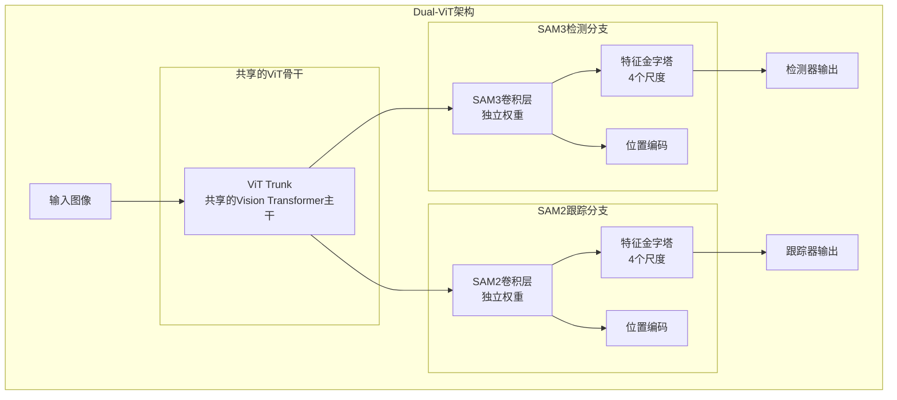
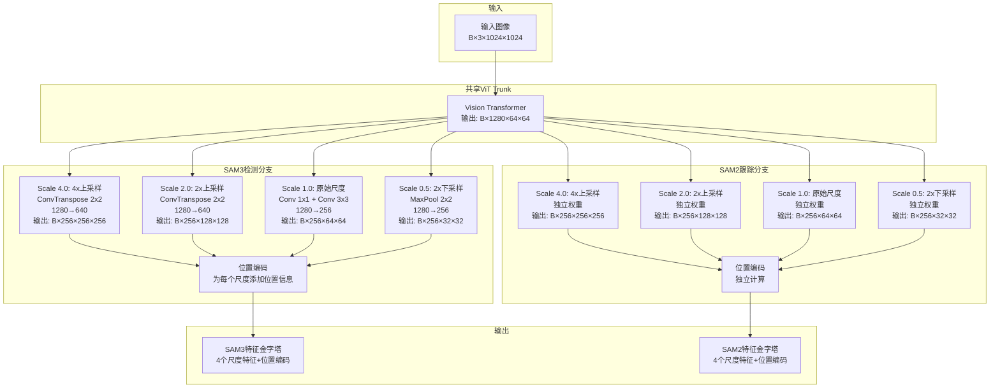
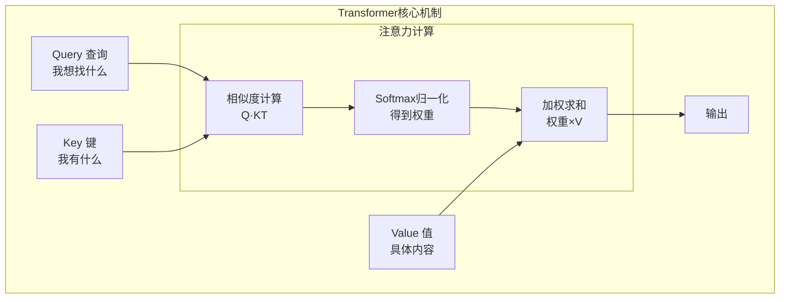
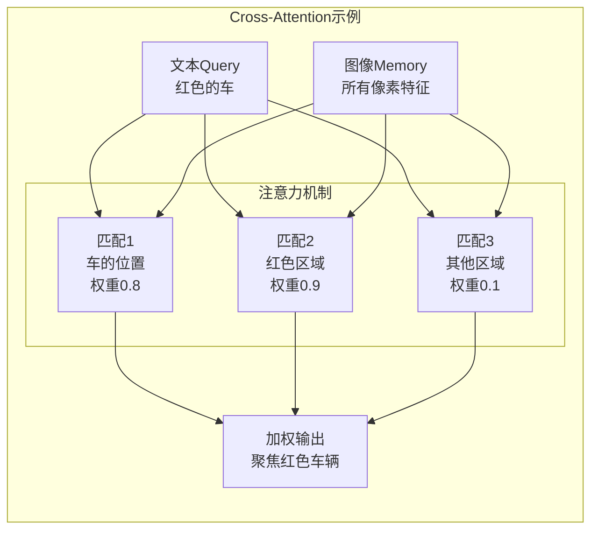
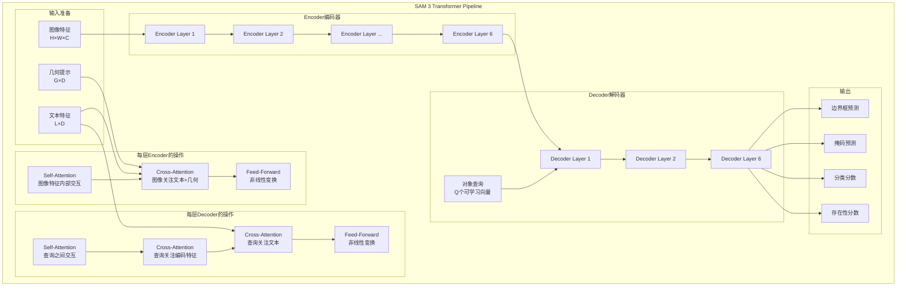
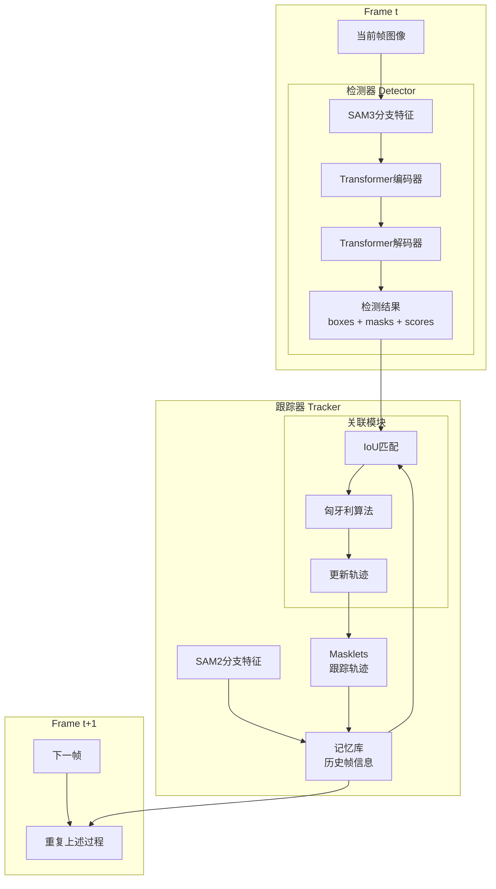

# SAM 3 Dual-ViT与Transformer架构深度解析

## 一、Dual-ViT架构详解

### 1.1 为什么需要两个ViT分支？

SAM 3 采用了**共享骨干、分离特征**的设计理念：



### 1.2 关键代码实现与数据流详解

#### 完整的数据流图



#### 详细的尺寸变化表

假设输入图像为 `B×3×1024×1024` (B=批次大小，通常为2或4)

| 模块 | 操作 | 输入尺寸 | 输出尺寸 | 说明 |
|------|------|----------|----------|------|
| **输入图像** | - | `B×3×1024×1024` | - | RGB图像 |
| **ViT Trunk** | Vision Transformer | `B×3×1024×1024` | `B×1280×64×64` | 下采样16倍 |
| | | | | |
| **SAM3分支** | | | | |
| Scale 4.0 | ConvTranspose(1280→640, k=2, s=2)<br/>GELU<br/>ConvTranspose(640→320, k=2, s=2)<br/>Conv1x1(320→256)<br/>Conv3x3(256→256) | `B×1280×64×64` | `B×256×256×256` | 4x上采样 |
| Scale 2.0 | ConvTranspose(1280→640, k=2, s=2)<br/>Conv1x1(640→256)<br/>Conv3x3(256→256) | `B×1280×64×64` | `B×256×128×128` | 2x上采样 |
| Scale 1.0 | Conv1x1(1280→256)<br/>Conv3x3(256→256) | `B×1280×64×64` | `B×256×64×64` | 保持尺寸 |
| Scale 0.5 | MaxPool2d(k=2, s=2)<br/>Conv1x1(1280→256)<br/>Conv3x3(256→256) | `B×1280×64×64` | `B×256×32×32` | 2x下采样 |
| 位置编码 | Sine Position Encoding | `B×256×H×W` | `B×256×H×W` | 添加位置信息 |
| | | | | |
| **SAM2分支** | 与SAM3相同结构 | 与SAM3相同 | 与SAM3相同 | **但权重独立** |

#### 代码实现

```python
class Sam3DualViTDetNeck(nn.Module):
    def __init__(
        self,
        trunk: nn.Module,           # 共享的ViT主干
        position_encoding: nn.Module,
        d_model: int = 256,         # 输出通道数
        scale_factors=(4.0, 2.0, 1.0, 0.5),  # 4个不同尺度
        add_sam2_neck: bool = False,  # 是否添加SAM2分支
    ):
        super().__init__()
        self.trunk = trunk  # 共享的ViT骨干
        self.d_model = d_model
        
        # 假设ViT输出维度为1280
        dim = 1280  # self.trunk.channel_list[-1]
        
        # SAM3分支的卷积层
        self.convs = nn.ModuleList()
        for scale in scale_factors:
            current = nn.Sequential()
            
            if scale == 4.0:  # 4x上采样: 64×64 → 256×256
                # 第一次上采样: 64→128
                current.add_module("dconv_2x2_0",
                    nn.ConvTranspose2d(dim, dim//2, kernel_size=2, stride=2))
                # 输出: B×640×128×128
                
                current.add_module("gelu", nn.GELU())
                
                # 第二次上采样: 128→256
                current.add_module("dconv_2x2_1",
                    nn.ConvTranspose2d(dim//2, dim//4, kernel_size=2, stride=2))
                # 输出: B×320×256×256
                out_dim = dim // 4  # 320
                
            elif scale == 2.0:  # 2x上采样: 64×64 → 128×128
                current.add_module("dconv_2x2",
                    nn.ConvTranspose2d(dim, dim//2, kernel_size=2, stride=2))
                # 输出: B×640×128×128
                out_dim = dim // 2  # 640
                
            elif scale == 1.0:  # 保持原始尺度: 64×64
                # 不做任何操作
                out_dim = dim  # 1280
                
            elif scale == 0.5:  # 2x下采样: 64×64 → 32×32
                current.add_module("maxpool_2x2",
                    nn.MaxPool2d(kernel_size=2, stride=2))
                # 输出: B×1280×32×32
                out_dim = dim  # 1280
            
            # 统一通道数到d_model(256)
            current.add_module("conv_1x1",
                nn.Conv2d(out_dim, d_model, kernel_size=1, bias=True))
            # 输出: B×256×H×W
            
            current.add_module("conv_3x3",
                nn.Conv2d(d_model, d_model, kernel_size=3, padding=1, bias=True))
            # 输出: B×256×H×W
            
            self.convs.append(current)
        
        # SAM2分支 - 深拷贝SAM3分支的结构
        self.sam2_convs = None
        if add_sam2_neck:
            self.sam2_convs = deepcopy(self.convs)  # 独立的权重！
    
    def forward(self, tensor_list):
        """
        Args:
            tensor_list: 输入图像张量 [B, 3, 1024, 1024]
        
        Returns:
            sam3_out: List[Tensor] - 4个尺度的SAM3特征
                [B×256×256×256, B×256×128×128, B×256×64×64, B×256×32×32]
            sam3_pos: List[Tensor] - 对应的位置编码
            sam2_out: List[Tensor] - 4个尺度的SAM2特征 (如果启用)
            sam2_pos: List[Tensor] - 对应的位置编码 (如果启用)
        """
        # 1. 通过共享的ViT主干
        xs = self.trunk(tensor_list)
        # xs是多层特征列表，我们取最后一层
        x = xs[-1]  # B×1280×64×64
        
        sam3_out, sam3_pos = [], []
        sam2_out, sam2_pos = None, None
        
        # 2. SAM3分支处理 - 生成4个尺度的特征
        for i, conv in enumerate(self.convs):
            sam3_x_out = conv(x)  # 经过对应尺度的卷积
            # sam3_x_out形状:
            # i=0: B×256×256×256 (scale 4.0)
            # i=1: B×256×128×128 (scale 2.0)
            # i=2: B×256×64×64   (scale 1.0)
            # i=3: B×256×32×32   (scale 0.5)
            
            sam3_pos_out = self.position_encoding(sam3_x_out)
            # sam3_pos_out形状与sam3_x_out相同
            
            sam3_out.append(sam3_x_out)
            sam3_pos.append(sam3_pos_out)
        
        # 3. SAM2分支处理（如果启用）- 使用独立的权重
        if self.sam2_convs is not None:
            sam2_out, sam2_pos = [], []
            for i, conv in enumerate(self.sam2_convs):
                sam2_x_out = conv(x)  # 使用独立的权重！
                # 输出尺寸与SAM3相同，但权重不同
                
                sam2_pos_out = self.position_encoding(sam2_x_out)
                
                sam2_out.append(sam2_x_out)
                sam2_pos.append(sam2_pos_out)
        
        return sam3_out, sam3_pos, sam2_out, sam2_pos
```

#### 关键点说明

1. **通道数统一**：所有尺度最终都输出256通道，便于后续Transformer处理

2. **空间分辨率多样**：4个不同的空间分辨率捕获不同粒度的信息
   - 256×256：细粒度，适合小物体
   - 128×128：中等粒度
   - 64×64：原始ViT输出分辨率
   - 32×32：粗粒度，全局上下文

3. **参数独立性**：SAM2分支虽然结构相同，但通过`deepcopy()`拥有完全独立的权重

4. **位置编码**：每个尺度都添加位置编码，帮助模型理解空间关系

### 1.3 为什么这样设计？

**关键优势：**

1. **共享底层特征** - ViT Trunk共享
   - 节省参数量
   - 统一的语义理解
   - 更好的泛化能力

2. **分离高层特征** - 独立的卷积层
   - 检测分支：优化物体定位和分类
   - 跟踪分支：优化时序一致性和身份关联
   - 避免任务冲突（task interference）

3. **多尺度特征金字塔**
   - 4x尺度：捕获细粒度细节（小物体）
   - 2x尺度：中等物体
   - 1x尺度：原始分辨率
   - 0.5x尺度：全局上下文（大物体）

## 二、Transformer机制详解

### 2.1 Transformer的核心思想

Transformer通过**注意力机制**让模型"关注"输入的不同部分：

```

**直观理解：**

想象你在图书馆找书：
- **Query（查询）**：你想找的主题，比如"机器学习"
- **Key（键）**：每本书的索引/标签
- **Value（值）**：书的实际内容
- **注意力**：计算你的查询和每本书标签的匹配度，然后根据匹配度获取书的内容

### 2.2 Self-Attention（自注意力）

```python
# 伪代码
def self_attention(input_sequence):
    """
    输入: [seq_len, batch, dim]
    例如: [100个像素位置, 2张图片, 256维特征]
    """
    # 1. 生成Q、K、V
    Q = input_sequence @ W_q  # 查询矩阵
    K = input_sequence @ W_k  # 键矩阵  
    V = input_sequence @ W_v  # 值矩阵
    
    # 2. 计算注意力分数
    scores = Q @ K.transpose()  # [seq_len, seq_len]
    scores = scores / sqrt(dim)  # 缩放
    
    # 3. Softmax归一化
    attention_weights = softmax(scores)  # 每行和为1
    
    # 4. 加权求和
    output = attention_weights @ V
    
    return output
```

**在SAM 3中的应用：**

```python
class TransformerEncoderLayer:
    def forward(self, tgt, memory):
        # 1. Self-Attention: 让输入特征内部相互关注
        q = k = tgt + positional_encoding  # 添加位置信息
        tgt2 = self.self_attn(q, k, tgt)
        tgt = tgt + tgt2  # 残差连接
        tgt = self.norm1(tgt)  # 层归一化
        
        # 2. Cross-Attention: 让query关注image特征
        tgt2 = self.cross_attn_image(
            query=tgt + query_pos,
            key=memory + memory_pos,
            value=memory
        )
        tgt = tgt + tgt2
        tgt = self.norm2(tgt)
        
        # 3. Feed-Forward Network: 非线性变换
        tgt2 = self.linear2(relu(self.linear1(tgt)))
        tgt = tgt + tgt2
        tgt = self.norm3(tgt)
        
        return tgt
```

### 2.3 Cross-Attention（交叉注意力）

Cross-Attention让一个序列"查询"另一个序列：



**在SAM 3中：**

```python
# 文本到图像的交叉注意力
def cross_attention_text_to_image(text_features, image_features):
    """
    让文本特征去"查询"图像特征
    找到图像中与文本描述匹配的区域
    """
    Q = text_features @ W_q  # Query来自文本
    K = image_features @ W_k  # Key来自图像
    V = image_features @ W_v  # Value来自图像
    
    # 计算文本和图像每个位置的相关性
    attention = softmax(Q @ K.T / sqrt(d))
    
    # 获取相关的图像特征
    output = attention @ V
    
    return output
```

### 2.4 SAM 3的完整Transformer流程



### 2.5 具体例子：检测"红色汽车"

让我们跟踪整个流程：

```python
# 输入
image = "一张包含红色汽车、蓝色汽车、树木的照片"
text_prompt = "red car"

# Step 1: 特征提取
image_features = vision_encoder(image)  # [H×W, C]
# 假设: [[车1特征], [车2特征], [树特征], [背景特征], ...]

text_features = text_encoder("red car")  # [L, D]
# 结果: [["red"特征], ["car"特征]]

# Step 2: Encoder - 融合文本和图像
for layer in encoder_layers:
    # Self-Attention: 图像特征内部交互
    # 让"车1"知道"车2"的存在，"树"知道"背景"
    image_features = self_attention(image_features)
    
    # Cross-Attention: 图像关注文本
    # 图像中的每个位置计算与"red car"的相关性
    image_features = cross_attention(
        query=image_features,
        key_value=text_features
    )
    # 结果: 红色车辆位置的特征被增强

# Step 3: Decoder - 生成对象查询
object_queries = learnable_embeddings  # [Q, D]，例如100个查询

for layer in decoder_layers:
    # Self-Attention: 查询之间交互
    # 让不同查询知道彼此，避免预测重复对象
    object_queries = self_attention(object_queries)
    
    # Cross-Attention: 查询关注图像
    # 每个查询去图像中找对应的对象
    object_queries = cross_attention(
        query=object_queries,
        key_value=image_features  # 已经融合了文本信息
    )
    
    # Cross-Attention: 查询直接关注文本
    # 进一步确保查询理解"red car"的含义
    object_queries = cross_attention(
        query=object_queries,
        key_value=text_features
    )

# Step 4: 预测输出
for i, query in enumerate(object_queries):
    box = box_head(query)  # 预测边界框
    mask = mask_head(query)  # 预测掩码
    score = score_head(query, text_features)  # 与文本的匹配分数
    presence = presence_head(query)  # 是否真的存在该对象
    
    if score * presence > threshold:
        # 这个查询找到了一个"red car"
        detections.append({
            'box': box,
            'mask': mask,
            'score': score * presence
        })
```

## 三、检测器和跟踪器的协同工作

### 3.1 完整的视频处理流程



### 3.2 为什么需要分离的特征？

**检测器关注：**
- 单帧内的物体定位
- 准确的语义理解（这是什么？）
- 精确的边界和掩码

**跟踪器关注：**
- 跨帧的身份一致性（这是之前的哪个物体？）
- 运动轨迹的平滑性
- 遮挡处理和重识别

**如果共享所有特征会怎样？**
```python
# 问题案例
shared_features = vit(image)

# 检测器优化目标
detection_loss = focal_loss(detect(shared_features))
# 希望: 对每个新对象高度敏感

# 跟踪器优化目标  
tracking_loss = association_loss(track(shared_features))
# 希望: 对相似外观的对象保持稳定

# 冲突！两个目标互相干扰
total_loss = detection_loss + tracking_loss  # 难以优化
```

**Dual-ViT的解决方案：**
```python
# SAM 3的方案
trunk_features = vit_trunk(image)  # 共享底层

# 分离的高层特征
sam3_features = sam3_neck(trunk_features)  # 检测优化
sam2_features = sam2_neck(trunk_features)  # 跟踪优化

# 各自优化，互不干扰
detection_loss = detect(sam3_features)
tracking_loss = track(sam2_features)
```

## 四、总结

### 关键设计理念

1. **Dual-ViT架构**
   - 共享骨干（省参数，统一语义）
   - 分离高层（专门优化，避免冲突）

2. **Transformer机制**
   - Self-Attention：特征内部交互
   - Cross-Attention：跨模态匹配
   - 灵活建模复杂关系

3. **检测-跟踪分离**
   - 检测器：单帧精准定位
   - 跟踪器：多帧身份关联
   - 协同工作，各司其职

这种设计使得SAM 3能够在保持高检测精度的同时，实现稳定的视频跟踪，是一个精心设计的工程杰作！