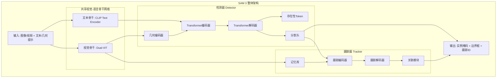
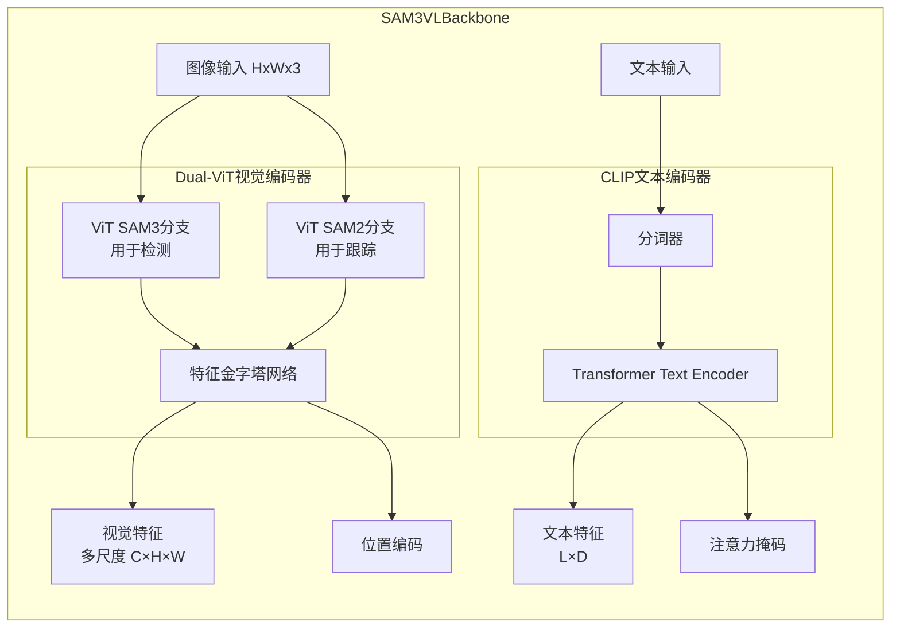
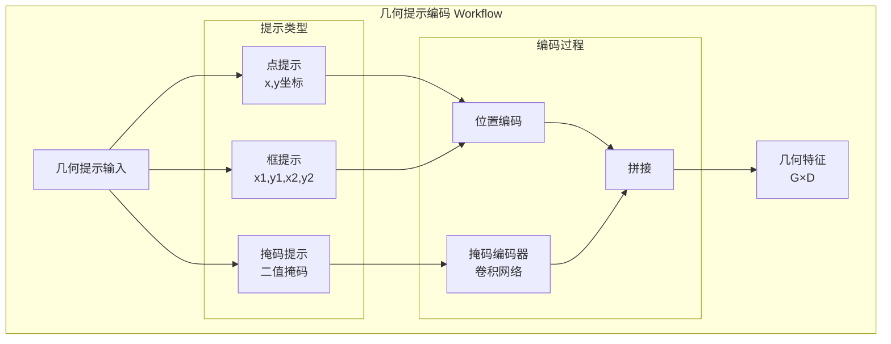
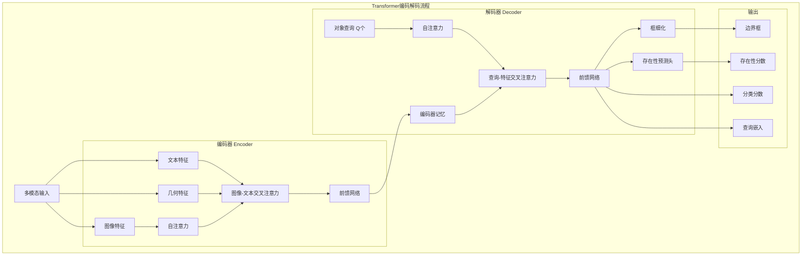
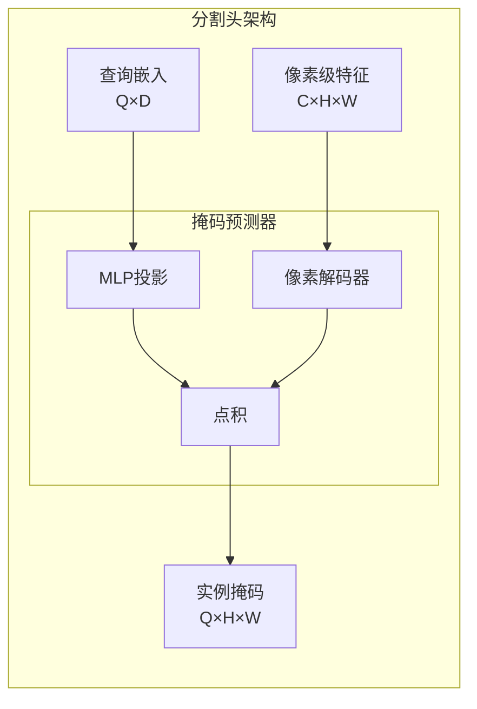
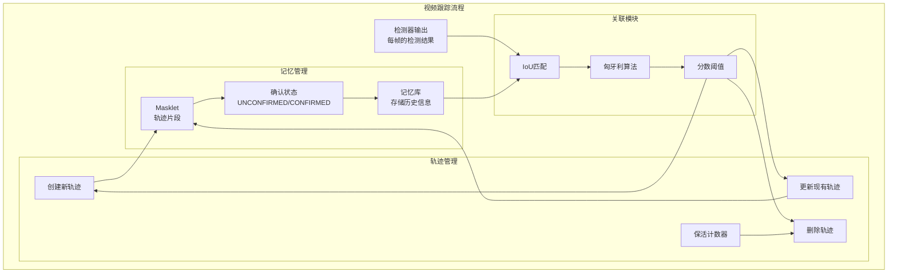
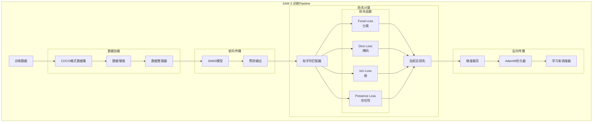
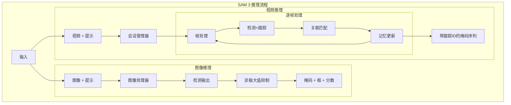

# SAM 3 深度技术分析

## 一、整体架构概览

SAM 3 采用了**解耦的检测器-跟踪器(Detector-Tracker)**双组件设计，共享视觉编码器。这是一个革命性的架构，使得模型能够同时处理图像和视频任务。



## 二、核心组件详细分析

### 1. 视觉-语言骨干网络 (Vision-Language Backbone)



**关键特性：**
- **Dual-ViT设计**：两个独立的Vision Transformer分支
  - SAM3分支：优化用于检测任务
  - SAM2分支：优化用于跟踪任务
- **特征金字塔**：多尺度特征表示，捕获不同粒度的语义信息
- **CLIP文本编码器**：处理开放词汇的自然语言描述

**代码实现位置：**
- `sam3/model/vl_combiner.py` - SAM3VLBackbone类
- `sam3/model/necks.py` - Sam3DualViTDetNeck类
- `sam3/model/vitdet.py` - Vision Transformer实现

### 2. 几何提示编码器 (Geometry Encoder)



**实现细节（来自代码）：**
```python
class SequenceGeometryEncoder:
    # 编码点、框和掩码提示
    def forward(geo_prompt, img_feats, img_sizes, img_pos_embeds):
        # 1. 对点和框使用位置编码
        geo_feats = positional_encoding(points, boxes)
        
        # 2. 对掩码使用卷积编码器
        mask_feats = mask_encoder(masks)
        
        # 3. 拼接所有几何特征
        return concat([geo_feats, mask_feats])
```

**代码实现位置：**
- `sam3/model/geometry_encoders.py` - Prompt类和编码器实现

### 3. Transformer编码器-解码器架构



**关键创新 - 存在性Token (Presence Token)：**
```python
# 存在性Token帮助区分相似提示
# 例如："白衣球员" vs "红衣球员"

def compute_final_score(class_score, presence_score):
    # 联合分数 = 分类分数 × 存在性分数
    return class_score.sigmoid() * presence_score.sigmoid()
```

**代码实现位置：**
- `sam3/model/encoder.py` - TransformerEncoder和TransformerEncoderLayer
- `sam3/model/sam3_image.py` - Sam3Image类，包含编码解码逻辑

### 4. 分割头 (Segmentation Head)



**多掩码输出机制：**
- 对于模糊的提示，模型输出多个候选掩码
- 使用IoU预测头对掩码质量评分
- 训练时使用最佳匹配，推理时输出top-k掩码

**代码实现位置：**
- `sam3/model/maskformer_segmentation.py` - SegmentationHead和MaskPredictor

### 5. 视频跟踪器 (Video Tracker)



**跟踪关键机制：**

1. **Masklet确认机制**：
```python
class MaskletConfirmationStatus:
    UNCONFIRMED = 1  # 新添加的轨迹，未被检测确认
    CONFIRMED = 2     # 至少被一次检测确认

# 连续3帧被检测匹配后，轨迹变为CONFIRMED状态
if consecutive_matches >= 3:
    masklet.status = CONFIRMED
```

2. **保活机制 (Keep-Alive)**：
```python
# 每个轨迹有一个保活计数器
keep_alive_counter = init_trk_keep_alive  # 初始值
max_keep_alive = 8                        # 最大值
min_keep_alive = -4                       # 最小值

# 匹配到检测时增加
if matched:
    keep_alive_counter = min(keep_alive_counter + 1, max_keep_alive)
else:
    keep_alive_counter -= 1

# 计数器降至最小值时删除轨迹
if keep_alive_counter < min_keep_alive:
    delete_track()
```

3. **热启动 (Hotstart) 机制**：
```python
# 延迟输出前N帧，用于过滤误检
hotstart_delay = 3  # 延迟3帧

# 在热启动期间：
# 1. 移除未匹配的轨迹
# 2. 移除重复的轨迹（IoU过高）
if frame_idx < hotstart_delay:
    filter_unmatched_tracks()
    filter_duplicate_tracks()
```

**代码实现位置：**
- `sam3/model/sam3_video_base.py` - Sam3VideoBase基类
- `sam3/model/sam3_video_inference.py` - Sam3VideoInference推理类
- `sam3/model/sam3_video_predictor.py` - Sam3VideoPredictor预测器

## 三、训练流程



**损失函数权重配置：**
```python
weight_dict = {
    'loss_ce': 2.0,        # 分类损失
    'loss_bbox': 5.0,      # 框L1损失  
    'loss_giou': 2.0,      # 框GIoU损失
    'loss_mask': 5.0,      # 掩码损失
    'loss_dice': 5.0,      # Dice损失
    'loss_presence': 1.0,  # 存在性损失
}
```

**代码实现位置：**
- `sam3/train/trainer.py` - Trainer训练类
- `sam3/train/loss/loss_fns.py` - 损失函数实现
- `sam3/train/matcher.py` - 匈牙利匹配器
- `sam3/train/optim/optimizer.py` - 优化器配置

## 四、推理流程



**代码实现位置：**
- `sam3/model/sam3_image_processor.py` - Sam3Processor图像处理器
- `sam3/model/sam3_video_predictor.py` - Sam3VideoPredictor视频预测器
- `sam3/model_builder.py` - 模型构建函数

## 五、关键技术创新

### 1. 存在性Token (Presence Token)

**问题：** 传统模型难以区分"白衣球员"和"红衣球员"这样的相似提示

**解决方案：**
```python
# 解码器输出两个分支
class_logits = dot_product(query_embed, text_embed)  # 分类分数
presence_logits = presence_head(query_embed)          # 存在性分数

# 最终分数 = 两者的乘积
final_score = class_logits.sigmoid() * presence_logits.sigmoid()
```

**效果：** 在SA-Co/Gold上提升~5个百分点

### 2. 解耦的检测器-跟踪器

**优势：**
- 检测器专注于每帧的目标检测
- 跟踪器专注于跨帧的身份关联
- 避免任务干扰，提升性能

### 3. 数据引擎

**创新：**
- 自动标注了400万+独特概念
- 使用SAM模型进行自动分割
- 人工验证质量控制
- 创建了最大的开放词汇分割数据集

### 4. 性能优化

**Triton内核优化：**
```python
@triton.jit
def sigmoid_focal_loss_kernel(
    inputs_ptr, targets_ptr, output_ptr,
    alpha, gamma, BLOCK_SIZE
):
    # 自定义CUDA内核，加速Focal Loss计算
    # 比PyTorch原生实现快3-5倍
```

**代码实现位置：**
- `sam3/train/loss/sigmoid_focal_loss.py` - Triton优化的Focal Loss
- `sam3/perflib/triton/connected_components.py` - 连通组件计算优化

## 六、评估指标

### 1. cgF1 (Concept-Grounded F1)

```python
# 计算公式
Precision = TP / (TP + FP)
Recall = TP / (TP + FN)
cgF1 = 2 * (Precision * Recall) / (Precision + Recall)

# 特点：考虑概念级别的匹配
# 一个提示的所有实例必须都正确才算TP
```

#### 📖 Precision和Recall详细解释

**基础术语定义：**
```
TP (True Positive)  - 真阳性：预测为正且实际为正 ✓
FP (False Positive) - 假阳性：预测为正但实际为负 ✗
TN (True Negative)  - 真阴性：预测为负且实际为负 ✓
FN (False Negative) - 假阴性：预测为负但实际为正 ✗
```

**Precision（准确度/精确率）：**
```python
Precision = TP / (TP + FP)
          = 预测正确的正样本数 / 所有预测为正的样本数
```

**含义：** "在所有我预测出来的对象中，有多少是真的对的？"

**例子：** 提示"找出图中所有的狗"
```python
# 场景：图中真实有3只狗
Ground Truth: 3只狗

# 模型预测出5个对象是狗
Predictions: 5个对象

# 分析：
TP = 3  # 正确识别的狗
FP = 2  # 误检（把猫当成狗）

Precision = 3 / (3 + 2) = 60%
# 解读：预测的5个对象中，只有60%真的是狗
```

**Recall（召回率/查全率）：**
```python
Recall = TP / (TP + FN)
       = 预测正确的正样本数 / 实际存在的正样本总数
```

**关键理解 - 分母含义：**
- `TP + FN` = 所有真实存在的正样本总数（Ground Truth）
- `TP`：真实存在且被找到的
- `FN`：真实存在但未被找到的（漏检）

**含义：** "在所有真实存在的对象中，我找到了多少？"

**例子：** 继续上面的场景
```python
# 场景：图中真实有5只狗
Ground Truth: 5只狗

# 模型只预测出3个对象是狗
Predictions: 3个对象

# 分析：
TP = 3  # 正确找到3只狗
FP = 0  # 没有误检
FN = 2  # 漏检2只狗（真实存在但未找到）

Recall = 3 / (3 + 2) = 60%
# 解读：5只真实的狗中，只找到了60%
```

**Precision vs Recall权衡：**
```
高阈值（严格）→ 高Precision（预测的准）+ 低Recall（找得少）
低阈值（宽松）→ 低Precision（误检多）  + 高Recall（找得全）
```

**完整示例：**
```python
# 场景：图中有10只真实的狗
Ground Truth: 10只狗

# 模型预测出12个对象
Predictions: 12个对象

# 结果：
TP = 8   # 正确找到8只狗
FP = 4   # 误检4个（不是狗）
FN = 2   # 漏检2只狗

# 计算：
Precision = 8/(8+4) = 8/12 = 66.7%  # 预测准确度
Recall = 8/(8+2) = 8/10 = 80.0%     # 召回完整度
F1 = 2×(0.667×0.8)/(0.667+0.8) = 72.7%  # 综合评分
```

**记忆技巧：**
- **Precision关注"质量"**：我说的有多准？（分母=我预测的总数）
- **Recall关注"覆盖"**：我找全了吗？（分母=真实存在的总数）

**代码实现位置：**
- `sam3/eval/cgf1_eval.py` - CGF1Eval和CGF1Evaluator类

### 2. pHOTA (Phrase HOTA)

用于视频评估，结合检测准确率和跟踪一致性：

```python
HOTA = sqrt(DetA * AssA)
DetA = Detection Accuracy  # 检测准确率
AssA = Association Accuracy  # 关联准确率
```

**代码实现位置：**
- `sam3/eval/hota_eval_toolkit/` - HOTA评估工具包
- `sam3/eval/teta_eval_toolkit/` - TETA评估工具包

## 七、实际应用示例

### 图像分割示例代码：

```python
from sam3.model_builder import build_sam3_image_model
from sam3.model.sam3_image_processor import Sam3Processor

# 加载模型
model = build_sam3_image_model()
processor = Sam3Processor(model)

# 处理图像
image = Image.open("example.jpg")
inference_state = processor.set_image(image)

# 文本提示
output = processor.set_text_prompt(
    state=inference_state, 
    prompt="person wearing red shirt"
)

# 获取结果
masks = output["masks"]        # 实例掩码
boxes = output["boxes"]        # 边界框  
scores = output["scores"]      # 置信度分数
```

### 视频跟踪示例代码：

```python
from sam3.model_builder import build_sam3_video_predictor

# 加载视频预测器
video_predictor = build_sam3_video_predictor()

# 创建会话
response = video_predictor.handle_request({
    "type": "start_session",
    "resource_path": "video.mp4"
})

session_id = response["session_id"]

# 添加提示（在第0帧）
response = video_predictor.handle_request({
    "type": "add_prompt",
    "session_id": session_id,
    "frame_index": 0,
    "text": "person in blue jacket"
})

# 获取所有帧的跟踪结果
outputs = response["outputs"]
# outputs包含每帧的掩码、框和跟踪ID
```

## 八、项目结构

```
sam3/
├── model/                      # 核心模型实现
│   ├── sam3_image.py          # 图像分割模型
│   ├── sam3_video_base.py     # 视频跟踪基类
│   ├── sam3_video_inference.py # 视频推理实现
│   ├── vl_combiner.py         # 视觉-语言骨干
│   ├── vitdet.py              # Vision Transformer
│   ├── encoder.py             # Transformer编码器
│   ├── geometry_encoders.py   # 几何提示编码器
│   ├── maskformer_segmentation.py # 分割头
│   └── box_ops.py             # 边界框操作
│
├── train/                      # 训练基础设施
│   ├── trainer.py             # 训练器
│   ├── data/                  # 数据加载
│   │   ├── sam3_image_dataset.py
│   │   ├── sam3_video_dataset.py
│   │   └── collator.py
│   ├── loss/                  # 损失函数
│   │   ├── loss_fns.py
│   │   └── sigmoid_focal_loss.py
│   ├── optim/                 # 优化器
│   └── transforms/            # 数据增强
│
├── eval/                       # 评估工具
│   ├── cgf1_eval.py           # cgF1指标
│   ├── hota_eval_toolkit/     # HOTA评估
│   ├── teta_eval_toolkit/     # TETA评估
│   └── coco_eval.py           # COCO评估
│
├── perflib/                    # 性能优化
│   └── triton/                # Triton内核
│
└── agent/                      # SAM 3 Agent
    └── helpers/               # 辅助函数
```

## 九、性能基准

### 图像分割性能

| 模型 | LVIS cgF1 | LVIS AP | SA-Co/Gold cgF1 | COCO AP |
|------|-----------|---------|-----------------|---------|
| 人类 | - | - | **72.8** | - |
| OWLv2 | 29.3 | 43.4 | 24.6 | 46.1 |
| DINO-X | - | 38.5 | 21.3 | 56.0 |
| Gemini 2.5 | 13.4 | - | 13.0 | - |
| **SAM 3** | **37.2** | **48.5** | **54.1** | **56.4** |

### 视频跟踪性能

| 模型 | SA-V cgF1 | YT-Temporal cgF1 | SmartGlasses cgF1 | LVVIS mAP | BURST HOTA |
|------|-----------|------------------|-------------------|-----------|------------|
| 人类 | **53.1** | **71.2** | **58.5** | - | - |
| **SAM 3** | **30.3** | **50.8** | **36.4** | **36.3** | **44.5** |

**相对人类性能：**
- 图像：74-75%
- 视频：57-71%

## 十、数据集

### SA-Co 基准数据集

SAM 3 发布了三个新的评估基准：

1. **SA-Co/Gold** - 高质量图像标注
   - 精心标注的图像数据集
   - 270K+独特概念
   - HuggingFace: `facebook/SACo-Gold`

2. **SA-Co/Silver** - 大规模图像数据集
   - 更大规模的标注数据
   - 用于训练和评估
   - HuggingFace: `facebook/SACo-Silver`

3. **SA-Co/VEval** - 视频跟踪基准
   - 视频级别的标注
   - 跨帧跟踪评估
   - HuggingFace: `facebook/SACo-VEval`

**数据格式：** COCO格式的JSON标注

## 十一、依赖项

### 核心依赖

```python
# pyproject.toml
dependencies = [
    "torch>=2.7.0",              # PyTorch深度学习框架
    "torchvision",               # 视觉工具
    "timm>=1.0.17",              # Vision Transformer模型
    "numpy>=1.26,<2",            # 数值计算
    "huggingface_hub",           # 模型下载
    "ftfy==6.1.1",               # 文本修复
    "regex",                     # 正则表达式
    "iopath>=0.1.10",            # 文件IO
]
```

### 训练依赖

```python
train = [
    "hydra-core",                # 配置管理
    "submitit",                  # SLURM作业提交
    "tensorboard",               # 可视化
    "scipy",                     # 科学计算
    "torchmetrics",              # 指标计算
    "fvcore",                    # Facebook视觉核心库
    "fairscale",                 # 分布式训练
]
```

## 十二、安装指南

### 基础安装

```bash
# 1. 创建Conda环境
conda create -n sam3 python=3.12
conda activate sam3

# 2. 安装PyTorch (CUDA 12.6)
pip install torch==2.7.0 torchvision torchaudio \
    --index-url https://download.pytorch.org/whl/cu126

# 3. 克隆并安装SAM 3
git clone https://github.com/facebookresearch/sam3.git
cd sam3
pip install -e .

# 4. 安装额外依赖（可选）
pip install -e ".[notebooks]"  # Jupyter notebooks
pip install -e ".[train,dev]"  # 训练和开发
```

### 获取模型权重

```bash
# 需要HuggingFace认证
huggingface-cli login

# 模型会自动从HuggingFace下载
# https://huggingface.co/facebook/sam3
```

## 十三、训练配置

### Hydra配置系统

SAM 3 使用Hydra进行配置管理，配置文件位于：

```
sam3/train/configs/
├── eval_base.yaml                    # 基础评估配置
├── gold_image_evals/                 # Gold图像评估
│   └── sam3_gold_image_attributes.yaml
├── silver_image_evals/               # Silver图像评估
│   └── sam3_silver_image_bdd100k.yaml
└── saco_video_evals/                 # 视频评估
    └── saco_veval_sav_test.yaml
```

### 训练命令示例

```bash
# 单节点训练
python sam3/train/train.py \
    --config-name=your_config \
    launcher.num_nodes=1 \
    launcher.gpus_per_node=8

# 多节点SLURM训练
python sam3/train/train.py \
    --config-name=your_config \
    launcher.num_nodes=4 \
    launcher.gpus_per_node=8 \
    launcher.partition=your_partition
```

## 十四、评估

### 运行评估

```bash
# COCO格式评估
python scripts/eval/standalone_cgf1.py \
    --gt-json path/to/gt.json \
    --dt-json path/to/predictions.json

# 视频评估
python sam3/eval/saco_veval_eval.py \
    --gt-annot-dir path/to/annotations \
    --eval-res-dir path/to/results
```

## 十五、总结

SAM 3 的核心创新点：

1. **开放词汇能力**：支持27万+概念，是现有基准的50倍
2. **统一架构**：一个模型处理图像和视频任务
3. **存在性Token**：精准区分相似提示
4. **解耦设计**：检测器和跟踪器独立优化
5. **大规模数据**：400万+概念的自动标注数据集
6. **高性能**：达到人类性能的57-75%

### 应用场景

- **智能标注**：自动化数据标注流程
- **视频分析**：场景理解、对象跟踪
- **机器人视觉**：开放世界场景理解
- **医疗影像**：器官和病灶分割
- **自动驾驶**：动态场景理解
- **增强现实**：实时对象分割和跟踪

### 未来方向

- 提升接近人类水平的性能
- 扩展到更多模态（3D、多光谱等）
- 优化推理速度和内存占用
- 增强时序理解能力
- 支持更复杂的推理任务

---

**项目信息：**
- **版本**: 0.1.0 (Beta)
- **许可证**: SAM License
- **组织**: Meta Superintelligence Labs
- **论文**: https://arxiv.org/abs/2511.16719
- **项目主页**: https://ai.meta.com/sam3
- **GitHub**: https://github.com/facebookresearch/sam3