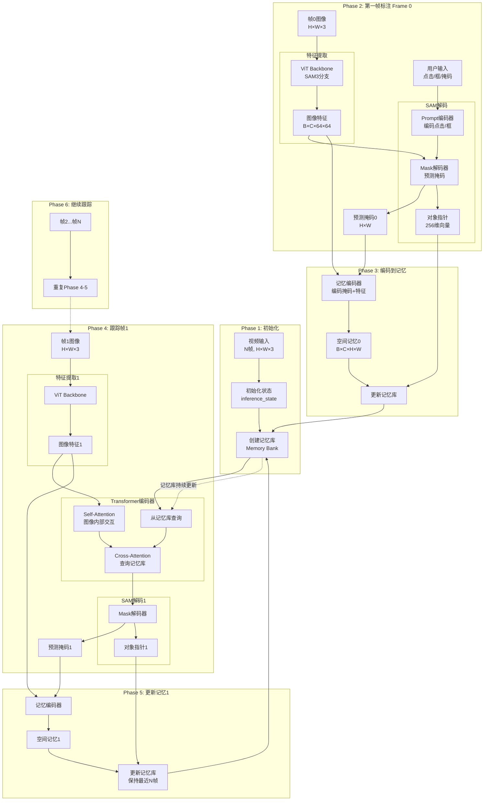
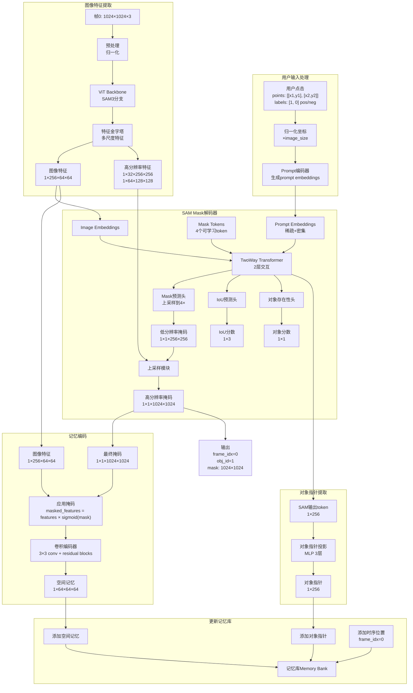
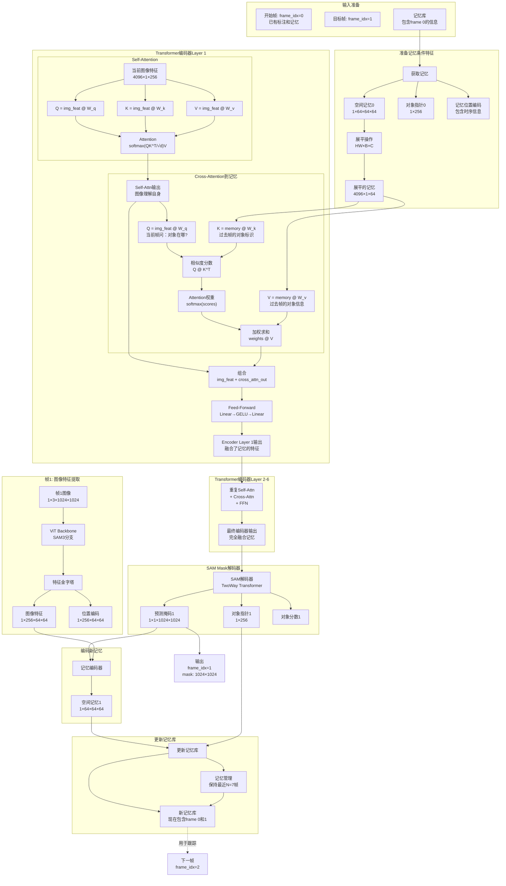
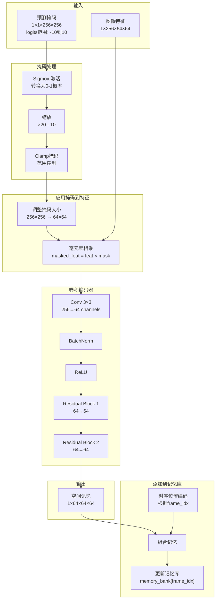

# SAM 3完整跟踪工作流程详解

## 目录
1. [概述](#概述)
2. [完整工作流程图](#完整工作流程图)
3. [初始化阶段](#初始化阶段)
4. [第一帧标注](#第一帧标注)
5. [跟踪传播](#跟踪传播)
6. [记忆更新](#记忆更新)
7. [详细数据流](#详细数据流)

---

## 概述

SAM 3的视频对象跟踪流程分为以下几个主要阶段：

```
1. 初始化 → 2. 第一帧标注 → 3. 跟踪传播 → 4. 记忆更新 → 循环2-4
```

---

## 完整工作流程图

### 整体架构图



---

## 初始化阶段

### 步骤1: 加载视频和初始化状态

```python
# 1. 创建预测器
predictor = Sam3TrackerPredictor(
    model_cfg=model_cfg,
    num_maskmem=7,  # 记忆库保存7帧
    image_size=1024,
    backbone_stride=16
)

# 2. 初始化推理状态
inference_state = predictor.init_state(
    video_path="video.mp4",
    # 或者手动提供
    # video_height=1080,
    # video_width=1920,
    # num_frames=100
)
```

### inference_state结构

```python
inference_state = {
    # 视频信息
    'images': Tensor[N, 3, H, W],  # 所有视频帧
    'num_frames': 100,
    'video_height': 1080,
    'video_width': 1920,
    
    # 对象管理
    'obj_id_to_idx': OrderedDict({1: 0, 2: 1}),  # 对象ID到索引
    'obj_idx_to_id': OrderedDict({0: 1, 1: 2}),  # 索引到对象ID
    'obj_ids': [1, 2],
    
    # 每个对象的输入
    'point_inputs_per_obj': {
        0: {frame_idx: {'point_coords': ..., 'point_labels': ...}},
        1: {frame_idx: {'point_coords': ..., 'point_labels': ...}}
    },
    'mask_inputs_per_obj': {
        0: {frame_idx: Tensor[1, 1, H, W]},
        1: {frame_idx: Tensor[1, 1, H, W]}
    },
    
    # 输出字典
    'output_dict': {
        'cond_frame_outputs': {  # 条件帧（有用户输入）
            frame_idx: {
                'pred_masks': Tensor,
                'obj_ptr': Tensor,
                'maskmem_features': Tensor,
                'maskmem_pos_enc': Tensor
            }
        },
        'non_cond_frame_outputs': {}  # 非条件帧（跟踪得到）
    },
    
    # 每个对象的输出（共享内存）
    'output_dict_per_obj': {
        0: {'cond_frame_outputs': {}, 'non_cond_frame_outputs': {}},
        1: {'cond_frame_outputs': {}, 'non_cond_frame_outputs': {}}
    },
    
    # 跟踪状态
    'tracking_has_started': False,
    'frames_already_tracked': {},
    
    # 缓存的特征
    'cached_features': {}
}
```

---

## 第一帧标注

### 详细流程图



### 代码实现详解

```python
def add_new_points_or_box(
    self,
    inference_state,
    frame_idx,  # 0
    obj_id,  # 1
    points,  # [[x1, y1], [x2, y2]]
    labels,  # [1, 0]  # 1=正点, 0=负点
):
    """在第一帧添加点击标注"""
    
    # 步骤1: 坐标归一化
    points = torch.tensor(points) * self.image_size  # 转换为绝对坐标
    labels = torch.tensor(labels)
    
    # 步骤2: 提取图像特征
    frame = inference_state['images'][frame_idx]  # [3, 1024, 1024]
    backbone_out = self.forward_image(frame)  # 使用SAM3 ViT分支
    
    # backbone_out包含:
    # - 'backbone_fpn': [特征level0, level1, level2]
    #     level0: [1, 256, 64, 64]    # 主要特征
    #     level1: [1, 32, 256, 256]    # 高分辨率特征1
    #     level2: [1, 64, 128, 128]    # 高分辨率特征2
    # - 'vision_pos_enc': 对应的位置编码
    
    # 步骤3: SAM Prompt编码
    sparse_embeddings, dense_embeddings = self.sam_prompt_encoder(
        points=(points, labels),
        boxes=None,
        masks=None
    )
    # sparse_embeddings: [1, N_points, 256]  # 点的嵌入
    # dense_embeddings: [1, 256, 64, 64]     # 密集嵌入（无掩码时为0）
    
    # 步骤4: SAM Mask解码
    (
        low_res_masks,      # [1, 1, 256, 256]  # 低分辨率掩码logits
        high_res_masks,     # [1, 1, 1024, 1024] # 高分辨率掩码logits
        iou_predictions,    # [1, 1]  # IoU预测
        low_res_masks,      # 重复（最佳掩码）
        high_res_masks,     # 重复（最佳掩码）
        obj_ptr,            # [1, 256]  # 对象指针！
        object_score_logits # [1, 1]  # 对象存在性分数
    ) = self._forward_sam_heads(
        backbone_features=backbone_out['backbone_fpn'][0],
        point_inputs={'point_coords': points, 'point_labels': labels},
        mask_inputs=None,
        high_res_features=[backbone_out['backbone_fpn'][1], 
                          backbone_out['backbone_fpn'][2]],
        multimask_output=False
    )
    
    # 步骤5: 编码到记忆
    spatial_memory = self._encode_new_memory(
        current_vision_feats=backbone_out['backbone_fpn'][0],
        current_vision_pos_embeds=backbone_out['vision_pos_enc'][0],
        feat_sizes=[(64, 64)],
        pred_masks=low_res_masks,
        object_score_logits=object_score_logits,
        is_init_cond_frame=True,
        run_mem_encoder=True
    )
    # spatial_memory: [1, 64, 64, 64]  # 空间记忆
    
    # 步骤6: 添加到记忆库
    inference_state['output_dict']['cond_frame_outputs'][frame_idx] = {
        'pred_masks': low_res_masks,           # 低分辨率掩码
        'pred_masks_video_res': high_res_masks, # 原始分辨率掩码
        'obj_ptr': obj_ptr,                    # 对象指针 [1, 256]
        'maskmem_features': spatial_memory,    # 空间记忆 [1, 64, 64, 64]
        'maskmem_pos_enc': self._get_maskmem_pos_enc(...), # 位置编码
        'object_score_logits': object_score_logits  # 对象分数
    }
    
    return frame_idx, [obj_id], None, high_res_masks
```

---

## 跟踪传播

### 完整跟踪流程图



### 关键代码实现

```python
def track_step(
    self,
    inference_state,
    frame_idx,  # 1
    batch_size=1
):
    """跟踪单帧"""
    
    # ============ 步骤1: 准备记忆条件特征 ============
    memory_bank = inference_state['output_dict']
    
    # 获取最近的N帧记忆（例如N=7）
    cond_frame_outputs = memory_bank['cond_frame_outputs']  # frame 0
    non_cond_frame_outputs = memory_bank['non_cond_frame_outputs']  # 之前跟踪的帧
    
    # 收集空间记忆和对象指针
    maskmem_features = []  # 空间记忆列表
    maskmem_pos_enc = []   # 位置编码列表
    
    # 从记忆库收集（最多N帧）
    for idx, frame_out in enumerate(cond_frame_outputs.values()):
        maskmem_features.append(frame_out['maskmem_features'])
        maskmem_pos_enc.append(frame_out['maskmem_pos_enc'])
    
    # 拼接所有记忆
    maskmem_features = torch.cat(maskmem_features, dim=0)  # [N, 64, 64, 64]
    maskmem_pos_enc = torch.cat(maskmem_pos_enc, dim=0)    # [N, 64, 64, 64]
    
    # 展平为序列: HW × N × C
    maskmem_features = maskmem_features.flatten(2).permute(2, 0, 1)  # [4096, N, 64]
    maskmem_pos_enc = maskmem_pos_enc.flatten(2).permute(2, 0, 1)    # [4096, N, 64]
    
    # ============ 步骤2: 提取当前帧特征 ============
    frame = inference_state['images'][frame_idx]
    backbone_out = self.forward_image(frame)
    
    # 准备vision特征
    vision_feats = backbone_out['backbone_fpn'][0]  # [1, 256, 64, 64]
    vision_pos_embeds = backbone_out['vision_pos_enc'][0]  # [1, 256, 64, 64]
    
    # 展平: HW × B × C
    vision_feats = vision_feats.flatten(2).permute(2, 0, 1)  # [4096, 1, 256]
    vision_pos_embeds = vision_pos_embeds.flatten(2).permute(2, 0, 1)  # [4096, 1, 256]
    
    # ============ 步骤3: Transformer编码器 ============
    # 输入当前帧特征和记忆条件
    current_feats = vision_feats
    
    for layer_idx, encoder_layer in enumerate(self.transformer.layers):
        # Self-Attention: 当前帧内部交互
        current_feats = encoder_layer.self_attn(
            query=current_feats + vision_pos_embeds,
            key=current_feats + vision_pos_embeds,
            value=current_feats
        )
        
        # Cross-Attention: 查询记忆库
        # Q: 当前帧 "我现在看到的，要在过去找对应"
        # K, V: 记忆库 "过去帧的对象信息"
        cross_attn_out = encoder_layer.cross_attn_image(
            query=current_feats + vision_pos_embeds,  # Q
            key=maskmem_features + maskmem_pos_enc,    # K
            value=maskmem_features                     # V
        )
        
        current_feats = current_feats + cross_attn_out
        
        # Feed-Forward Network
        current_feats = encoder_layer.ffn(current_feats)
    
    # 重新整形: HW × B × C → B × C × H × W
    current_feats = current_feats.permute(1, 2, 0).reshape(1, 256, 64, 64)
    
    # ============ 步骤4: SAM解码器预测掩码 ============
    (
        low_res_masks,
        high_res_masks,
        iou_predictions,
        _,
        _,
        obj_ptr,
        object_score_logits
    ) = self._forward_sam_heads(
        backbone_features=current_feats,
        point_inputs=None,  # 跟踪时没有点击输入
        mask_inputs=None,
        high_res_features=[backbone_out['backbone_fpn'][1], 
                          backbone_out['backbone_fpn'][2]],
        multimask_output=False
    )
    
    # ============ 步骤5: 编码新记忆 ============
    spatial_memory = self._encode_new_memory(
        current_vision_feats=[vision_feats],
        current_vision_pos_embeds=[vision_pos_embeds],
        feat_sizes=[(64, 64)],
        pred_masks=low_res_masks,
        object_score_logits=object_score_logits,
        is_init_cond_frame=False,
        run_mem_encoder=True
    )
    
    # ============ 步骤6: 更新记忆库 ============
    inference_state['output_dict']['non_cond_frame_outputs'][frame_idx] = {
        'pred_masks': low_res_masks,
        'pred_masks_video_res': high_res_masks,
        'obj_ptr': obj_ptr,
        'maskmem_features': spatial_memory,
        'maskmem_pos_enc': self._get_maskmem_pos_enc(...),
        'object_score_logits': object_score_logits
    }
    
    # ============ 步骤7: 记忆管理（保持最近N帧） ============
    # 如果记忆超过N=7帧，移除最旧的非条件帧
    all_frame_outputs = {
        **inference_state['output_dict']['cond_frame_outputs'],
        **inference_state['output_dict']['non_cond_frame_outputs']
    }
    
    if len(all_frame_outputs) > self.num_maskmem:
        # 保留最近的N帧
        sorted_frames = sorted(all_frame_outputs.keys())
        oldest_frame = sorted_frames[0]
        if oldest_frame in inference_state['output_dict']['non_cond_frame_outputs']:
            del inference_state['output_dict']['non_cond_frame_outputs'][oldest_frame]
    
    return high_res_masks, object_score_logits
```

---

## 记忆更新

### 记忆编码详细流程



### 记忆管理策略

```python
class MemoryManagement:
    """记忆库管理"""
    
    def __init__(self, num_maskmem=7):
        self.num_maskmem = num_maskmem  # 最多保存7帧
        self.memory_bank = {
            'cond_frame_outputs': {},     # 条件帧（有用户输入）
            'non_cond_frame_outputs': {}  # 非条件帧（纯跟踪）
        }
    
    def add_memory(self, frame_idx, memory_data, is_cond=False):
        """添加新记忆"""
        storage_key = 'cond_frame_outputs' if is_cond else 'non_cond_frame_outputs'
        self.memory_bank[storage_key][frame_idx] = memory_data
        
        # 管理记忆大小
        self._manage_memory_size()
    
    def _manage_memory_size(self):
        """保持记忆库大小"""
        # 统计所有记忆
        all_memories = {
            **self.memory_bank['cond_frame_outputs'],
            **self.memory_bank['non_cond_frame_outputs']
        }
        
        if len(all_memories) > self.num_maskmem:
            # 策略: 
            # 1. 总是保留条件帧（有用户输入的帧）
            # 2. 保留最近的非条件帧
            
            cond_frames = set(self.memory_bank['cond_frame_outputs'].keys())
            non_cond_frames = sorted(self.memory_bank['non_cond_frame_outputs'].keys())
            
            # 需要移除的数量
            num_to_remove = len(all_memories) - self.num_maskmem
            
            # 从最旧的非条件帧开始移除
            for _ in range(num_to_remove):
                if non_cond_frames:
                    oldest_frame = non_cond_frames.pop(0)
                    del self.memory_bank['non_cond_frame_outputs'][oldest_frame]
    
    def get_recent_memories(self, current_frame_idx, max_cond_frames=-1):
        """获取最近的记忆用于跟踪"""
        # 收集所有可用的记忆
        all_frame_ids = []
        all_memories = []
        
        # 1. 添加条件帧记忆
        for fid, mem in self.memory_bank['cond_frame_outputs'].items():
            if fid < current_frame_idx:  # 只使用过去的帧
                all_frame_ids.append(fid)
                all_memories.append(mem)
        
        # 2. 添加非条件帧记忆
        for fid, mem in self.memory_bank['non_cond_frame_outputs'].items():
            if fid < current_frame_idx:
                all_frame_ids.append(fid)
                all_memories.append(mem)
        
        # 3. 按时间排序（最近的优先）
        sorted_indices = sorted(
            range(len(all_frame_ids)),
            key=lambda i: current_frame_idx - all_frame_ids[i]
        )
        
        # 4. 选择最近的N帧
        selected_memories = [all_memories[i] for i in sorted_indices[:self.num_maskmem]]
        
        return selected_memories
```

---

## 详细数据流

### 完整的张量流动

```python
# ========== 帧0: 第一帧标注 ==========
frame_0 = video[0]  # [3, 1024, 1024]
points = [[512, 512]]  # 点击中心
labels = [1]  # 正点

# 1. 特征提取
image_features = backbone(frame_0)
# image_features['backbone_fpn'][0]: [1, 256, 64, 64]
# image_features['backbone_fpn'][1]: [1, 32, 256, 256]
# image_features['backbone_fpn'][2]: [1, 64, 128, 128]

# 2. Prompt编码
sparse_emb, dense_emb = prompt_encoder(points, labels)
# sparse_emb: [1, 1, 256]  # 1个点
# dense_emb: [1, 256, 64, 64]

# 3. SAM解码
low_res_mask, high_res_mask, obj_ptr = sam_decoder(
    image_features['backbone_fpn'][0],  # [1, 256, 64, 64]
    sparse_emb,                         # [1, 1, 256]
    dense_emb                           # [1, 256, 64, 64]
)
# low_res_mask: [1, 1, 256, 256]
# high_res_mask: [1, 1, 1024, 1024]
# obj_ptr: [1, 256]

# 4. 记忆编码
spatial_memory = memory_encoder(
    low_res_mask,  # [1, 1, 256, 256]
    image_features['backbone_fpn'][0]  # [1, 256, 64, 64]
)
# spatial_memory: [1, 64, 64, 64]

# 5. 保存到记忆库
memory_bank[0] = {
    'maskmem_features': spatial_memory,  # [1, 64, 64, 64]
    'obj_ptr': obj_ptr,                  # [1, 256]
    'pred_masks': low_res_mask,          # [1, 1, 256, 256]
    'maskmem_pos_enc': pos_enc_0         # [1, 64, 64, 64]
}

# ========== 帧1: 跟踪 ==========
frame_1 = video[1]  # [3, 1024, 1024]

# 1. 特征提取
image_features_1 = backbone(frame_1)
# image_features_1['backbone_fpn'][0]: [1, 256, 64, 64]

# 2. 准备记忆条件
memory_feats = memory_bank[0]['maskmem_features']  # [1, 64, 64, 64]
memory_pos = memory_bank[0]['maskmem_pos_enc']     # [1, 64, 64, 64]

# 展平: [H*W, B, C]
memory_feats_flat = memory_feats.flatten(2).permute(2, 0, 1)  # [4096, 1, 64]
memory_pos_flat = memory_pos.flatten(2).permute(2, 0, 1)      # [4096, 1, 64]

current_feats_flat = image_features_1['backbone_fpn'][0].flatten(2).permute(2, 0, 1)
# [4096, 1, 256]

# 3. Transformer编码器
for layer in transformer.layers:
    # Self-Attention
    Q_self = current_feats_flat @ W_q_self  # [4096, 1, 256]
    K_self = current_feats_flat @ W_k_self  # [4096, 1, 256]
    V_self = current_feats_flat @ W_v_self  # [4096, 1, 256]
    
    attn_self = softmax(Q_self @ K_self.T / sqrt(256)) @ V_self
    # [4096, 1, 256]
    
    current_feats_flat = current_feats_flat + attn_self
    
    # Cross-Attention到记忆
    Q_cross = current_feats_flat @ W_q_cross  # [4096, 1, 256] → [4096, 1, 64]
    K_cross = memory_feats_flat @ W_k_cross   # [4096, 1, 64]
    V_cross = memory_feats_flat @ W_v_cross   # [4096, 1, 64]
    
    scores = Q_cross @ K_cross.T / sqrt(64)   # [4096, 1, 4096]
    attn_weights = softmax(scores, dim=-1)    # [4096, 1, 4096]
    attn_cross = attn_weights @ V_cross       # [4096, 1, 64]
    
    # 投影回原维度
    attn_cross = attn_cross @ W_proj  # [4096, 1, 64] → [4096, 1, 256]
    
    current_feats_flat = current_feats_flat + attn_cross
    
    # FFN
    current_feats_flat = FFN(current_feats_flat)

# 4. 重新整形
current_feats = current_feats_flat.permute(1, 2, 0).reshape(1, 256, 64, 64)

# 5. SAM解码器
low_res_mask_1, high_res_mask_1, obj_ptr_1 = sam_decoder(current_feats)
# low_res_mask_1: [1, 1, 256, 256]
# high_res_mask_1: [1, 1, 1024, 1024]
# obj_ptr_1: [1, 256]

# 6. 编码新记忆
spatial_memory_1 = memory_encoder(low_res_mask_1, current_feats)
# spatial_memory_1: [1, 64, 64, 64]

# 7. 更新记忆库
memory_bank[1] = {
    'maskmem_features': spatial_memory_1,
    'obj_ptr': obj_ptr_1,
    'pred_masks': low_res_mask_1,
    'maskmem_pos_enc': pos_enc_1
}

# ========== 帧2: 继续跟踪 ==========
# 现在记忆库包含帧0和帧1
# 跟踪时会使用两帧的记忆

frame_2 = video[2]
# ...重复上述跟踪流程
# 但是Cross-Attention会查询两帧的记忆:
memory_feats_all = torch.cat([
    memory_bank[0]['maskmem_features'],  # [1, 64, 64, 64]
    memory_bank[1]['maskmem_features']   # [1, 64, 64, 64]
], dim=0)  # [2, 64, 64, 64]

# 展平为 [H*W*2, 1, 64] = [8192, 1, 64]
```

### 注意力权重可视化

```python
# 跟踪帧2时的注意力权重示例

# Cross-Attention分数
scores = Q_frame2 @ K_memory.T  # [4096, 1, 8192]
# 4096: 帧2的每个位置(64×64)
# 8192: 记忆中的所有位置(帧0和帧1的64×64×2)

# Softmax后的权重
attention_weights = softmax(scores)  # [4096, 1, 8192]

# 对于帧2中的某个像素(i, j):
pixel_idx = i * 64 + j
pixel_weights = attention_weights[pixel_idx, 0, :]  # [8192]

# 前4096个权重对应帧0的记忆
weights_to_frame0 = pixel_weights[:4096]  # 对帧0的关注度

# 后4096个权重对应帧1的记忆
weights_to_frame1 = pixel_weights[4096:]  # 对帧1的关注度

# 解释:
# - 如果对象在帧1更清晰，weights_to_frame1会更大
# - 如果对象被遮挡，模型会更多关注帧0
# - 这是自动学习的，不需要手动设计！
```

---

## 总结

### SAM 3跟踪的关键特性

1. **记忆机制**
   - 存储过去帧的语义表示（不是像素）
   - 包含空间记忆（详细外观）和对象指针（身份）

2. **注意力关联**
   - 通过Cross-Attention查询过去帧
   - 自动学习如何关联对象

3. **端到端学习**
   - 整个管道可微分
   - 从像素到掩码，统一优化

4. **时序建模**
   - 时序位置编码
   - 记忆管理策略

5. **多对象支持**
   - 每个对象独立的记忆
   - 非重叠约束

### 与传统方法的根本差异

| 方面 | 传统方法 | SAM 3 |
|------|----------|-------|
| **表示** | 像素、光流 | 语义特征 |
| **关联** | IoU、匈牙利 | Attention学习 |
| **记忆** | 前一帧 | N帧语义记忆 |
| **处理** | 几何变换 | 神经网络 |
| **优化** | 手工设计 | 端到端训练 |

这使得SAM 3在处理复杂场景时更加鲁棒和灵活！