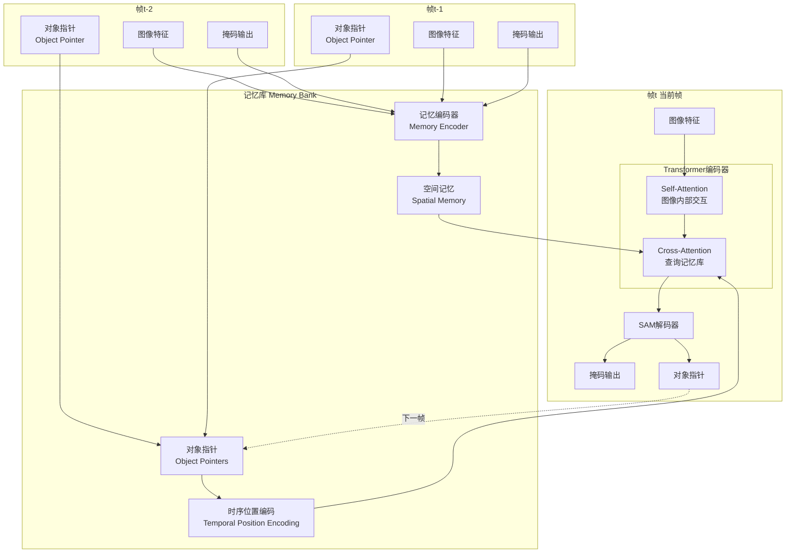

# SAM 3跟踪器机制详解

## 一、核心问题回答

### 问题1：SAM 3使用传统的Homography变换吗？

**答案：不使用！**

SAM 3不使用显式的Homography矩阵或传统的几何变换来跟踪对象。相反，它使用：
1. **记忆机制（Memory Mechanism）** - 存储过去帧的特征
2. **学习的关联（Learned Association）** - 通过神经网络学习对象关联
3. **Transformer注意力** - 跨帧匹配对象

### 问题2：它是用大语言模型做的吗？

**答案：不是！**

SAM 3**不是大语言模型（LLM）**！它是一个**视觉Transformer模型**，专门用于图像/视频分割和跟踪。虽然使用了Transformer架构（和LLM类似的技术），但：
- 处理的是**图像特征**，不是文本
- 训练的是**视觉任务**，不是语言理解
- 使用**视觉注意力机制**，不是语言模型

## 二、SAM 3的跟踪机制

### 2.1 整体架构



### 2.2 核心组件

#### A. 记忆编码器（Memory Encoder）

**作用：** 将过去帧的掩码和特征编码成记忆表示

```python
class SimpleMaskEncoder:
    def forward(self, mask, image_features):
        """
        将掩码和图像特征编码成记忆
        
        输入:
        - mask: 上一帧的预测掩码 [B, 1, H, W]
        - image_features: 上一帧的图像特征 [B, C, H, W]
        
        输出:
        - spatial_memory: 空间记忆 [B, C, H, W]
        """
        # 1. 将掩码应用到图像特征上
        masked_features = image_features * sigmoid(mask)
        
        # 2. 通过卷积网络编码
        memory = conv_layers(masked_features)
        
        return memory
```

**不同于传统方法：**
```
传统方法（如光流、Homography）：
  - 计算像素级别的运动
  - 使用几何变换
  - 显式计算变换矩阵
  
SAM 3的记忆编码：
  - 学习语义级别的表示
  - 隐式编码对象信息
  - 端到端训练
```

#### B. 对象指针（Object Pointers）

**作用：** 紧凑地表示每个对象的身份特征

```python
# 从SAM解码器输出提取对象指针
obj_ptr = obj_ptr_proj(sam_output_token)  # [B, C]

# 添加时序位置编码
temporal_pos = get_temporal_encoding(frame_idx)
obj_ptr = obj_ptr + temporal_pos

# 存储到记忆库
memory_bank.add(obj_ptr, frame_idx)
```

**关键特性：**
- 维度：256或512维向量（远小于整个图像）
- 包含：对象的语义信息、外观特征
- 用途：在未来帧中识别同一对象

#### C. Cross-Attention跨帧关联

**作用：** 让当前帧查询过去帧的记忆

```python
def cross_attention_to_memory(current_features, memory_bank):
    """
    当前帧关注记忆库
    
    Q: 当前帧的特征（我现在看到什么？）
    K: 记忆库的对象指针（过去有什么对象？）
    V: 记忆库的空间记忆（过去对象的详细信息）
    """
    Q = current_features @ W_q  # 当前帧的查询
    K = memory_bank.obj_ptrs @ W_k  # 过去对象的键
    V = memory_bank.spatial_mem @ W_v  # 过去对象的值
    
    # 计算相似度
    scores = Q @ K.T  # [HW_current, N_past_objects]
    attention = softmax(scores)
    
    # 加权求和
    output = attention @ V
    
    return output
```

**与Homography的对比：**

| 方面 | Homography变换 | SAM 3的Cross-Attention |
|------|----------------|------------------------|
| **假设** | 平面+刚体运动 | 无几何假设 |
| **处理对象** | 整个平面 | 每个对象独立 |
| **形变处理** | 无法处理 | 可以处理 |
| **遮挡处理** | 困难 | 自然处理 |
| **外观变化** | 敏感 | 鲁棒 |
| **计算方式** | 显式几何 | 隐式学习 |

### 2.3 跟踪流程

```python
class Sam3TrackerBase:
    def track_step(self, current_frame, memory_bank):
        """
        跟踪一帧
        
        步骤：
        1. 提取当前帧特征
        2. 查询记忆库（Cross-Attention）
        3. 预测掩码
        4. 更新记忆库
        """
        # 1. 提取特征
        image_features = backbone(current_frame)
        
        # 2. 准备记忆条件特征
        # 从记忆库获取过去N帧的信息
        past_spatial_mem = memory_bank.get_spatial_memory()  # [N, C, H, W]
        past_obj_ptrs = memory_bank.get_object_pointers()    # [N, C]
        
        # 3. Cross-Attention: 当前帧查询过去
        for layer in transformer_layers:
            # Self-Attention: 当前帧内部交互
            image_features = self_attention(image_features)
            
            # Cross-Attention: 查询记忆
            Q = image_features @ W_q
            K = past_obj_ptrs @ W_k
            V = past_spatial_mem @ W_v
            
            attention_output = softmax(Q @ K.T) @ V
            image_features = image_features + attention_output
        
        # 4. SAM解码器预测掩码
        pred_mask, obj_ptr = sam_decoder(image_features)
        
        # 5. 编码当前帧到记忆
        spatial_mem = memory_encoder(pred_mask, image_features)
        
        # 6. 更新记忆库
        memory_bank.add(spatial_mem, obj_ptr, current_frame_idx)
        
        return pred_mask
```

### 2.4 对象关联机制

SAM 3使用**学习的关联矩阵**而不是IoU匹配：

```python
class TrackingByDetectionAssoc:
    """
    检测和跟踪的关联损失
    不使用传统的IoU阈值，而是学习关联
    """
    def forward(self, det_queries, trk_queries):
        """
        det_queries: 当前帧检测的对象查询 [B, Q_det, C]
        trk_queries: 从记忆库来的跟踪查询 [B, Q_trk, C]
        """
        # 计算检测到跟踪的关联分数
        det2trk_assoc = det_queries @ trk_queries.T  # [B, Q_det, Q_trk]
        
        # Softmax得到关联概率
        det2trk_prob = softmax(det2trk_assoc, dim=-1)
        
        # 反向：跟踪到检测的关联
        trk2det_assoc = trk_queries @ det_queries.T
        trk2det_prob = softmax(trk2det_assoc, dim=-1)
        
        # 学习的关联（不是硬编码的IoU阈值）
        return det2trk_prob, trk2det_prob
```

**关键区别：**

```python
# 传统方法（如SORT、DeepSORT）
def traditional_tracking(detections, tracks):
    # 1. 计算IoU矩阵
    iou_matrix = compute_iou(detections, tracks)
    
    # 2. 使用匈牙利算法匹配
    matches = hungarian_algorithm(iou_matrix, threshold=0.3)
    
    return matches

# SAM 3的方法
def sam3_tracking(det_queries, trk_queries):
    # 1. 通过神经网络计算关联（学习的）
    assoc_matrix = neural_network(det_queries, trk_queries)
    
    # 2. 通过交叉熵损失训练
    loss = cross_entropy(assoc_matrix, ground_truth_associations)
    
    # 3. 自动学习最佳关联策略
    return assoc_matrix
```

## 三、与传统跟踪方法的对比

### 3.1 传统方法：光流 + Homography

```python
# 传统方法伪代码
def traditional_tracking(frame_t, frame_t1, mask_t):
    # 1. 计算光流
    flow = optical_flow(frame_t, frame_t1)
    
    # 2. 或者计算Homography
    H = find_homography(frame_t, frame_t1)
    
    # 3. 变换掩码
    mask_t1 = warp_mask(mask_t, H)  # 或用光流
    
    return mask_t1

# 问题：
# - 假设刚体运动或平面场景
# - 无法处理大形变
# - 对遮挡敏感
# - 对外观变化敏感
```

### 3.2 SAM 3方法：记忆 + 注意力

```python
# SAM 3方法
def sam3_tracking(frame_t1, memory_bank):
    # 1. 提取特征（深度学习）
    features_t1 = backbone(frame_t1)
    
    # 2. 查询记忆（注意力机制）
    attended_features = cross_attention(
        features_t1,  # Query
        memory_bank.obj_ptrs,  # Key（对象身份）
        memory_bank.spatial_mem  # Value（对象外观）
    )
    
    # 3. 预测掩码（学习的解码器）
    mask_t1 = sam_decoder(attended_features)
    
    return mask_t1

# 优势：
# - 无几何假设
# - 处理非刚体形变
# - 鲁棒处理遮挡
# - 适应外观变化
# - 端到端学习
```

### 3.3 对比表

| 特性 | 光流/Homography | SAM 3记忆机制 |
|------|-----------------|---------------|
| **运动假设** | 刚体/平面 | 无假设 |
| **形变处理** | 差 | 好 |
| **遮挡处理** | 差 | 好 |
| **外观变化** | 敏感 | 鲁棒 |
| **多对象** | 需要分别处理 | 自然支持 |
| **长时跟踪** | 累积误差大 | 误差小 |
| **计算方式** | 几何优化 | 神经网络 |
| **可学习性** | 固定算法 | 端到端训练 |

## 四、SAM 3跟踪的关键创新

### 1. 记忆机制

```python
# 不是存储像素位置，而是存储语义特征
memory_bank = {
    'spatial_memory': [过去N帧的空间特征],
    'object_pointers': [过去N帧的对象身份向量],
    'temporal_positions': [帧的时序位置编码]
}
```

### 2. 注意力关联

```python
# 不是用IoU匹配，而是用注意力机制
attention_scores = current_frame_features @ past_object_pointers.T
# 自动学习：哪些过去的对象与当前观察最相关
```

### 3. 端到端训练

```python
# 整个跟踪管道可微分，可以端到端优化
loss = detection_loss + segmentation_loss + association_loss
# 一次性学习所有组件
```

### 4. 时序位置编码

```python
# 不是简单的帧索引，而是学习的时序表示
temporal_encoding = learnable_encoding(frame_distance)
# 帮助模型理解时间关系
```

## 五、总结

### SAM 3跟踪 vs 传统跟踪

**传统跟踪（光流/Homography）：**
- ✅ 简单直观
- ✅ 计算效率高（对于简单场景）
- ❌ 依赖几何假设
- ❌ 对形变、遮挡敏感
- ❌ 累积误差大

**SAM 3跟踪（记忆+注意力）：**
- ✅ 无几何假设
- ✅ 鲁棒处理形变、遮挡
- ✅ 端到端可学习
- ✅ 长时跟踪稳定
- ❌ 计算量较大
- ❌ 需要大量训练数据

### 核心回答

1. **不使用Homography**：SAM 3不使用显式的几何变换，而是通过学习的注意力机制进行跨帧关联

2. **不是大语言模型**：SAM 3是视觉Transformer，处理图像而非文本，虽然使用了类似的Transformer架构

3. **结合了传统和深度学习思想**：
   - 传统：记忆过去信息，关联对象
   - 深度学习：用神经网络学习如何记忆和关联

4. **核心优势**：通过学习隐式地理解对象运动和外观变化，比显式的几何方法更灵活、更鲁棒！