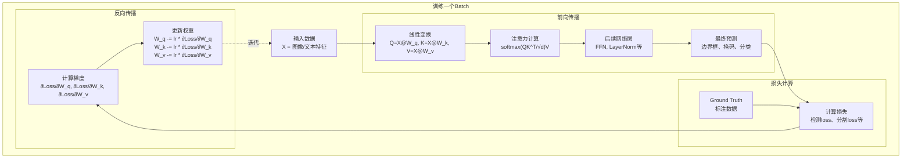
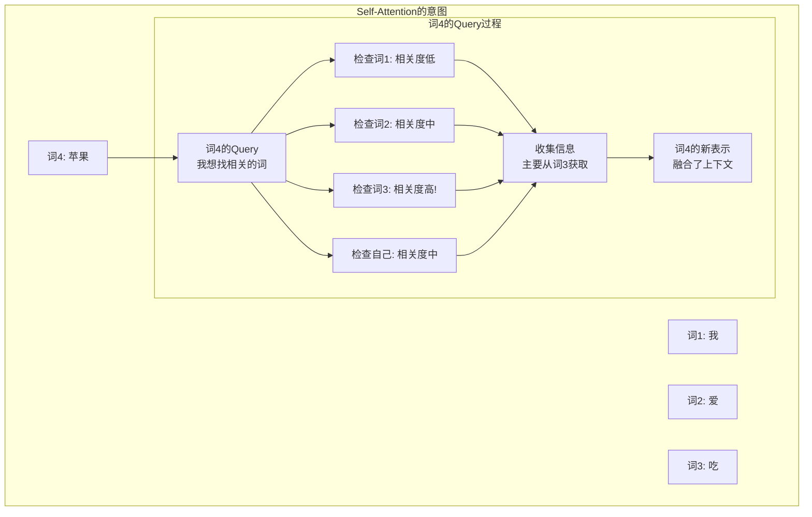

# Transformer训练与Self-Attention深度解析

## 一、如何学习W_q、W_k、W_v？

### 1.1 通过反向传播学习

W_q、W_k、W_v就像神经网络中的其他权重一样，通过**反向传播**和**梯度下降**学习！

```python
# 初始化（随机初始化）
W_q = torch.randn(d_model, d_k) * 0.02  # 例如 [512, 64]
W_k = torch.randn(d_model, d_k) * 0.02
W_v = torch.randn(d_model, d_v) * 0.02

# 标记为可学习参数
W_q.requires_grad = True
W_k.requires_grad = True
W_v.requires_grad = True

# 前向传播
Q = X @ W_q
K = X @ W_k
V = X @ W_v
attention_output = attention(Q, K, V)

# 后续经过更多层，得到最终输出
final_output = model(attention_output)

# 计算损失
loss = criterion(final_output, ground_truth)

# 反向传播（自动计算梯度）
loss.backward()

# 更新权重
optimizer.step()  # W_q, W_k, W_v 都会被更新
```

### 1.2 完整的训练流程



### 1.3 具体例子：SAM 3的训练

```python
# SAM 3的训练循环（简化版）
for epoch in epochs:
    for batch in dataloader:
        # 输入
        images = batch['images']          # B×3×1024×1024
        text_prompts = batch['prompts']   # 文本描述
        gt_masks = batch['masks']         # 真实掩码
        gt_boxes = batch['boxes']         # 真实边界框
        
        # 前向传播
        # 1. 提取特征
        image_features = vision_encoder(images)
        text_features = text_encoder(text_prompts)
        
        # 2. Encoder（使用W_q, W_k, W_v）
        for layer in encoder_layers:
            # Self-Attention
            Q = image_features @ layer.W_q
            K = image_features @ layer.W_k
            V = image_features @ layer.W_v
            image_features = attention(Q, K, V)
            
            # Cross-Attention to text
            Q = image_features @ layer.W_q_cross
            K = text_features @ layer.W_k_cross
            V = text_features @ layer.W_v_cross
            image_features = attention(Q, K, V)
        
        # 3. Decoder（使用另一组W_q, W_k, W_v）
        object_queries = learnable_queries  # 可学习的查询
        for layer in decoder_layers:
            # Self-Attention among queries
            Q = object_queries @ layer.W_q_self
            K = object_queries @ layer.W_k_self
            V = object_queries @ layer.W_v_self
            object_queries = attention(Q, K, V)
            
            # Cross-Attention to image
            Q = object_queries @ layer.W_q_cross
            K = image_features @ layer.W_k_cross
            V = image_features @ layer.W_v_cross
            object_queries = attention(Q, K, V)
        
        # 4. 预测
        pred_boxes = box_head(object_queries)
        pred_masks = mask_head(object_queries)
        pred_scores = score_head(object_queries)
        
        # 计算损失
        loss_box = box_loss(pred_boxes, gt_boxes)
        loss_mask = mask_loss(pred_masks, gt_masks)
        loss_class = classification_loss(pred_scores, gt_labels)
        
        total_loss = loss_box + loss_mask + loss_class
        
        # 反向传播
        optimizer.zero_grad()
        total_loss.backward()  # 所有W_q, W_k, W_v的梯度都被计算
        
        # 更新参数
        optimizer.step()  # 所有权重被更新
        
        print(f"Loss: {total_loss.item()}")
```

### 1.4 梯度流动示例

```python
# 假设一个简单的损失
loss = ||pred_mask - gt_mask||²

# 梯度如何流回W_q？
loss → pred_mask → object_queries → attention_output 
    → softmax(QK^T/√d)V → QK^T → Q → W_q

# 计算梯度链
∂loss/∂W_q = ∂loss/∂pred_mask × ∂pred_mask/∂queries × 
             ∂queries/∂attention × ∂attention/∂Q × ∂Q/∂W_q

# PyTorch自动完成这个链式求导！
```

### 1.5 学习到什么？

训练后，W_q、W_k、W_v学会了：

```python
# W_q 学习：如何提出"好问题"
# 例如：在检测任务中
Q = X @ W_q
# Q可能强调："这个位置有物体的边界吗？"
#              "这里的纹理特征是什么？"

# W_k 学习：如何成为"好索引"
K = X @ W_k  
# K可能强调："我这里有明显的边缘"
#              "我这里有特定的颜色"

# W_v 学习：如何传递"有用信息"
V = X @ W_v
# V可能保留："完整的语义特征"
#              "位置和上下文信息"
```

## 二、Self-Attention中Q的意图是什么？

### 2.1 核心理解

**关键洞察：在Self-Attention中，每个token既是"提问者"又是"回答者"！**

```
句子: "我 爱 吃 苹果"

每个词的双重角色：
━━━━━━━━━━━━━━━━━━━━━━━━━━━━━━━━━━
作为Query（提问者）        作为Key-Value（回答者）
"我"想知道：              "我"可以提供：
- 谁在爱？                - 主语信息
- 这个动作的执行者是谁？  - 第一人称

"爱"想知道：              "爱"可以提供：
- 爱的是什么？            - 动作信息
- 主语是谁？              - 情感关系

"吃"想知道：              "吃"可以提供：
- 吃什么？                - 动作信息
- 谁在吃？                - 行为细节

"苹果"想知道：            "苹果"可以提供：
- 我是什么动作的对象？    - 宾语信息
- 我的修饰词是什么？      - 物体属性
```

### 2.2 具体例子

```python
# 输入序列
X = ["我", "爱", "吃", "苹果"]

# 每个词生成自己的Q、K、V
Q = X @ W_q  # 每个词的"问题"
K = X @ W_k  # 每个词的"标签"
V = X @ W_v  # 每个词的"内容"

# "苹果"作为Query去查询
q_苹果 = Q[3]  # "苹果"的查询向量

# 计算与所有词的相关度
score_我   = q_苹果 · K[0]  # "苹果"问："我"相关吗？  → 低
score_爱   = q_苹果 · K[1]  # "苹果"问："爱"相关吗？  → 中
score_吃   = q_苹果 · K[2]  # "苹果"问："吃"相关吗？  → 高！
score_苹果 = q_苹果 · K[3]  # "苹果"问：我自己相关吗？→ 中

# Softmax归一化
weights = softmax([0.1, 0.2, 0.5, 0.2])

# 加权求和Value
output_苹果 = 0.1×V[0] + 0.2×V[1] + 0.5×V[2] + 0.2×V[3]

# 结果："苹果"的新表示融合了上下文
# 尤其是"吃"的信息，因为"吃"和"苹果"关系最密切
```

### 2.3 Self-Attention的意图

**Q的意图：让每个位置主动寻找与自己相关的其他位置！**



### 2.4 为什么需要Q？

**如果没有Q会怎样？**

```python
# 错误的想法：直接用输入计算相似度
scores = X @ X.T  # 只用输入本身

# 问题：
# 1. 每个位置的"提问能力"没有被优化
# 2. 无法学习"什么样的问题是有用的"
# 3. 匹配模式是固定的（仅基于原始特征）

# 正确的做法：使用可学习的Q
Q = X @ W_q  # W_q是可学习的
scores = Q @ K.T  # K = X @ W_k

# 好处：
# 1. W_q学习：如何提出好问题
# 2. W_k学习：如何成为好索引
# 3. 两者独立优化，更灵活
```

### 2.5 图像Self-Attention的例子

```python
# 图像特征：每个像素位置作为一个token
image_features = [位置1特征, 位置2特征, ..., 位置N特征]

# 位置i（例如：车的边缘）的Q想找什么？
Q_i = 车边缘特征 @ W_q
# 可能学到的意图："找其他边缘"、"找相同物体的其他部分"

# 与所有位置的K匹配
score_车身 = Q_i · K_车身  # 高分！同一物体
score_车轮 = Q_i · K_车轮  # 高分！同一物体
score_树   = Q_i · K_树    # 低分，不相关
score_天空 = Q_i · K_天空  # 低分，不相关

# 加权求和
output_i = 主要包含车身和车轮的特征
# 结果：车边缘知道了整个车的形状信息！
```

## 三、Cross-Attention也需要Q！

### 3.1 澄清误解

❌ **错误**：Cross-Attention不需要Q
✅ **正确**：Cross-Attention同样需要Q、K、V！

**区别在于Q和KV的来源不同：**

```python
# Self-Attention
Q = X @ W_q  # Q来自X
K = X @ W_k  # K也来自X
V = X @ W_v  # V也来自X
# X自己询问自己

# Cross-Attention
Q = X @ W_q  # Q来自X（例如：文本）
K = Y @ W_k  # K来自Y（例如：图像）
V = Y @ W_v  # V也来自Y（例如：图像）
# X去询问Y
```

### 3.2 Cross-Attention中Q的意图

```python
# 场景：文本查询图像
text = "红色的车"
image = [车区域, 树区域, 天空区域, 道路区域]

# Q：文本想在图像中找什么
Q = text @ W_q
q = "红色的车"的查询向量
# Q的意图："在图像中找到符合'红色的车'的区域"

# K：图像每个区域可以被什么找到
K = image @ W_k
k1 = "车区域"的键向量
k2 = "树区域"的键向量
# K的作用："我是一个车区域"、"我是一个树区域"

# V：图像每个区域的实际内容
V = image @ W_v
v1 = "车区域"的值向量（完整特征）
v2 = "树区域"的值向量

# 匹配过程
score_车 = q · k1  # 高分！
score_树 = q · k2  # 低分

# 输出
output = 0.9×v1 + 0.1×v2
# 主要包含车的特征
```

### 3.3 两种Attention的对比

| 方面 | Self-Attention | Cross-Attention |
|------|----------------|-----------------|
| **Q来源** | 输入X | 输入X |
| **K来源** | 输入X（同一个） | 输入Y（另一个） |
| **V来源** | 输入X（同一个） | 输入Y（另一个） |
| **Q的意图** | 找自己序列中的相关位置 | 在另一个序列中找相关内容 |
| **应用** | 理解上下文关系 | 跨模态匹配 |
| **例子** | 词之间的关系 | 文本查询图像 |

### 3.4 SAM 3中的实际应用

```python
# Encoder中的Self-Attention
class EncoderLayer:
    def forward(self, image_features):
        # 图像特征内部交互
        Q = image_features @ self.W_q  # 每个位置问其他位置
        K = image_features @ self.W_k  # 每个位置作为候选
        V = image_features @ self.W_v  # 每个位置的内容
        
        attention = softmax(Q @ K.T / sqrt(d)) @ V
        # 让图像理解自己的结构
        return attention

# Decoder中的Cross-Attention
class DecoderLayer:
    def forward(self, object_queries, image_features):
        # 对象查询关注图像
        Q = object_queries @ self.W_q      # 查询想找物体
        K = image_features @ self.W_k      # 图像位置标签
        V = image_features @ self.W_v      # 图像位置内容
        
        attention = softmax(Q @ K.T / sqrt(d)) @ V
        # 让查询在图像中定位对象
        return attention
```

## 四、总结

### 关于学习W_q, W_k, W_v：

1. **方法**：通过标准的反向传播和梯度下降
2. **初始化**：随机初始化小值
3. **更新**：根据任务损失自动优化
4. **学到的能力**：
   - W_q：如何提出有效的问题
   - W_k：如何成为有效的索引
   - W_v：如何传递有用的信息

### 关于Self-Attention中的Q：

1. **Q的意图**：让每个位置主动寻找相关的其他位置
2. **为什么需要Q**：可学习的提问方式，比固定匹配更灵活
3. **每个token的双重角色**：
   - 作为Query：我想了解什么？
   - 作为Key-Value：我能提供什么？

### 关于Cross-Attention：

1. **同样需要Q**！
2. **区别**：Q来自一个序列，KV来自另一个序列
3. **Q的意图**：在另一个模态/序列中寻找相关信息

**核心理解：Q不是可有可无的，而是Attention机制的核心组成部分，负责"主动提问"和"选择性关注"！**